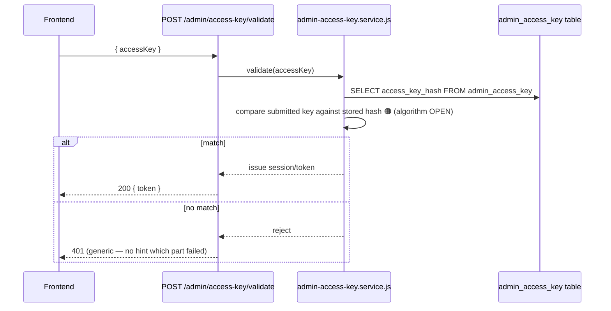
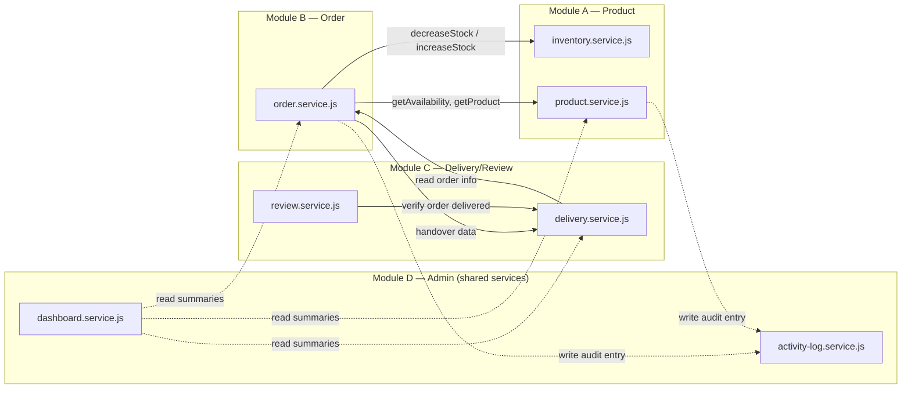

# BACKEND / API ARCHITECTURE DESIGN — VERSION 1.0

**Gen-Z Digital Storefront — Men's, Boys' Clothing & Perfume Store**
**Project Group: ISE_WE_0201_58**

> Baseline: *Physical MySQL Database Schema Design V1.0*, which derives from the full accepted chain (Logical Design V1.1 → Database Architecture V1.1 → Detailed System Architecture V1.2 → Integrated Business & Architecture Model V2). This document defines the backend/API architecture — endpoints, folder structure, auth flow, module boundaries, service-layer responsibilities — that will guide implementation. **No code is written in this document.** Folder structures are shown as text trees (structure, not content); endpoint definitions are contracts (method, path, purpose), not implementations.

**Labelling used throughout:** 🔵 *Inherited/locked from prior documents* — 🟢 *New backend/API-layer decision made here* — 🟠 *Previously OPEN, addressed with a non-committal architectural placeholder, not resolved*.

---

## 1. Architecture Objectives

- Translate the Physical MySQL Schema (21 tables: 18 conceptual entities + `role_permissions`, `product_images`, `admin_access_key`) into a concrete Node.js + Express.js API surface.
- Preserve every module boundary established since the Integrated Business & Architecture Model — EP-01 through EP-04 — as the organizing structure for routes, services, and folders.
- Assign every application-level business rule flagged as "cannot be database-enforced" in the Physical Schema Design (Section 5 of that document) to a specific, named place in the service layer, so nothing is left ambiguous about *where* it will be implemented.
- Carry forward every OPEN decision without resolving it, while still producing a runnable API contract — exactly as the Physical Schema carried forward OPEN items with non-committal columns.

---

## 2. Architectural Principles

1. **One backend application, four internal module boundaries.** Consistent with every prior document: this is a modular monolith, not four microservices. Modules communicate via direct in-process function calls (service-to-service), never via internal HTTP calls to themselves.
2. **Routes are thin; services hold business logic.** Route handlers parse/validate the HTTP request, delegate to a service function, and shape the HTTP response. No business rule (stock validation, order-state transitions, price snapshotting) lives in a route handler.
3. **Inventory is called, never touched.** EP-02's services call an explicit `InventoryService` interface (`decreaseStock`, `increaseStock`, `getAvailability`, `getProduct`) — they never issue a direct database write to `inventory_stock` or `products`.
4. **Every application-level-only DB rule gets an explicit home.** Section 12 maps each rule from Physical Schema Section 5 to a specific service method.
5. **OPEN decisions get architectural placeholders, not invented resolutions.** Where the schema left a column nullable/unconstrained, the API layer likewise leaves the corresponding behaviour flexible rather than picking an answer.

---

## 3. Technology Stack Confirmation 🔵

| Layer | Technology | Source |
|---|---|---|
| Runtime | Node.js (v18+ LTS recommended) | ISPM Sprint 0 Proposal |
| Framework | Express.js | ISPM Sprint 0 Proposal |
| Database | MySQL 8.0+ | ISPM Sprint 0 Proposal / Physical Schema V1.0 |
| Database access | 🟢 **Decision made here:** a lightweight query builder/driver (e.g., `mysql2` with parameterized queries, or a thin query builder such as Knex) is recommended over a full ORM (e.g., Sequelize/Prisma) for this project, since the schema's application-enforced rules (Section 12) require precise transactional control that a full ORM's abstractions can obscure. This is a **backend-layer decision**, not previously constrained by any prior document, and is disclosed as such — the team may substitute an ORM if preferred without affecting the API contract below. |
| Authentication | JWT (Staff, mechanism details OPEN) + custom Access Key flow (Owner/Admin) | ISPM Sprint 0 Proposal / Admin Access Key correction |
| Image storage | Cloudflare R2 (S3-compatible API) | ISPM Sprint 0 Proposal |
| Checkout channel | WhatsApp (mechanism OPEN) | ISPM Sprint 0 Proposal |
| API style | RESTful JSON over HTTPS | ISPM Sprint 0 Proposal |
| API testing | Postman (per Definition of Done) | ISPM Sprint 0 Proposal |

---

## 4. Backend Project Structure (Text Tree — Structure Only, No Code)

```
genz-backend/
├── src/
│   ├── modules/
│   │   ├── product-catalogue/          # Module A — EP-01
│   │   │   ├── routes/
│   │   │   ├── controllers/
│   │   │   ├── services/
│   │   │   │   ├── product.service.js
│   │   │   │   ├── category.service.js
│   │   │   │   └── inventory.service.js      # ← exposes decreaseStock/increaseStock/getAvailability/getProduct
│   │   │   ├── validators/
│   │   │   └── repositories/
│   │   │
│   │   ├── customer-order/             # Module B — EP-02
│   │   │   ├── routes/
│   │   │   ├── controllers/
│   │   │   ├── services/
│   │   │   │   ├── customer.service.js
│   │   │   │   ├── cart.service.js
│   │   │   │   ├── order.service.js
│   │   │   │   └── whatsapp.service.js        # 🟠 mechanism OPEN — isolated behind one interface
│   │   │   ├── validators/
│   │   │   └── repositories/
│   │   │
│   │   ├── delivery-review/            # Module C — EP-03
│   │   │   ├── routes/
│   │   │   ├── controllers/
│   │   │   ├── services/
│   │   │   │   ├── delivery.service.js
│   │   │   │   └── review.service.js
│   │   │   ├── validators/
│   │   │   └── repositories/
│   │   │
│   │   └── store-administration/       # Module D — EP-04
│   │       ├── routes/
│   │       ├── controllers/
│   │       ├── services/
│   │       │   ├── admin-access-key.service.js
│   │       │   ├── staff.service.js
│   │       │   ├── role-permission.service.js
│   │       │   ├── store-settings.service.js
│   │       │   ├── dashboard.service.js        # ← read-only aggregation across all modules
│   │       │   └── activity-log.service.js     # ← central audit writer, consumed by every module
│   │       ├── validators/
│   │       └── repositories/
│   │
│   ├── shared/                         # Cross-cutting, consumed by all modules
│   │   ├── middleware/
│   │   │   ├── auth-customer.middleware.js
│   │   │   ├── auth-admin-access-key.middleware.js
│   │   │   ├── auth-staff.middleware.js         # 🟠 mechanism OPEN
│   │   │   ├── rbac.middleware.js
│   │   │   ├── error-handler.middleware.js
│   │   │   └── request-validator.middleware.js
│   │   ├── utils/
│   │   ├── constants/                  # status enums, shared across modules
│   │   └── db/
│   │       └── connection.js
│   │
│   ├── config/
│   │   ├── database.config.js
│   │   ├── r2.config.js
│   │   └── env.config.js
│   │
│   └── app.js                          # Express app assembly — mounts each module's router
│
├── tests/
│   ├── unit/                           # mirrors src/modules structure
│   └── integration/
│
├── .env.example
├── package.json
└── server.js                           # entry point
```

**Structural note:** each module folder is self-contained (routes → controllers → services → repositories), mirroring the four ownership boundaries exactly. The `shared/` folder holds only genuinely cross-cutting concerns (auth, RBAC, error handling, the DB connection) — no business logic lives there. This directly implements Detailed System Architecture V1.2's instruction that modules remain "internal boundaries within one cohesive application."

---

## 5. Module-to-Route Mapping

| Module | Base Route Prefix |
|---|---|
| Module A (EP-01) | `/api/v1/products`, `/api/v1/categories` |
| Module B (EP-02) | `/api/v1/auth/customer`, `/api/v1/cart`, `/api/v1/orders` |
| Module C (EP-03) | `/api/v1/deliveries`, `/api/v1/reviews` |
| Module D (EP-04) | `/api/v1/admin`, `/api/v1/staff`, `/api/v1/roles`, `/api/v1/permissions`, `/api/v1/settings`, `/api/v1/dashboard`, `/api/v1/activity-log` |

---

## 6. API Endpoint Design

*(Auth column: **Public** = no authentication; **Customer** = authenticated customer session; **Admin** = Owner/Admin via Access Key session or an authorised Staff/Admin User session per RBAC.)*

### Module A — Product & Catalogue (EP-01)

| Method | Path | Auth | Purpose | Traces To |
|---|---|---|---|---|
| GET | `/products` | Public | Browse/search/filter (category, price range, name, pagination) | US-05 |
| GET | `/products/:id` | Public | Product detail incl. availability | US-06, US-07 |
| POST | `/products` | Admin | Create product | US-01 |
| PUT | `/products/:id` | Admin | Edit product | US-02 |
| DELETE | `/products/:id` | Admin | Discontinue product (soft — sets `status='DISCONTINUED'`, never a hard `DELETE`, consistent with Physical Schema's RESTRICT policy on Product's child references) | US-03 |
| PATCH | `/products/:id/stock` | Admin | Manual stock adjustment — the normal way to increase or correct stock; `reason` is mandatory and every adjustment is written to the Activity Log (Physical Schema Section 24/DDA) | DEC-05 (revised) |
| GET | `/categories` | Public | List categories | US-04 |
| POST | `/categories` | Admin | Create category | US-04 |
| PUT | `/categories/:id` | Admin | Edit category | US-04 |

**Not exposed as HTTP endpoints:** `decreaseStock`, `increaseStock`, `getAvailability`, `getProduct` are **internal service functions** (`inventory.service.js`), called in-process by Module B's services — they are the conceptual interfaces from Detailed System Architecture V1.2, implemented here as direct function calls within one Node process, not as internal REST calls (Section 2, Principle 1).

### Module B — Customer & Order (EP-02)

| Method | Path | Auth | Purpose | Traces To |
|---|---|---|---|---|
| POST | `/auth/customer/register` | Public | Customer registration | DEC-02 |
| POST | `/auth/customer/login` | Public | Customer login | DEC-02 |
| GET | `/cart` | Customer 🟠 | View own cart — **auth requirement here is entangled with the OPEN guest-cart-persistence decision**; see Section 15, item 2 | US-08 |
| POST | `/cart/items` | Customer 🟠 | Add item to cart | US-08 |
| PUT | `/cart/items/:id` | Customer 🟠 | Update quantity | US-08 |
| DELETE | `/cart/items/:id` | Customer 🟠 | Remove item | US-08 |
| POST | `/orders` | **Customer (mandatory)** | Checkout — creates Order (Pending), generates WhatsApp message. Request body requires `deliveryAddress` (🟢 *project-owner amendment*, captured on the Order at this point and later snapshotted onto Delivery at handover — resolves the EP-03 delivery-address schema gap found during Module C implementation) | US-09, US-10, DEC-02 |
| GET | `/orders` | Customer (own) / Admin (all, filterable by status) | Order history / admin order list | US-11, US-13 |
| GET | `/orders/:id` | Customer (own) / Admin | Order detail | US-13 |
| PATCH | `/orders/:id/confirm` | Admin | Pending → Confirmed; **calls `InventoryService.decreaseStock()`** | US-12, DEC-04 |
| PATCH | `/orders/:id/status` | Admin | Confirmed → Processing → Ready for Delivery (separate transition, never automatic — Physical Schema Section 6/DSA V1.2) | US-12 |
| PATCH | `/orders/:id/cancel` | Admin 🟠 *(and possibly Customer for Pending — actor question OPEN, Section 15 item 5)* | Cancel; if Confirmed-or-later, **calls `InventoryService.increaseStock()`** for restoration | DEC-04, DEC-06 |

### Module C — Delivery Tracking with Review Management (EP-03)

| Method | Path | Auth | Purpose | Traces To |
|---|---|---|---|---|
| POST | `/deliveries` | Admin | Create delivery record + assign delivery person (system-triggered at Ready-for-Delivery handover, exposed here for admin-initiated assignment) | US-14 |
| GET | `/deliveries/:id` | Customer (via own order) / Admin | Delivery detail/status | US-16 |
| PATCH | `/deliveries/:id/status` | 🟠 Delivery Person (identity mechanism OPEN, Section 15 item 10) / Admin | Update status Assigned→Picked Up→Out for Delivery→Delivered | US-15 |
| GET | `/orders/:id/delivery` | Customer (own) | Convenience lookup, same data as above via Order context | US-16 |
| POST | `/reviews` | Customer | Submit review (service validates Delivered + verified purchase) | US-17 |
| GET | `/products/:id/reviews` | Public | Approved reviews + aggregate rating for a product | US-18 |
| GET | `/reviews` | Admin | Moderation queue (Pending Moderation) | US-19 |
| PATCH | `/reviews/:id/moderate` | Admin | Approve / Reject / Delete — service records `actor_type`/`actor_id` on Moderation Log per the Actor Identity Decision (Physical Schema V1.0 §5b); Owner/Admin actions carry no Staff/Admin User FK | US-19 |

**`GET /products/:id/reviews` is deliberately placed under Module C's controller but exposed at a Module-A-looking path**, since the product detail page needs to compose both Product data (Module A) and Review data (Module C) — this route calls Module C's `review.service.js` directly; it does **not** imply Module A owns Review data. This is the concrete implementation of the previously-OPEN "Product + Review integration mechanism" — see Section 15, item 4, where this choice is disclosed as the resolution now being made explicitly at this stage.

### Module D — Store Administration Management (EP-04)

| Method | Path | Auth | Purpose | Traces To |
|---|---|---|---|---|
| POST | `/admin/access-key/validate` | Public (rate-limited) | Owner/Admin Access Key submission → session/token on success | Locked Access Key flow |
| POST | `/admin/logout` | Admin | End Owner/Admin session | Locked Access Key flow |
| GET | `/staff` | Admin | List staff accounts | US-21 |
| POST | `/staff` | Admin (Owner-level) | Create staff account | US-21 |
| PUT | `/staff/:id` | Admin | Edit staff account | US-21 |
| PATCH | `/staff/:id/deactivate` | Admin | Deactivate staff | US-21 |
| GET | `/roles` | Admin | List roles | US-22 |
| POST | `/roles` | Admin | Create role | US-22 |
| GET | `/permissions` | Admin | List permissions | US-22 |
| POST | `/roles/:id/permissions` | Admin | Assign permission(s) to role (writes `role_permissions`) | US-22 |
| GET | `/settings` | Public (WhatsApp number only) / Admin (full) | Store settings | US-24 |
| PUT | `/settings` | Admin | Update store settings | US-24 |
| GET | `/dashboard` | Admin | Unified operational summary (reads across A/B/C) | US-23 |
| GET | `/activity-log` | Admin | Audit trail, filterable | US-25 |

**No `POST /auth/staff/login` route is defined.** Per Section 15 (item 1), the Staff authentication entry mechanism remains OPEN — this document does not invent a login endpoint shape until that decision is made.

**Actor Identity Decision (resolved 2026-09-08):** `PATCH /reviews/:id/moderate` (Module C above) may be exercised by **either** an Owner/Admin (Access Key) session **or** an authorised Staff/Admin User session, consistent with this document's own "Admin" auth-level definition (Section 6) and the RBAC Architecture (DSA V1.2 §15), without requiring Owner/Admin to hold a Staff/Admin User row. See Physical Schema V1.0 §5b and Logical Database Design V1.1 (Section C4) for the full mechanism.

---

## 7. Authentication & Authorization Architecture

### Owner/Admin — Access Key Flow (locked, technical implementation)



- Rate limiting (e.g., a sliding-window counter per IP) applied at the `POST /admin/access-key/validate` route specifically, per the locked requirement for brute-force protection.
- No username/password fields exist anywhere in this flow — confirmed by the endpoint's single-field request shape.
- Session mechanism: 🟢 JWT is recommended (reuses the same library already needed for Staff auth once that mechanism is decided), stored as an HTTP-only cookie to reduce XSS exposure — this is a backend implementation decision, not previously locked, and is disclosed as such.

### Staff — Entry Mechanism 🟠 OPEN

No endpoint is defined for Staff login in Section 6. `auth-staff.middleware.js` exists in the folder structure (Section 4) as a placeholder consuming whatever mechanism is eventually decided (Section 15, item 1) — once resolved, it will validate a Staff session and attach the authenticated `staff_admin_user_id` + `role` to the request, feeding into `rbac.middleware.js` identically to how an Owner/Admin session does.

### Customer Authentication

- Standard email/password (or equivalent) registration and login, JWT-based session, per DEC-02.
- `auth-customer.middleware.js` enforces authentication only on the routes explicitly marked **Customer** in Section 6 (checkout, order history, review submission) — never on public browsing routes.

### RBAC Middleware

`rbac.middleware.js` is a single, shared middleware consumed by every Admin-marked route across all four modules — implementing Detailed System Architecture V1.2's "one shared Auth/RBAC middleware, applied uniformly" rule. It checks the authenticated session's role/permissions (via `roles`/`permissions`/`role_permissions`) against the specific action the route represents. Owner/Admin sessions (Access-Key-derived) are treated as carrying full authority by definition; Staff sessions are checked against their assigned Role's Permissions.

---

## 8. Middleware Architecture

| Middleware | Applies To | Responsibility |
|---|---|---|
| `auth-customer.middleware.js` | Customer-marked routes | Validates customer JWT, attaches `req.customer` |
| `auth-admin-access-key.middleware.js` | Admin-marked routes (Owner/Admin path) | Validates Access-Key-derived session |
| `auth-staff.middleware.js` 🟠 | Admin-marked routes (Staff path) | Validates Staff session — mechanism OPEN |
| `rbac.middleware.js` | All Admin-marked routes, after auth | Checks role/permission for the specific action |
| `error-handler.middleware.js` | Global (last in chain) | Converts thrown service errors into consistent HTTP responses (Section 10) |
| `request-validator.middleware.js` | Per-route, parameterised | Runs each route's declared validator (Section 11) before the controller executes |

---

## 9. Request/Response Conventions 🟢

- All request/response bodies: JSON.
- Success envelope: `{ "data": {...} }` (or `{ "data": [...], "meta": { "page", "limit", "total" } }` for paginated lists).
- Error envelope: `{ "error": { "code": "...", "message": "..." } }` (Section 10).
- All list endpoints support `page`/`limit` query parameters; filterable endpoints (products, orders, activity log) support named query filters (e.g., `?status=PENDING`).
- All monetary values serialised as strings (not floats) to avoid client-side floating-point precision loss on `DECIMAL` values.

---

## 10. Error Handling Strategy 🟢

| HTTP Status | Used For |
|---|---|
| 400 | Validation failure (malformed/missing request data) |
| 401 | Authentication missing/invalid (customer, Access Key, or Staff session) |
| 403 | Authenticated but not authorised (RBAC denial) |
| 404 | Referenced entity does not exist |
| 409 | Business-rule conflict — e.g., insufficient stock at confirmation (Physical Schema Section 9.1's failure path), a contact info already registered, a Delivery already existing for an order |
| 422 | Well-formed request but semantically invalid for current entity state (e.g., confirming an order that is no longer Pending, or an out-of-sequence delivery status change) |
| 500 | Unexpected server/database error |

**The 409 case for failed stock decrease is the most important one to implement correctly**, since Physical Schema Section 5/9.1 requires: stock left completely unchanged, order remains Pending, no partial mutation — this maps to a **single database transaction** in `order.service.js`'s `confirmOrder()` method that rolls back entirely on insufficient stock, returning 409 rather than partially succeeding.

---

## 11. Validation Strategy 🟢

- Per-route validators (folder: `validators/` in each module) run via `request-validator.middleware.js` before any controller/service code executes — rejecting malformed requests at the edge (400), before database-level `CHECK` constraints would ever be reached.
- **Validation is layered, not duplicated in spirit:** the API validator layer catches obviously malformed input (missing fields, wrong types, out-of-range values like a rating outside 1–5) early for a better client experience; the database's `CHECK` constraints (Physical Schema Section 5) remain the final authority, catching anything that somehow bypasses the API layer (e.g., a direct DB script) — this is standard defense-in-depth, not redundant design.
- Application-only business rules (Section 12 below) are explicitly **not** validator-layer checks — they require database state lookups (e.g., "is this order still Pending?") and belong in the service layer, not the stateless validator layer.

---

## 12. Service Layer — Application-Level Business Rule Enforcement Map

*(Directly answers Physical Schema Design V1.0 Section 5's "must remain application-level" list — every rule now has a named home.)*

| Rule (from Physical Schema Section 5) | Enforced In | Mechanism |
|---|---|---|
| Immutable historical price snapshots | `order.service.js` | Snapshot fields are set **only** at creation (`INSERT`); no service method ever issues an `UPDATE` touching `price_snapshot` |
| Atomicity of stock-decrease-and-order-confirm | `order.service.js` → `confirmOrder()` | Single DB transaction: verify stock → `InventoryService.decreaseStock()` → update order status → commit; any failure rolls back the entire transaction |
| Atomicity of stock-restoration-and-cancel | `order.service.js` → `cancelOrder()` | Same transactional pattern for the Confirmed-or-later cancellation path |
| Manual stock adjustment is traceable (revised DEC-05) | `product.service.js` → `adjustStockManually()` + `product.controller.js` | Transactional row-locked update; a non-empty `reason` is required and an Activity Log entry is written for every adjustment |
| Order cancellation actor authorization | 🟠 `order.service.js` → `cancelOrder()` | **OPEN** — the method signature accepts an `actorType`/`actorId`, but the authorization rule for *who* is allowed to call it is not implemented pending Section 15, item 5 |
| Duplicate-review restriction | 🟠 `review.service.js` → `submitReview()` | **OPEN** — no restriction is currently implemented; the method does not check for prior reviews by the same customer on the same product/order, pending Section 15, item 6 |

---

## 13. Data Access Layer

Each module owns a `repositories/` folder containing only data-access functions for the tables that module owns (per Physical Schema Section 3's ownership mapping). **Cross-module data access is never performed via another module's repository directly** — if Module B needs Product data, it calls Module A's `inventory.service.js`/`product.service.js` exposed functions, which internally use Module A's own repository. This preserves the "read-only reference, never direct table access" rule (Physical Schema Section 14) at the code-organization level, not just the database level.

---

## 14. Cross-Module Communication (In-Process)



Solid arrows = direct function calls (request/response). Dotted arrows = the audit-writing and dashboard-aggregation cross-cutting pattern. No arrow ever represents Module B writing directly to Module A's data — every inventory-touching arrow terminates at `inventory.service.js`.

---

## 15. OPEN Decisions — Carried Forward to Backend/API Architecture

| # | OPEN Decision | Architectural Placeholder in This Document | Status |
|---|---|---|---|
| 1 | Staff authentication mechanism | `auth-staff.middleware.js` exists but is unimplemented; no login endpoint defined | **OPEN** |
| 2 | Guest cart persistence through login/register | Cart endpoints marked "Customer 🟠" — exact behaviour (whether a pre-login cart exists/merges) not designed | **OPEN** |
| 3 | WhatsApp integration mechanism | `whatsapp.service.js` isolated behind one interface; internal implementation (simple link vs. Business API) not designed | **OPEN** |
| 4 | Product + Review aggregation mechanism | **Resolved at this stage** — `GET /products/:id/reviews` calls Module C directly (Section 6); this is a disclosed API-layer decision, analogous to how Product ImageReference was resolved at the physical-schema stage | **RESOLVED HERE** (backend/API-layer decision, not a business decision) |
| 5 | Order cancellation authority | `cancelOrder()` service method signature exists; authorization logic not implemented | **OPEN** |
| 6 | Multiple reviews per Product/Order | `submitReview()` performs no duplicate check | **OPEN** |
| 7 | Admin Access Key storage/validation mechanism | Validation flow diagrammed (Section 7) with the comparison step marked 🟠; specific algorithm not chosen | **OPEN** |
| 8 | *(Withdrawn — not applicable to the final four-epic scope)* | — | **N/A** |
| 9 | Category/Customer/Staff deactivation behaviour | Deactivation endpoints exist (`PATCH .../deactivate`) but their downstream effects (visibility, cascading behaviour) are not specified beyond the flag itself | **OPEN** |
| 10 | Delivery Person identity structure | `PATCH /deliveries/:id/status` auth is marked 🟠; no dedicated Delivery Person login/role is defined | **OPEN** |
| 11 | Product ImageReference physical representation | *(Already resolved at Physical Schema stage — `product_images` table; this API layer simply exposes it via `POST/DELETE /products/:id/images` if needed, not separately re-opened here)* | Resolved (prior stage) |

**Item 4 is the one genuine backend-layer resolution made in this document**, for the same reason Item 11 was resolved at the physical-schema stage: composing two modules' data for a single read-only endpoint is squarely an API-design-stage decision, not a business decision requiring supervisor/team sign-off. All other items remain untouched.

---

## 16. File/Image Upload Handling (Cloudflare R2)

- `product.service.js` (Module A) is the sole caller of an R2 client wrapper (`config/r2.config.js`).
- Upload flow: `POST /products` / `PUT /products/:id` accept image data (multipart or pre-signed-URL pattern — 🟢 pre-signed URL upload is recommended, so image bytes never transit through the Node server itself, reducing backend load); on successful upload, a `product_images` row is inserted with the resulting R2 object key.
- No other module ever calls R2 directly — consistent with Physical Schema's external-integration ownership (Module A → Cloudflare R2 only).

---

## 17. Environment Configuration & Secrets 🟢

| Secret/Config | Location | Note |
|---|---|---|
| Database credentials | `.env` → `config/database.config.js` | Never committed; `.env.example` documents required keys only |
| Admin Access Key raw value (pre-hash) | Set once via a secure setup script, never stored in `.env` after initial hashing | Mechanism OPEN (Section 15, item 7) |
| JWT signing secret | `.env` | Shared between Customer and (once decided) Staff JWT issuance |
| Cloudflare R2 credentials | `.env` → `config/r2.config.js` | — |
| WhatsApp-related config | `.env`, shape TBD | Depends on Section 15, item 3 |

---

## 18. API Versioning Strategy 🟢

All routes are prefixed `/api/v1/...` from the start (visible throughout Section 6). This is a standard, low-cost convention adopted proactively — no source document requested it, but it costs nothing to include now and avoids a breaking change later if a `v2` is ever needed.

---

## 19. Testing Strategy 🔵

Per the project's Definition of Done (ISPM proposal): every endpoint must be verified via **Postman integration testing** returning correct HTTP status codes, and every feature requires developer + peer functional testing before merge. This document's `tests/` folder (Section 4) mirrors the module structure so unit tests for services (especially the transactional methods in Section 12) can be organised 1:1 with the code they cover.

---

## 20. Deployment Architecture Mapping 🔵

| Component | Target (per ISPM Budget/Hardware sections) |
|---|---|
| Backend (this API) | Render/Railway free tier |
| Frontend (React) | Vercel/Netlify free tier |
| Database | Supabase/Neon-hosted MySQL free tier |
| Images | Cloudflare R2 |

No change from the originally approved deployment targets.

---

## 21. Traceability Matrix (Excerpt — Endpoint → Business Rule → Source)

| Endpoint | Business Rule Enforced | Locked Source |
|---|---|---|
| `PATCH /orders/:id/confirm` | Stock decreases only at Pending→Confirmed; failure leaves order Pending | DEC-04, Physical Schema Section 9.1 |
| `PATCH /orders/:id/status` | Confirmed→Processing is separate, not automatic | DSA V1.2 correction |
| `PATCH /orders/:id/cancel` | Confirmed-or-later cancellation restores stock; Pending cancellation has no stock effect | DEC-04, DEC-06 |
| `PATCH /products/:id/stock` | Manual stock adjustment is the normal restocking path; reason mandatory; Activity Log entry written | DEC-05 (revised) |
| `PATCH /reviews/:id/moderate` | Actor (Owner/Admin or Staff/Admin User) recorded without requiring Owner/Admin to hold a Staff/Admin User row | Actor Identity Decision (Physical Schema V1.0 §5b) |
| `POST /admin/access-key/validate` | No username/password page; server-side validation only | Locked Access Key flow |
| `POST /reviews` | Verified-purchase eligibility (Delivered order) | EP-03 DoD |

---

## 22. Consistency Verification Against Prior Documents

| Check | Result |
|---|---|
| Four module boundaries preserved as folder/route boundaries | ✅ |
| Inventory touched only via `inventory.service.js` functions, never direct DB access from Module B | ✅ |
| No Owner/Admin username/password endpoint introduced | ✅ |
| Staff auth left unimplemented, not invented | ✅ |
| All 21 physical tables have a corresponding owning module's service/repository | ✅ |
| Every Physical-Schema "application-level only" rule has a named service-method home | ✅ (Section 12) |
| No OPEN decision silently resolved, except the two explicitly disclosed API-layer resolutions (Items 4 and — carried from before — 11) | ✅ |
| Three-tier architecture, single backend process, no microservices | ✅ |

---

## BACKEND/API ARCHITECTURE STATUS

**Ready to proceed to implementation: YES**, with the same category of caveats as the Physical Schema stage — ten OPEN business decisions remain, each with a defined but unimplemented placeholder in the code structure (not a missing consideration).

**Remaining OPEN decisions:** Staff auth mechanism, guest cart persistence, WhatsApp mechanism, order cancellation authority, duplicate-review rule, Access Key hashing algorithm, deactivation downstream behaviour, Delivery Person identity structure.

**Backend-layer decisions made in this document:** query builder over full ORM (recommended, substitutable); JWT for Access-Key session token; pre-signed-URL image upload pattern; `/api/v1` prefix; Product+Review composition at the `GET /products/:id/reviews` endpoint (the one deliberate resolution, disclosed).

**Next stage:** actual implementation — writing the Node.js/Express route/controller/service/repository code files following this architecture, module by module, starting with Module A (no inbound dependencies) so Module B has a real interface to build against early, consistent with the parallelisation plan established back in Detailed System Architecture V1.2.

---

*No code has been written in this document. This is the architectural contract implementation will follow.*
