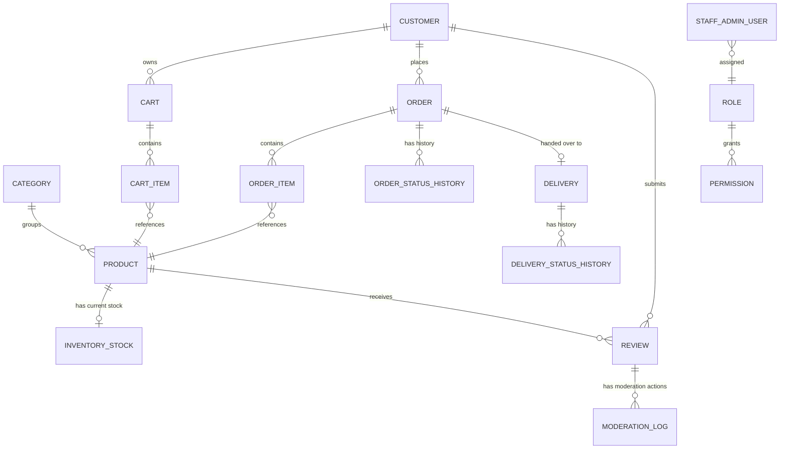
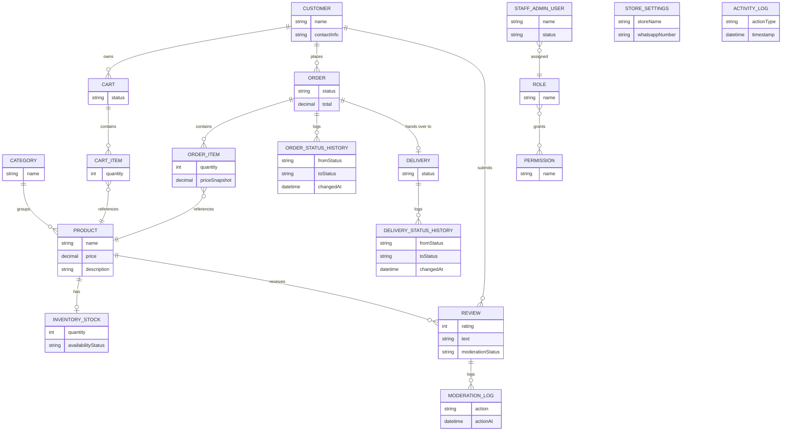
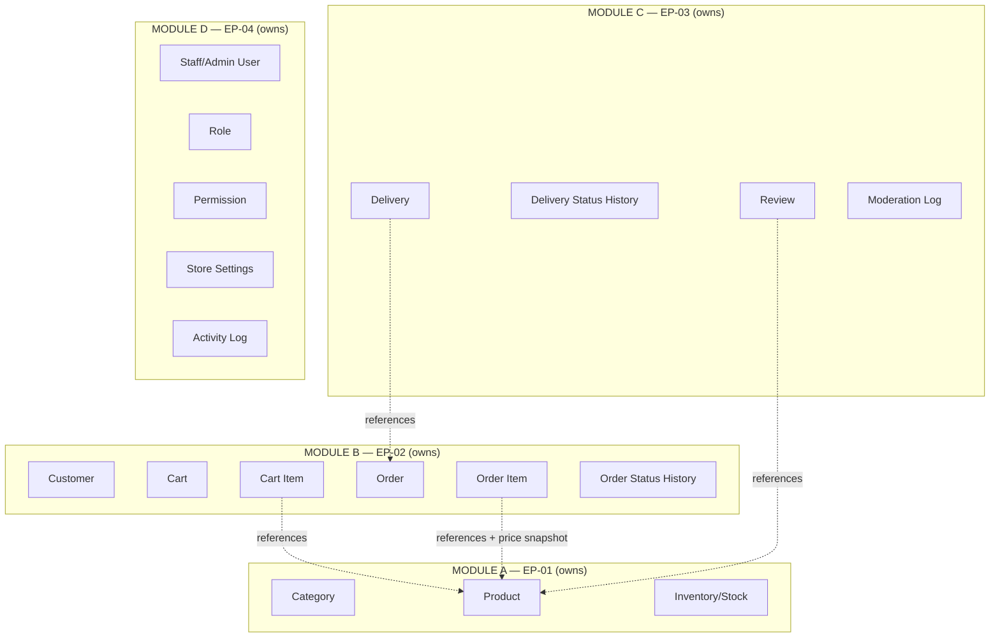

# DETAILED DATABASE ARCHITECTURE — VERSION 1.1

**Gen-Z Digital Storefront — Men's, Boys' Clothing & Perfume Store**
**Project Group: ISE_WE_0201_58**

> Baseline: *Detailed System Architecture — Version 1.2* (which itself derives from *Integrated Business & Architecture Model — Version 2*). This document is a **conceptual database architecture** — entities, ownership, relationships, cardinality, and business/referential rules. It contains **no SQL, no CREATE TABLE statements, no migration scripts, no API endpoints, and no code**. It is designed to be directly traceable to, and never to reinterpret, the module ownership established in the system architecture baseline.
>
> **Version 1.1** applies seven corrections to Version 1 — see the Revision Summary at the end of this document for the exact list. Corrections that concerned the since-descoped module are no longer applicable; the final four-epic scope contains 18 entities across four module-ownership boundaries.

---

## 1. Database Architecture Objectives

- Translate the module-ownership model of Detailed System Architecture V1.2 into a conceptual data architecture — entities, relationships, and constraints — without yet writing schema.
- Preserve, without reinterpretation, every ownership and business rule locked in the system architecture baseline (see the full non-negotiable list reproduced in Section 26).
- Provide enough entity-level precision (attributes conceptually, relationships, cardinality, lifecycle, access rules) that the next stage (physical schema/SQL design) requires no further business-model interpretation.
- Keep the data architecture as **one single relational database** supporting four internal module boundaries — not four separate databases or schemas-per-service.

---

## 2. Database Design Principles

1. **One entity, one owning module.** Every entity identified in this document belongs to exactly one module; no entity is jointly owned or duplicated across modules.
2. **Ownership governs write access; module boundaries govern read/request access.** A module may read another module's entity where the system architecture permits it, and may request an operation (via the owning module's logic) — but may never write directly to an entity it does not own.
3. **One physical database, enforced logical boundaries.** All entities reside in a single MySQL database; module boundaries are enforced by application-layer convention (per Section 8 of the system architecture), not by physical database separation.
4. **No duplicate Product/Inventory entities.** Every other module's entities reference EP-01's Product; they never re-model product or stock as their own data.
5. **Status/lifecycle fields are conceptual state machines, not free text.** Every entity with a lifecycle (Order, Delivery, Review) has an explicitly enumerated, finite set of states, matching the system architecture's lifecycle tables exactly.
6. **Immutability where the business model requires it.** Historical records (order price snapshots, status histories, moderation and activity logs) are never edited in place.
7. **Audit is centralized.** All auditable actions produce a record referencing the central Activity Log entity (owned by EP-04); no module maintains a second, independent audit trail.
8. **Genuinely undecided rules are marked OPEN, not resolved by default schema choices.** Where the system architecture left a decision open, this document does not silently pick an answer through its data model (e.g., it does not add a "one review per order" unique constraint, since that rule is open).

---

## 3. Module-to-Data Ownership Mapping

| Module | Owns (Entities) |
|---|---|
| **Module A (EP-01)** | Product, Category, Inventory/Stock, Availability (derived) |
| **Module B (EP-02)** | Customer, Cart, Cart Item, Order, Order Item, Order Status History |
| **Module C (EP-03)** | Delivery, Delivery Status History, Review, Moderation Log |
| **Module D (EP-04)** | Staff/Admin User, Role, Permission, Store Settings, Activity Log |

This mapping is identical to the ownership table in Detailed System Architecture V1.2, Section 15 — it is repeated here as the anchor for every subsequent entity definition in this document.

---

## 4. Conceptual Data Domains

```
┌─────────────────────────────────────────────────────────────────┐
│                        GEN-Z DATA DOMAINS                        │
├───────────────┬───────────────┬───────────────┬─────────────────┤
│  Catalogue &   │  Customer &    │  Fulfilment &  │  Administration │
│  Inventory     │  Order Domain  │  Trust Domain  │  Domain         │
│  Domain (A)    │  (B)           │  (C)           │  (D)            │
└───────────────┴───────────────┴───────────────┴─────────────────┘
```

Four conceptual domains, one per module, mapped 1:1 to Section 3. No domain's entities are shared or duplicated across a boundary.

---

## 5. Entity Identification

| # | Entity | Owning Module |
|---|---|---|
| 1 | Product | A |
| 2 | Category | A |
| 3 | Inventory/Stock | A |
| 4 | Customer | B |
| 5 | Cart | B |
| 6 | Cart Item | B |
| 7 | Order | B |
| 8 | Order Item | B |
| 9 | Order Status History | B |
| 10 | Delivery | C |
| 11 | Delivery Status History | C |
| 12 | Review | C |
| 13 | Moderation Log | C |
| 14 | Staff/Admin User | D |
| 15 | Role | D |
| 16 | Permission | D |
| 17 | Store Settings | D |
| 18 | Activity Log | D |


---

## 6. Entity Responsibilities

*(Full attribute-level, relationship-level, lifecycle, and access detail for each entity is provided per-domain in Sections 9–21. This section gives the one-line responsibility summary for quick reference.)*

| Entity | Responsibility |
|---|---|
| Product | Represents a sellable catalogue item — the single source of product identity. |
| Category | Groups Products for browsing/filtering. |
| Inventory/Stock | Represents current sellable quantity for a Product — the single source of stock truth. |
| Customer | Represents a registered, authenticated storefront account. |
| Cart | Represents a customer's (or guest's) in-progress item selection prior to checkout. |
| Cart Item | A line entry within a Cart, referencing a Product and quantity. |
| Order | Represents a placed, trackable purchase transaction. |
| Order Item | A line entry within an Order, referencing a Product, quantity, and price at time of order. |
| Order Status History | Records each status transition an Order has passed through. |
| Delivery | Represents the fulfilment record for an Order once it reaches Ready for Delivery. |
| Delivery Status History | Records each status transition a Delivery has passed through. |
| Review | Represents a customer's rating/feedback on a purchased Product. |
| Moderation Log | Records moderation actions taken on Reviews. |
| Staff/Admin User | Represents an internal system user account (Staff or, distinctly, the Owner/Admin's Access Key context). |
| Role | A named grouping of Permissions assignable to a Staff/Admin User. |
| Permission | A specific allowed system action. |
| Store Settings | Store-wide configuration values (name, contact, WhatsApp number). |
| Activity Log | The single, central, cross-module audit trail. |

---

## 7. Entity Relationships



This diagram is conceptual — it shows relationships and approximate cardinality only, not column-level foreign key implementation.

---

## 8. Cardinality Rules

| Relationship | Cardinality | Notes |
|---|---|---|
| Category → Product | 1 : many | A Category groups many Products; a Product belongs to one Category (simplification consistent with V2's "Category" scope — sub-categorization is not established and not assumed). |
| Product → Inventory/Stock | 1 : 1 | Each Product has exactly one current stock record, owned by Module A. |
| Customer → Cart | 1 : many (conceptually 1 active) | A Customer may have cart history, but only one active/in-progress Cart at a time is implied by the business flow. |
| Cart → Cart Item | 1 : many | |
| Customer → Order | 1 : many | |
| Order → Order Item | 1 : many | |
| Order → Order Status History | 1 : many | One entry per transition. |
| Order → Delivery | 1 : 0 or 1 | A Delivery record exists only once an Order reaches Ready for Delivery. |
| Delivery → Delivery Status History | 1 : many | One entry per transition. |
| Customer → Review | 1 : many | Frequency-per-product/order rule is OPEN (Section 34). |
| Product → Review | 1 : many | |
| Review → Moderation Log | 1 : many | One entry per moderation action. |
| Staff/Admin User → Role | many : 1 | Each Staff/Admin User has one Role (simplification; multi-role assignment not established in V2 and not assumed). |
| Role → Permission | many : many | A Role grants many Permissions; a Permission may belong to many Roles. **This is an associative (many-to-many) relationship, not itself an independently owned business entity** — the eventual physical relational design will require an appropriate junction/associative structure to represent it, but no separate "Role-Permission" business entity is introduced in this conceptual model, and the entity count in Section 5 does not include one. |

---

## 9. Customer & Account Data Model

**Owning module:** B (EP-02)

| Entity | Purpose | Key Attributes (conceptual) | Lifecycle/Status | Created/Updated By | Readable By Other Modules | Operations Requestable By Other Modules |
|---|---|---|---|---|---|---|
| **Customer** | Registered storefront account | Name, contact info, credentials reference | Active / Deactivated (deactivation not explicitly established — OPEN if needed) | Customer (self-registration, per DEC-02) | Module C (for review/delivery association, read-only) | None |

**Relationships:** Customer 1:many Order; Customer 1:many Cart (conceptually one active); Customer 1:many Review.

**Business rules applied:** Customer authentication is required before checkout/order creation (DEC-02, locked) but not for browsing; guest browsing does not create a Customer record.

---

## 10. Product & Catalogue Data Model

**Owning module:** A (EP-01)

| Entity | Purpose | Key Attributes (conceptual) | Lifecycle/Status | Created/Updated By | Readable By Other Modules | Operations Requestable By Other Modules |
|---|---|---|---|---|---|---|
| **Product** | Sellable catalogue item | Name, description, price, category reference, image reference(s) | Active / Discontinued (deletion behavior — soft vs. hard — not explicitly established; treated as OPEN if needed beyond what US-03 implies) | Module A (Admin) | Modules B, C (read) | None (no other module writes to Product) |
| **Category** | Groups Products | Name, description | N/A | Module A (Admin) | Modules B (read, for browsing/filter) | None |

**Relationships:** Category 1:many Product; Product 1:1 Inventory/Stock; Product 1:many Cart Item / Order Item / Review (all as a *referenced* entity, never owned by the referencing module).

**Business rules applied:** No tag-management entity is introduced (per system architecture correction) — only Category. Product is never duplicated by any other module.

---

## 11. Inventory Data Model

**Owning module:** A (EP-01) — exclusively

| Entity | Purpose | Key Attributes (conceptual) | Lifecycle/Status | Created/Updated By | Readable By Other Modules | Operations Requestable By Other Modules |
|---|---|---|---|---|---|---|
| **Inventory/Stock** | Current sellable quantity for a Product | Product reference, current quantity, last-updated context | N/A (a running value, not a state machine) | **Module A only** — every mutation is performed by Module A itself, in response to a request | Modules B, C (read availability, derived) | **Requestable operations (never direct writes):** `decreaseStock` (from Module B, at order confirmation), `increaseStock` (from Module B, at Confirmed-or-later cancellation restoration) |
| **Availability** *(derived, not a stored entity in its own right)* | In Stock / Out of Stock status | Derived from Inventory/Stock quantity | Recalculated automatically on every stock mutation | Module A | Modules B, C (read) | None |

**Non-negotiable rule reinforced:** no entity in this section is ever created, updated, or deleted by any module other than Module A. Module B interacts exclusively through the `decreaseStock`/`increaseStock` request pattern established in the system architecture (Section 8/9.1 of DSA V1.2) — this document introduces no new inventory-mutation pathway. **Exactly three business flows may trigger an Inventory/Stock mutation, and no others:**
1. Module B, order confirmation → `decreaseStock(quantity)`
2. Module B, Confirmed-or-later cancellation → `increaseStock(quantity)`
3. Module A, authorised manual stock adjustment — the normal way to increase or correct stock (revised DEC-05, Sections 24–25); a reason is mandatory

**Stock Audit Information and traceability:** every one of the three mutations above is traceable through the single, centrally-owned **Activity Log** (Module D) to its triggering business event — the Order (for flows 1–2) or the manual adjustment and its mandatory reason (for flow 3). This traceability is achieved entirely through the existing Activity Log; **no second Inventory Audit/History entity is introduced by this revision or at any point in this data model.** Module A supplies the business-context reason for a mutation, but does not store a parallel audit record of its own — consistent with the single-audit-ownership principle established in DSA V1.2 (Section 8/19 correction) and reinforced, not altered, here.

---

## 12. Cart & Order Data Model

**Owning module:** B (EP-02)

| Entity | Purpose | Key Attributes (conceptual) | Lifecycle/Status | Created/Updated By | Readable By Other Modules | Operations Requestable By Other Modules |
|---|---|---|---|---|---|---|
| **Cart** | In-progress item selection | Customer reference (or guest session reference — see OPEN item), creation timestamp | Active / Converted-to-Order / Abandoned | Customer/Guest | None | None |
| **Cart Item** | Line entry in a Cart | Product reference, quantity | N/A | Customer/Guest | None | None |
| **Order** | Placed purchase transaction | Customer reference, total, WhatsApp checkout reference, current status | **Pending → Confirmed → Processing → Ready for Delivery → (handover)**; Cancelled (from Pending or from Confirmed-or-later, per system architecture) | Module B (created at checkout); status updated by Admin/Owner/Staff (and possibly Customer for Pending cancellation — actor question OPEN) | Module C (read, at and after handover, for delivery/review-eligibility purposes) | None — Module C reads but never writes Order |
| **Order Item** | Line entry in an Order | Product reference, quantity, **price captured at time of order** (snapshot, consistent with the price-snapshot pattern used elsewhere in this project) | N/A | Module B (at order creation) | Module C (read) | None |
| **Order Status History** | Record of each status transition | Order reference, from-status, to-status, timestamp, actor | Append-only | Module B | Module D (read, for audit/dashboard) | None |

**Business rules applied:**
- Guest cart persistence through the login/register step is **OPEN** (Section 34) — this data model does not assume whether a Cart is guest-session-based and later re-associated with a Customer, or only ever created post-login.
- A successful stock-decrease request completes only the Pending → Confirmed transition; Confirmed → Processing is a separate, independently triggered transition — no single "confirm" operation is modeled as also performing the Processing transition.
- Pending → Cancelled: no Inventory/Stock effect. Confirmed-or-later → Cancelled: triggers an `increaseStock` request. The **actor** permitted to trigger either cancellation path remains OPEN (Section 34), consistent with DSA V1.2.

---

## 13. Delivery Data Model

**Owning module:** C (EP-03)

| Entity | Purpose | Key Attributes (conceptual) | Lifecycle/Status | Created/Updated By | Readable By Other Modules | Operations Requestable By Other Modules |
|---|---|---|---|---|---|---|
| **Delivery** | Fulfilment record for an Order | Order reference, delivery person reference, delivery address (read from Order at handover) | **Assigned → Picked Up → Out for Delivery → Delivered** | Module C (created at Ready-for-Delivery handover); status updated by Admin/Owner (assignment) and Delivery Person (status progression) | None required beyond Module C's own use | None |
| **Delivery Status History** | Record of each status transition | Delivery reference, from-status, to-status, timestamp, actor | Append-only | Module C | Module D (read, for audit/dashboard) | None |

**Business rules applied:** Delivery is created only once, at the Ready-for-Delivery handover — Module C does not own or duplicate the Order entity itself; it holds only a reference to it (per the corrected EP-02/EP-03 boundary in Version 2 and DSA V1.2).

---

## 14. Review & Moderation Data Model

**Owning module:** C (EP-03)

| Entity | Purpose | Key Attributes (conceptual) | Lifecycle/Status | Created/Updated By | Readable By Other Modules | Operations Requestable By Other Modules |
|---|---|---|---|---|---|---|
| **Review** | Customer rating/feedback on a Product | Customer reference, Product reference, Order reference (for verified-purchase eligibility), star rating, written text | **Pending Moderation → Approved / Rejected** (Deleted, as an admin action) | Customer (creation, if eligible); Admin/Owner (moderation status) | Module A (read, for display alongside product data — integration mechanism OPEN, see Section 34) | None |
| **Moderation Log** | Record of moderation actions | Review reference, action (approve/reject/delete), actor, timestamp | Append-only | Module C | Module D (read, for audit) | None |

**Business rules applied:**
- Review eligibility requires the underlying Order to be Delivered and the submitter to be the verified purchaser.
- **Whether a Customer may submit more than one Review per Product/Order is OPEN** (per the correction to DSA V1.2) — this data model does **not** impose a uniqueness constraint reflecting a "one review only" rule, since that rule is not established in the approved business model.
- Aggregate rating (a derived value, not a stored entity of its own) is recalculated from Approved Reviews only.

---

## 15. Administration / Staff / RBAC Data Model

**Owning module:** D (EP-04)

| Entity | Purpose | Key Attributes (conceptual) | Lifecycle/Status | Created/Updated By | Readable By Other Modules | Operations Requestable By Other Modules |
|---|---|---|---|---|---|---|
| **Staff/Admin User** | Internal system user account | Name, role reference, credentials reference (**Staff's own authentication mechanism is OPEN — see Section 34; this is entirely separate from, and must not be confused with, the Owner/Admin Access Key described below**) | Active / Deactivated | Created/managed by an Owner/Admin who has already entered the Admin Dashboard via the Access Key flow (Section 16) | None required by other modules for their own logic (RBAC checks are a shared cross-cutting concern, not a business-data read) | None |
| **Role** | Named permission grouping | Name (e.g., Owner/Admin, Sales/Floor Staff) | N/A | Module D (Admin) | None | None |
| **Permission** | Specific allowed action | Name/identifier at a conceptual level (not yet a technical permission ID, per system architecture Section 15) | N/A | Module D (Admin) | None | None |
| **Store Settings** | Store-wide configuration | Store name, contact info, WhatsApp number | N/A (single configuration record) | Owner/Admin | Module B (read, for WhatsApp number used at checkout) | None |
| **Activity Log** | Central, cross-module audit trail | Actor, action, timestamp, affected entity reference, module-of-origin | Append-only | **All modules write here; Module D owns/stores the entity itself** | Module D displays it; no other module needs to read it for its own logic | None |

**Business rules applied:**
- **The Owner/Admin Access Key is NOT a Staff/Admin User username/password credential, and there is NO separate Owner/Admin username/password login page.** These are two entirely distinct concepts in this data model:
  - **Staff/Admin User, Role, Permission** represent internal staff accounts and support staff RBAC — Staff's own authentication mechanism (how a Staff member signs in) is explicitly OPEN (Section 34).
  - **Owner/Admin Access Key** is a separate access mechanism for entering the Admin Dashboard, conceptually independent of the Staff/Admin User entity. The flow remains exactly:
    ```
    Customer Storefront → Footer → Small Shop Logo → Admin Access Key input
    → Server-side validation → Correct key → Admin Dashboard
                              → Incorrect key → Access denied
    ```
  - Whether the Access Key's storage is conceptually attached to Store Settings, a dedicated single-row entity, or elsewhere is not decided here — its storage/validation mechanism is **OPEN** (Section 34); no specific mechanism (e.g., a particular hashing approach) is locked as a business rule.
- The **Staff authentication entry mechanism** is explicitly OPEN — this data model defines a Staff/Admin User entity and a Role/Permission structure, but does not invent the specific credential/session mechanism Staff use to authenticate, and this remains entirely separate from the Owner/Admin Access Key above.
- Every module writes into the single, centrally-owned Activity Log — no module maintains a second, parallel audit entity (this reinforces the correction applied in DSA V1.2 regarding Module A's stock-mutation context).

---

## 16. Stock Replenishment Data Model

**Owning module:** A (EP-01)

Stock replenishment introduces **no additional entity**. It is represented entirely by Module A's own manual stock adjustment against the existing **Inventory/Stock** entity (Section 11), with the adjustment and its mandatory reason recorded in the central **Activity Log** (Section 21). Under revised DEC-05 this is the normal way to increase or correct stock. Data rules are in Section 25.

*(Section numbers 17–20 are intentionally unused in the final four-epic scope; later section numbers are retained for traceability.)*

---

## 21. Activity / Audit Data Model

**Owning module:** D (EP-04) — the single, central audit authority

| Entity | Purpose | Key Attributes (conceptual) | Created By |
|---|---|---|---|
| **Activity Log** | The single central record of all auditable actions across the entire application | Actor (Staff/Admin User or Owner/Admin), action type, timestamp, affected entity type/reference, originating module, business-context note (e.g., the reason supplied by Module A for a stock mutation) | Written by every module (A, B, C, and D itself) as actions occur; owned/stored/displayed by Module D |

**Operations that generate an Activity Log entry** (unchanged from DSA V1.2, Section 19): Admin Access Key access attempts, Product changes, Stock adjustments, Order status changes, Order cancellation, Staff account changes, Role/permission changes, Store setting changes, Review moderation actions.

**No second audit entity exists anywhere in this data model** — this is the single point of truth for all administrative audit history, consistent with the single-audit-ownership correction applied in DSA V1.2.

---

## 21a. Actor Identity — Owner/Admin vs. Staff/Admin User (Resolved Decision, added 2026-09-08)

The Moderation Log's actor reference was originally restricted to Staff/Admin User at the Logical Database Design stage (V1.1, Section C4) as an unconditional foreign key — inconsistent with Section 15's RBAC grant, since Owner/Admin was never given a Staff/Admin User identity to satisfy that FK.

**Resolution:** the Moderation Log's Actor is modeled as **either** a Staff/Admin User reference **or** an Owner/Admin actor, mirroring this document's own Activity Log design (Section 21, "Actor (Staff/Admin User or Owner/Admin)"). No new entity, authentication mechanism, or Staff/Admin User sentinel record is introduced; Owner/Admin remains without a `staff_admin_users` row, exactly as Section 15 requires. When the actor is Owner/Admin, the Activity Log (Section 21) is the authoritative audit record for that action. Full mechanism and DDL: Logical Database Design V1.1 (Section C4) and Physical Schema V1.0 (Section 5b).

---

## 22. Cross-Module Data Relationships

| Referencing Entity (Module) | References | Nature of Reference |
|---|---|---|
| Cart Item (B) | Product (A) | Read-only reference; no write |
| Order Item (B) | Product (A) | Read-only reference, plus a **price snapshot** captured at order time |
| Review (C) | Product (A), Customer (B), Order (B) | Read-only references |
| Delivery (C) | Order (B) | Read-only reference — Delivery does not duplicate Order data, only references it |
| Activity Log (D) | Any entity in any module | Read-only reference, generic (records *what* changed, not a foreign-key-enforced link to every possible entity type) |
| Staff/Admin User (D) | Role (D) | Owned reference, internal to Module D |

**No entity outside Module A ever holds a writable reference to Inventory/Stock** — every cross-module reference to Product-related data is either a read-only lookup or, where financial/quantity accuracy matters (Order Item), a **snapshot** captured at the moment of creation, never a live mutable link into Module A's owned tables.

---

## 23. Status and Lifecycle Data Rules

| Entity | Status Values | Transition Trigger | Locked or Open |
|---|---|---|---|
| Order | Pending → Confirmed → Processing → Ready for Delivery → (handover); Cancelled | Pending→Confirmed: Admin/Owner/Staff confirms, contingent on successful `decreaseStock()`. Confirmed→Processing: separate, independently authorized transition (not automatic). Processing→Ready for Delivery: Admin/Owner/Staff. Cancellation: stock effects locked; triggering actor OPEN. | Mostly locked; cancellation actor OPEN |
| Delivery | Assigned → Picked Up → Out for Delivery → Delivered | Assignment: Admin/Owner. Status progression: Delivery Person. | Locked |
| Review | Pending Moderation → Approved / Rejected (+ Deleted) | Submission: Customer. Moderation: Admin/Owner. | Locked (moderation flow); duplicate-submission rule OPEN |

---

## 24. Inventory Transaction/Data Rules

- Every Inventory/Stock mutation is one of exactly three types: **decrease** (Module B, order confirmation), **increase — restoration** (Module B, Confirmed-or-later cancellation), or **manual adjustment** (Module A, Admin-initiated, reason mandatory) — the normal way to increase or correct stock (revised DEC-05).
- No mutation type may leave Inventory/Stock in a partially-updated state — either the full requested quantity is applied, or the request is rejected outright (per DSA V1.2 Section 9.1's failure-handling rule).
- Every mutation conceptually carries a reference to its triggering business event (Order, for decrease/restoration; the mandatory adjustment reason, for manual adjustments) — this is the "business context/reason" that flows into the Activity Log (Section 21).

---

## 25. Manual Stock Adjustment Data Rules

- Only an authorised administrative session may perform a manual stock adjustment; it is Module A's own operation on its own Inventory/Stock data.
- The new quantity must be a whole number ≥ 0 (the `Quantity ≥ 0` rule of Section 27 applies).
- A non-empty reason is mandatory and is recorded as the business context of the adjustment in the central Activity Log (Section 21).
- The adjustment is applied atomically; availability is recalculated by the same single rule used for every other stock change.

---

## 26. Referential Integrity Rules

- Every entity that references a Product (Cart Item, Order Item, Review) must reference an existing Product owned by Module A — no orphaned or duplicated product references.
- Order Item stores a **price snapshot**, not a live reference to a mutable price field — referential integrity for price is intentionally point-in-time, not live-linked, to preserve historical accuracy.
- Delivery must reference an existing Order that has reached "Ready for Delivery" — no Delivery may exist without a corresponding Order.
- Review must reference an existing, Delivered Order and the Customer who placed it (verified-purchase constraint) — no Review may exist unlinked from a completed purchase.
- Staff/Admin User must reference exactly one Role (per the simplification noted in Section 8); Role references many Permissions **via an associative many-to-many relationship, not a separate business entity** (Section 8 correction).

---

## 27. Data Validation and Business Constraints

*(Restated here at the data-model level; full conceptual validation logic already established in DSA V1.2, Section 18 — not re-derived, only mapped to entities.)*

| Constraint | Applies To | Rule |
|---|---|---|
| Price snapshot immutability | Order Item | Once created, the stored price value does not change even if the underlying Product price later changes. |
| Stock sufficiency | Inventory/Stock (via decreaseStock) | A decrease request must not be permitted to result in negative stock. |
| Manual adjustment reason | Inventory/Stock (manual adjustment) | A non-empty reason is required and is recorded in the Activity Log (revised DEC-05). |

---

## 28. Normalization Considerations

The conceptual model above is structured to at least Third Normal Form (3NF) in spirit — each entity represents a single, cohesive business concept, with derived/calculated values (Availability, Review aggregate rating) explicitly identified as **derived**, not duplicated stored data. Price is deliberately **denormalized by design** in one specific place (Order Item) — this is not a normalization oversight but a required historical-accuracy snapshot, consistent with the locked business rules in Section 12. No other intentional denormalization is introduced. Physical normalization decisions (exact column layout, indexing) are deferred to the next design stage.

---

## 29. Conceptual ER Diagram



---

## 30. Logical ER Diagram

At this stage, the "logical" view is expressed as the same entity/relationship structure with explicit ownership boundaries drawn over it, since physical keys/types are deliberately deferred to the next stage:



Dotted lines denote read-only cross-module references, never write access.

---

## 31. Module Data Ownership Diagram

```
┌───────────────────────────────────────────────────────────────────┐
│                     GEN-Z DATABASE (single MySQL DB)                │
├───────────────┬───────────────┬───────────────┬─────────────────┬─┤
│  MODULE A      │  MODULE B      │  MODULE C      │  MODULE D       │ │
│  Category      │  Customer      │  Delivery       │  StaffAdminUser │ │
│  Product       │  Cart          │  DeliveryStatus  │  Role          │ │
│  InventoryStock│  CartItem      │    History       │  Permission    │ │
│                │  Order         │  Review         │  StoreSettings  │ │
│                │  OrderItem     │  ModerationLog   │  ActivityLog    │ │
│                │  OrderStatus   │                 │                 │ │
│                │    History     │                 │                 │ │
└───────────────┴───────────────┴───────────────┴─────────────────┴─┘
```

One physical database; four non-overlapping ownership zones, exactly mirroring Section 3.

---

## 32. Data Flow / Transaction Relationships

*(Mapped 1:1 to DSA V1.2, Section 17 — restated here in data-write terms.)*

| Flow | Entities Written | Entities Read (cross-module) |
|---|---|---|
| Customer Ordering | Cart, Cart Item → Order, Order Item, Order Status History (B) | Product, Inventory/Stock (A, read only) |
| Stock Deduction | Inventory/Stock (A, via request) | — |
| Order Cancellation | Order, Order Status History (B); Inventory/Stock (A, via request, conditional) | — |
| Delivery Handover | Delivery, Delivery Status History (C) | Order, Order Item (B, read only) |
| Review Submission | Review (C); Moderation Log (C, on moderation) | Order (B, read only, eligibility check) |
| Admin Dashboard Aggregation | — (read-only operation) | Product/Inventory (A), Order (B), Delivery/Review (C) — all read-only |

No flow in this table writes to an entity outside its own owning module.

---

## 33. Traceability Matrix: Business Rule → Entity/Data Responsibility

| Business Rule | Entity/Data Responsibility | Section |
|---|---|---|
| EP-01 sole owner of Product/Inventory | Product, Category, Inventory/Stock (Module A only) | 10, 11 |
| Pending orders do not reduce stock | Order status = Pending has no linked Inventory/Stock mutation | 12, 24 |
| Admin confirmation triggers stock deduction | Order Pending→Confirmed transition linked to a decreaseStock request | 12, 24 |
| Confirmed/later cancellation restores stock | Order Cancelled (from Confirmed+) linked to an increaseStock request | 12, 24 |
| Pending cancellation does not restore stock | Order Cancelled (from Pending) has no linked Inventory/Stock mutation | 12, 24 |
| Successful decreaseStock completes only Pending→Confirmed | Order Status History records the transition as a discrete event, separate from any later Confirmed→Processing entry | 12, 23 |
| Login required before checkout | Order/Cart creation requires a Customer reference (post-authentication) | 9, 12 |
| Guest browsing without authentication | Product/Category read access is not gated by Customer entity existence | 10 |
| Owner/Admin Access Key, no username/password page | No "password" attribute modeled for Owner/Admin entry; Access Key storage mechanism OPEN | 15, 34 |
| Staff accounts/JWT/RBAC remain | Staff/Admin User, Role, Permission entities retained | 15 |
| EP-03 begins at Ready for Delivery, does not own Order | Delivery references (not duplicates) Order; created only at handover | 13, 22 |
| Role–Permission is associative, not an independent entity | Section 8/26 clarification; not counted in the 18-entity total | 8, 26 |
| Manual stock adjustment is the normal restocking path (revised DEC-05) | Inventory/Stock mutated only by Module A; mandatory reason recorded in the Activity Log | 11, 24, 25 |
| Three-tier, single database, no microservices | Section 2, Principle 3; Section 31 | 2, 31 |

Every locked non-negotiable rule listed in the task's requirement set traces to at least one row above.

---

## 34. Open Database Decisions

Preserved as OPEN, not resolved by this document:

- **Exact Staff authentication entry mechanism** — Staff/Admin User's credential structure is identified conceptually but not designed.
- **Guest cart persistence through login/register** — whether Cart is guest-session-based and later re-associated with a Customer, or only ever created post-authentication.
- **Exact WhatsApp integration mechanism** — does not affect this data model's Order/Cart entities beyond noting a "WhatsApp checkout reference" attribute conceptually exists on Order.
- **Exact technical mechanism for combining Product and Review/Rating data on the product detail page** — does not affect entity ownership (Product stays with A, Review stays with C) but may affect how a future API composes the read.
- **Who may trigger order cancellation, and at which stages** — affects which actor reference is recorded in Order Status History for a Cancelled transition, not the entity structure itself.
- **Whether a Customer may submit more than one Review per Product/Order** — no uniqueness constraint is imposed pending this decision.
- **Admin Access Key storage/validation mechanism** (e.g., specific hashing approach) — the principle (secure, never plain text, never client-visible) is established; the specific mechanism is not.
- **Deactivation/status handling for Category, Customer, and Staff/Admin User** beyond what's explicitly established for Product — treated as out of current scope rather than invented.

**Addendum (2026-09-08):** the Actor Identity question (Owner/Admin vs. Staff/Admin User as the Moderation Log actor) was **not** among the items above — it was an unflagged internal inconsistency between Section 15's RBAC grant and the Staff-only actor reference, now resolved. See Section 21a.

---

## 35. Consistency Verification Against Detailed System Architecture V1.2

| Check | Result |
|---|---|
| EP-01 exclusively owns Product, Category, Inventory/Stock, Availability | ✅ Sections 10, 11 |
| EP-02 owns Customer, Cart, Order, Order Item, Order Status History | ✅ Section 12 |
| EP-03 owns Delivery, Delivery Status History, Review, Moderation Log | ✅ Sections 13, 14 |
| EP-04 owns Staff/Admin User, Role, Permission, Store Settings, Activity Log | ✅ Sections 15, 21 |
| EP-02 requests (never performs) stock decrease | ✅ Sections 11, 24 |
| EP-02 requests stock restoration on Confirmed+ cancellation | ✅ Sections 11, 12, 24 |
| Pending orders do not reduce stock | ✅ Sections 12, 23, 24 |
| Guests browse without authentication | ✅ Sections 9, 10 |
| Login required before checkout/order creation | ✅ Sections 9, 12 |
| Owner/Admin Access Key, no username/password page | ✅ Section 15 |
| Staff accounts/JWT/RBAC remain | ✅ Section 15 |
| Staff authentication entry mechanism remains open | ✅ Section 34 |
| EP-03 does not own Order; begins at Ready for Delivery | ✅ Sections 13, 22 |
| Owner/Admin can exercise its RBAC-granted moderation authority without a Staff/Admin User row | ✅ Section 21a addendum (Actor Identity Decision, 2026-09-08) |
| Successful decreaseStock completes only Pending→Confirmed, not Processing | ✅ Section 23 (correction applied) |
| Duplicate-review rule left open, not silently locked | ✅ Section 14, 34 (correction applied) |
| Access Key hashing not locked as a specific mechanism | ✅ Section 15, 34 (correction applied) |
| Three-tier architecture, one database, no microservices | ✅ Sections 2, 31 |
| Role–Permission is an associative relationship, not an independently owned entity | ✅ Sections 8, 26 (v1.1 correction); entity count 18 |
| Owner/Admin Access Key explicitly distinguished from Staff/Admin User credentials | ✅ Section 15 (v1.1 correction) |
| Inventory traceability strengthened; no second Inventory Audit entity introduced | ✅ Section 11 (v1.1 correction) |
| Entity count is exactly 18 across the four module boundaries | ✅ Section 5 |

No inconsistency with Detailed System Architecture V1.2 was found. All four corrections applied to produce DSA V1.2, plus all seven corrections applied in this revision to produce Database Architecture V1.1, are correctly and consistently reflected throughout this document.

---

## 36. Final Database Architecture Summary

This conceptual database architecture defines eighteen entities across four non-overlapping ownership zones — Product/Catalogue/Inventory (Module A), Customer/Cart/Order (Module B), Delivery/Review (Module C), and Administration/RBAC/Audit (Module D) — all residing in a single MySQL database with no physical or logical duplication of any entity across modules. Every cross-module interaction takes one of two forms: a read-only reference (e.g., Cart Item referencing Product) or, where financial accuracy over time matters, a point-in-time price snapshot (Order Item) — no module ever holds a writable link into another module's owned data, and Inventory/Stock in particular is mutated exclusively by Module A, either in response to explicit requests from Module B or through its own audited manual stock adjustment (the normal restocking path under revised DEC-05). Every locked business rule from the system architecture baseline — the stock-deduction trigger, the cancellation/restoration behavior, price snapshots, and the preserved Access-Key/Staff/RBAC authentication model — is traceable to a specific entity, attribute, or constraint in this document (Section 33). The remaining open items (Section 34) are carried forward without invented resolutions.

---

*No SQL, CREATE TABLE statements, database scripts, API endpoints, controller code, service code, repository code, React code, or folder structure has been created in this task. This document is a conceptual database architecture only, directly traceable to Detailed System Architecture V1.2.*

---

## REVISION SUMMARY — Version 1 → Version 1.1

| # | Correction | Section(s) Affected | What Changed |
|---|---|---|---|
| 1 | *(Historical correction to a since-descoped section)* | — | No longer applicable to the final four-epic scope. |
| 2 | Role–Permission associative relationship | Sections 8, 26 | Explicitly clarified that Role↔Permission is a many-to-many **associative relationship**, not an independently owned business entity — the physical design will need a junction/associative structure, but no separate entity is counted in the conceptual model. |
| 3 | Owner/Admin Access Key clarification | Section 15 | Rewrote the Staff/Admin User entity row and Section 15's business rules to fully separate the Owner/Admin Access Key (a distinct entry mechanism for the Admin Dashboard) from Staff/Admin User credentials (internal staff accounts supporting RBAC). Reproduced the exact locked Access Key flow. Fixed a phrase that could have implied Staff records were themselves Access-Key-authenticated. Confirmed no Owner/Admin username/password page exists, and kept the Access Key's storage/validation mechanism OPEN. |
| 4 | Inventory traceability | Section 11 | Strengthened the inventory section to explicitly enumerate the business flows permitted to mutate Inventory/Stock, and to state clearly that all of them are traceable through the single, existing Activity Log — with no second Inventory Audit/History entity introduced. |
| 5 | *(Historical correction to a since-descoped section)* | — | No longer applicable to the final four-epic scope. |
| 6 | *(Historical correction to a since-descoped section)* | — | No longer applicable to the final four-epic scope. |
| 7 | Entity count consistency | Section 5 | Confirmed the entity count at that revision. The final four-epic scope contains 18 entities. |

No section outside of what these seven corrections required was rewritten. Module ownership, price-snapshot rules, and every other entity's definition were preserved from Version 1.

---

## REMAINING OPEN DECISIONS

Preserved exactly as open — none resolved by this revision:

- **Exact Staff authentication entry mechanism** — Staff/Admin User's credential structure is identified conceptually but not designed; entirely separate from the Owner/Admin Access Key.
- **Guest cart persistence through login/register** — whether Cart is guest-session-based and later re-associated with a Customer, or only ever created post-authentication.
- **Exact WhatsApp integration mechanism** — simple client-side pre-filled link vs. a formal WhatsApp Business API integration.
- **Exact technical mechanism for combining Product and Review/Rating data on the product detail page** — frontend composition, backend read, or another approach.
- **Who may trigger order cancellation, and at which stages** — Customer self-service, Admin/Owner only, or both depending on stage.
- **Whether a Customer may submit more than one Review per Product/Order** — no uniqueness constraint is imposed pending this decision.
- **Admin Access Key storage/validation mechanism** (e.g., a specific hashing approach) — the security principle is established; the specific mechanism is not.
- **Deactivation/status handling for Category, Customer, and Staff/Admin User** beyond what's explicitly established for Product.

Eight items total.

**Addendum (2026-09-08):** as noted after Section 34, the Actor Identity (Owner/Admin vs. Staff/Admin User) question was never part of this list — it was a separately-discovered, unflagged inconsistency, now resolved per Section 21a.

---

## CONSISTENCY VALIDATION

| Validation Point | Consistent? | Basis |
|---|---|---|
| **1. Business Architecture** (ISPM Sprint 0 Proposal, EA Business Architecture Assessment Report) | ✅ Consistent | Product/Catalogue, Customer/Order, Delivery/Review, and Store Administration entities map directly to the originally submitted epics' scope. |
| **2. Approved four epics** (EP-01–EP-04, unchanged) | ✅ Consistent | Section 3's module-to-data ownership mapping preserves all four epics exactly as specified in the task's "Preserve These Important Existing Rules" section — no entity moved, merged, or renamed across epic boundaries. |
| **3. Detailed System Architecture V1.2** | ✅ Consistent | Every module boundary, dependency direction, and locked rule in DSA V1.2 (Sections 6, 7, 8, 9, 9.1, 10, 15, 19) is traceable to a specific entity or constraint in this document (Section 33's traceability matrix), including the four corrections DSA V1.2 itself applied (EP-01/EP-03 frontend composition — not a database-layer concern; the expanded decision log; the EP-04/shared-service clarification; and the permission-matrix caveat). |
| **4. Locked business decisions** (DEC-02, DEC-04, Admin Access Key flow, EP-01 sole ownership, etc.) | ✅ Consistent | Section 12 (Order lifecycle) reflects DEC-02 (login before checkout) and DEC-04 (stock deducted only at Confirmed, with the Confirmed→Processing separation correction applied in Sections 12/23); Section 15 reflects the exact, unaltered Admin Access Key flow; Section 11 reflects EP-01's exclusive inventory ownership with no exception. |
| **5. Working team decisions** (DEC-05 revised, DEC-06, price snapshots) | ✅ Consistent | Sections 11, 12, 24 and 25 reflect the cancellation restoration rule, order price snapshotting, and manual stock adjustment as the normal restocking path (revised DEC-05). |
| **6. Open decisions** | ✅ Consistent | Section 34 lists the remaining open items, none silently resolved by this revision's schema choices (e.g., no uniqueness constraint was added for the duplicate-review question; no specific Access Key hashing mechanism was locked; no Staff authentication mechanism was invented). |

No inconsistency was found across any of the six validation points.

---

*This document (Database Architecture V1.1) remains ready for the next stage — Logical Database Design / Physical Database Schema Design — and no physical MySQL schema, SQL, API design, or implementation has been produced at this stage.*
