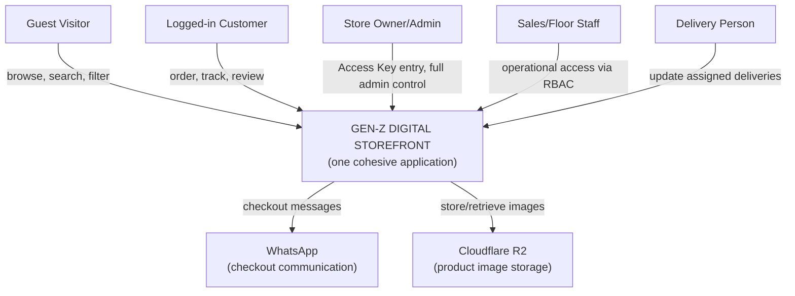
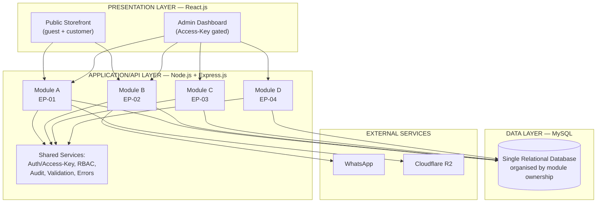
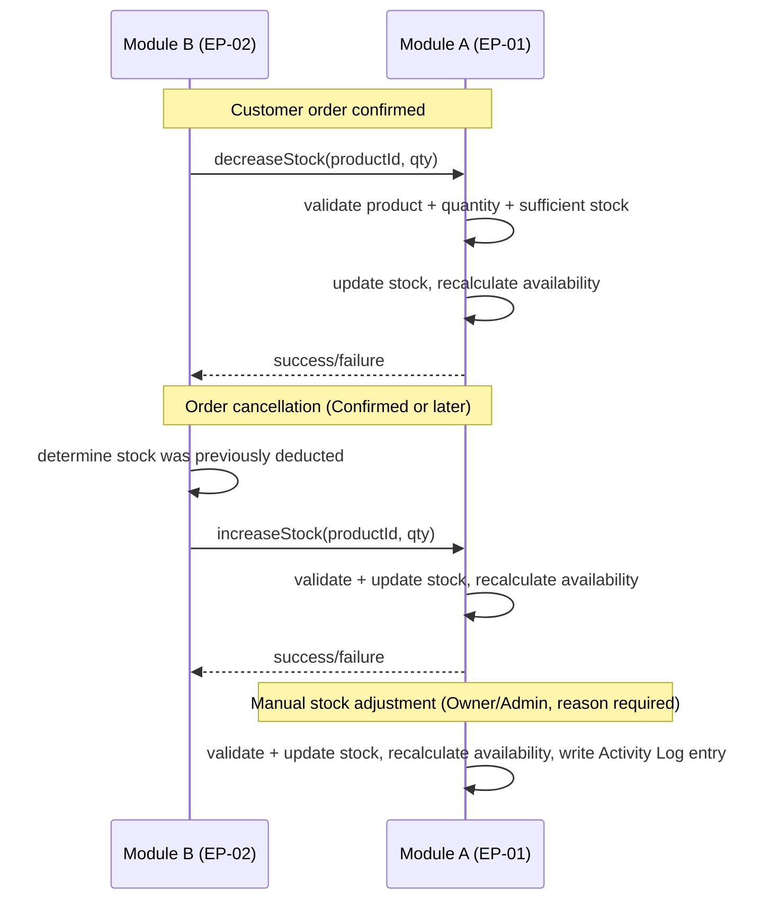
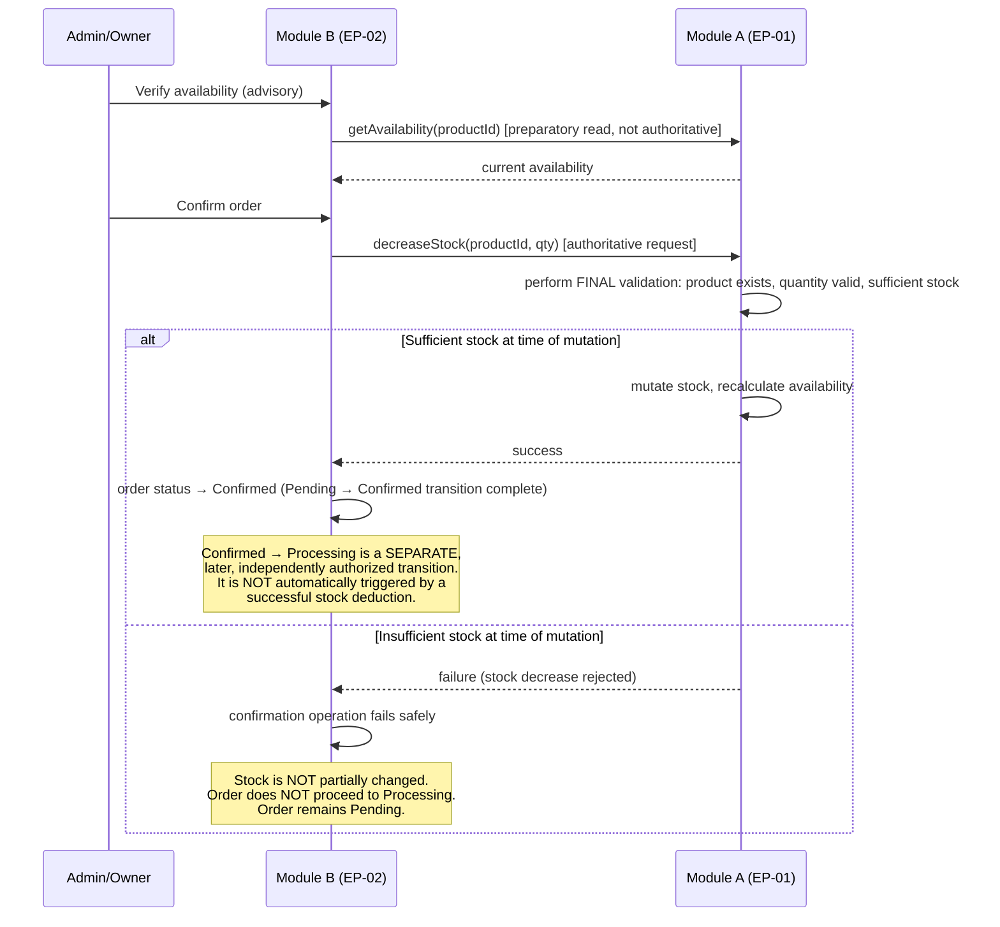
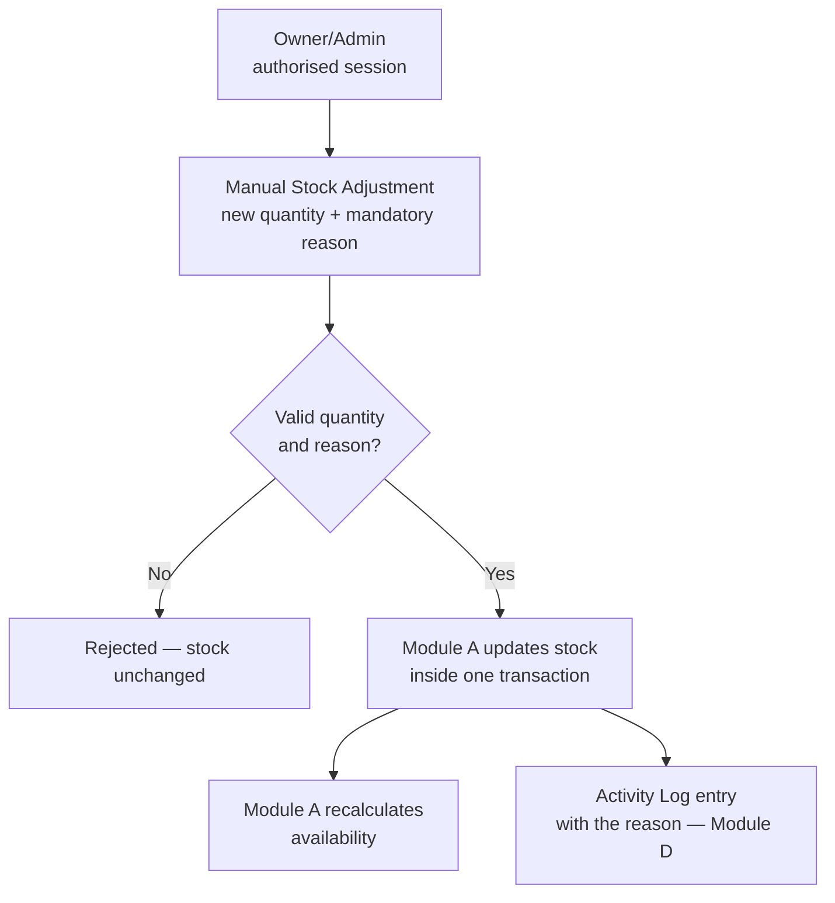
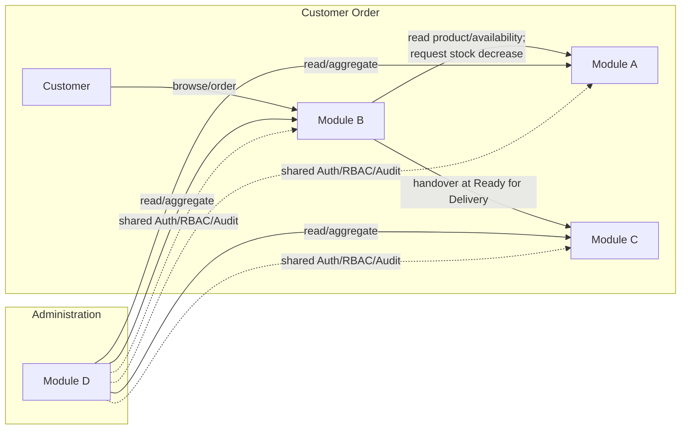

# DETAILED SYSTEM ARCHITECTURE — VERSION 1.2

**Gen-Z Digital Storefront — Men's, Boys' Clothing & Perfume Store**
**Project Group: ISE_WE_0201_58**

> Baseline: *Integrated Business & Architecture Model — Version 2 (Final)*. This document details the internal system architecture that will guide database and API design in the next stage. It is conceptual — no code, database schema, API endpoints, or folder structure are included.
>
> **Version 1.2** applies four small corrections to Version 1.1: (1) a shared Auth/RBAC consumption clarification (no longer applicable — the module it concerned was descoped from the final scope); (2) successful stock deduction completes only Pending → Confirmed, with Confirmed → Processing remaining a separate transition; (3) the duplicate-review-submission rule is now marked OPEN rather than locked; (4) Admin Access Key storage/validation is described as a secure-storage principle without locking a specific hashing mechanism as a business rule.

---

## 1. Architecture Objectives

- Translate the Version 2 business/architecture model into a detailed, implementation-ready conceptual architecture.
- Preserve every locked rule from Version 2 without reinterpretation: the four approved epics (the complete final scope), EP-01's sole Product/Inventory ownership, the locked customer checkout and stock-deduction decisions, and the Admin Access Key flow.
- Provide enough architectural precision (module boundaries, dependencies, data flows, validation points, audit points) that the subsequent database and API design stages do not need to reinterpret business ownership.
- Keep the system as **one cohesive three-tier application** with internal module boundaries, not independently deployed services.

---

## 2. Architectural Principles

1. **Single ownership per business capability.** Each data domain (Product/Inventory, Order, Delivery/Review, Administration) has exactly one owning module; no other module writes to it directly.
2. **Request, don't reach.** Any module needing another module's data either **reads** it (if permitted) or **requests an operation** on it (if a change is needed) — it never mutates another module's data directly.
3. **No circular ownership.** Dependencies flow in one direction per relationship; no two modules mutually own each other's core data.
4. **Locked decisions are architectural constraints, not options.** DEC-02 (login required at checkout) and DEC-04 (stock deducted only at Admin confirmation) are treated as fixed inputs to this architecture, not points of design freedom.
5. **Internal modularity, not microservices.** Modules are logical/organisational boundaries inside one Node.js/Express application and one MySQL database — chosen deliberately so three developers can work in parallel on one cohesive product without the operational overhead of distributed services.
6. **Defer what is genuinely undecided.** Where Version 2 left an item open (Staff entry mechanism, cart persistence, WhatsApp mechanism, rating-display integration), this document preserves that openness rather than silently resolving it.

---

## 3. System Context



**Context boundary:** the system is one application serving five human-facing actor types (Guest, Customer, Owner/Admin, Staff, Delivery Person), and integrates with exactly two external services (WhatsApp, Cloudflare R2). No other external system is introduced.

---

## 4. Three-Tier Architecture



The three tiers remain intact; modules are **internal boundaries within the Application/API layer**, all sharing one database and one deployed backend process — not separate services.

**One shared database does not mean unrestricted cross-module table access.** All four modules persisting to a single MySQL database is a deployment/infrastructure choice, not a licence for any module to read or write another module's tables directly. Modules must interact through their defined conceptual module boundaries/interfaces (Sections 6, 7) regardless of the fact that their data physically resides in the same database. Concretely, and without yet designing the tables themselves:

- Module B (EP-02) does not directly modify Module A's (EP-01) inventory data, even though both persist to the same database.
- Module C (EP-03) does not directly modify Module B's (EP-02) Order data.
- Module D (EP-04) does not take ownership of other modules' business data merely because it displays dashboard summaries drawn from that data.

How this boundary is technically enforced (e.g., through the application layer's service/repository conventions) is an implementation detail for the database/API design stage — this section establishes only the architectural principle, not the mechanism.

---

## 5. Internal Module Architecture

| Module | Epic/Module Reference |
|---|---|
| **Module A** | EP-01 — Product & Catalogue Management |
| **Module B** | EP-02 — Customer & Order Management |
| **Module C** | EP-03 — Delivery Tracking with Review Management |
| **Module D** | EP-04 — Store Administration Management |

Each module is a cohesive internal boundary: its own business logic, its own owned data, and a defined, narrow surface through which other modules may read from or request operations of it.

---

## 6. Module Responsibilities

### Module A — EP-01 Product & Catalogue Management

- **Main responsibilities:** product lifecycle (create/edit/delete), category management, image association (via Cloudflare R2), pricing, stock quantity, availability calculation, product browsing/search/filter support.
- **Owned business data:** Product, Category, Inventory/Stock, Availability status.
- **Business rules:** availability is automatically derived from stock quantity (In Stock / Out of Stock); Module A is the only module permitted to write to Product or Inventory data, regardless of which other module's action triggered the need for a change.
- **Incoming dependencies:** none for its core logic — no other module's failure or delay blocks Module A's own product/catalogue operations.
- **Outgoing dependencies:** Cloudflare R2 (image storage) only.
- **Read operations exposed to others:** `getProduct(productId)`, `getAvailability(productId)`.
- **Write operations exposed to others:** `decreaseStock(productId, qty)`, `increaseStock(productId, qty)` — invoked only by Module B, never performed by it directly. Restocking and corrections are Module A's own manual stock adjustment (revised DEC-05: reason mandatory, audited).
- **Restricted operations:** no other module may write to Product, Category, or Inventory data under any circumstance.
- **External integrations:** Cloudflare R2.

### Module B — EP-02 Customer & Order Management

- **Main responsibilities:** guest/customer catalogue browsing pass-through, cart management, login/registration gate at checkout (DEC-02), WhatsApp checkout message generation, order creation and status transitions up to "Ready for Delivery," customer order history.
- **Owned business data:** Customer account, Cart, Order, Order Item, Order Status History.
- **Business rules:** login/registration required before order creation, not before browsing (DEC-02, locked); stock is not deducted while an order is Pending (DEC-04, locked); stock deduction is requested only at the Pending→Confirmed transition; cancellation of a Confirmed (or later) order requests stock restoration, cancellation of a Pending order does not.
- **Incoming dependencies:** none — no other module dictates Module B's internal order logic.
- **Outgoing dependencies:** Module A (product reference, availability check, stock decrease/increase requests); WhatsApp (checkout message).
- **Read operations exposed to others:** order information relevant to delivery handover and review eligibility, exposed to Module C.
- **Write operations exposed to others:** none — Module B's Order/Cart/Customer data is never written to by another module.
- **Restricted operations:** Module B must never write directly to Product or Inventory data; it may only call Module A's exposed write operations.
- **External integrations:** WhatsApp.

### Module C — EP-03 Delivery Tracking with Review Management

- **Main responsibilities:** delivery assignment, delivery status tracking (Assigned → Picked Up → Out for Delivery → Delivered), customer-facing delivery tracking, review submission, review moderation.
- **Owned business data:** Delivery, Delivery Status History, Review, Moderation Log.
- **Business rules:** delivery responsibility begins only once an order reaches "Ready for Delivery" (handover from Module B); review eligibility requires a Delivered, verified-purchase order; reviews are held Pending Moderation until explicit admin approval.
- **Incoming dependencies:** Module B (order handover at "Ready for Delivery"; order/delivery-completion status for review eligibility).
- **Outgoing dependencies:** none required for Module C's own core logic beyond reading from Module B.
- **Read operations exposed to others:** aggregate rating/review data — may be displayed alongside Module A's product data; exact integration mechanism deferred (Section 23).
- **Write operations exposed to others:** none.
- **Restricted operations:** Module C must never own or write to the main Order entity (Pending/Confirmed/Processing remain Module B's); must never touch Product or Inventory data.
- **External integrations:** none.

### Module D — EP-04 Store Administration Management

- **Main responsibilities:** Owner/Admin Access Key validation, Staff account management, role/permission (RBAC) assignment, unified admin dashboard, store settings, activity/audit logging; also provides the shared Auth/RBAC/Audit implementation consumed by every module.
- **Owned business data:** Staff/Admin User, Role, Permission, Store Settings, Activity Log.
- **Business rules:** Owner/Admin entry is via Access Key only, never username/password; Staff accounts/JWT/RBAC remain in place; every admin-facing operation across every module must pass through the shared authorization check Module D defines.
- **Incoming dependencies:** read-only summary data from Modules A, B, and C for dashboard aggregation.
- **Outgoing dependencies:** none that mutate another module's data.
- **Read operations exposed to others:** none of substantive business value (RBAC/session validation is a cross-cutting check, not a "read" in the business-data sense).
- **Write operations exposed to others:** none.
- **Restricted operations:** Module D must not take ownership of the business logic it summarises on its dashboard (e.g., it displays order counts but does not decide what counts as "pending").
- **External integrations:** none.

---

## 7. Module Dependency Matrix

| From ↓ / To → | Module A (EP-01) | Module B (EP-02) | Module C (EP-03) | Module D (EP-04) |
|---|---|---|---|---|
| **Module A** | Owns | — | — | — |
| **Module B** | Reads + Requests operation | Owns | — | — |
| **Module C** | *(read, for rating display — mechanism TBD)* | Reads | Owns | — |
| **Module D** | Reads (dashboard) | Reads (dashboard) | Reads (dashboard) | Owns |

**Legend:** *Owns* = exclusive read/write authority over business data. *Reads* = read-only access to another module's business data. *Requests operation from* = asks the owning module to perform a specific, narrow mutation on its behalf. *Does not have access to* = no interaction defined or permitted. This matrix intentionally captures **business-data ownership and dependency only** — Module D's cross-cutting Auth/RBAC/Audit capability is addressed separately immediately below, precisely so it is not mistaken for a business-data relationship.

**No circular ownership exists:** Module A has no outgoing *business-data* dependency on any other module for its core logic; Module B depends one-directionally on Module A for product/availability reads and stock operations; Module C depends one-directionally on Module B for order information/handover; Module D depends one-directionally (read-only) on all others for dashboard aggregation.

**Auth/RBAC/Audit is explicitly excluded from this business-ownership matrix.** Module D's Auth/RBAC/Audit capability is a **cross-cutting architectural dependency**, not a business-data dependency, and is deliberately kept out of the table above to avoid implying a circular relationship. Every module — including Module D itself — consumes this shared capability when handling an authenticated/authorized request, but this consumption never alters who owns business data or who may request an operation from whom. Concretely, this means relationships such as "Module A → Module D → Module A" or "Module B → Module D → Module B" do **not** exist as business dependencies: Module A never depends on Module D for its product/inventory logic, and Module D never depends back on Module A for anything beyond a read-only dashboard summary. The business ownership/dependency directions remain exactly as stated above and in Section 6:

- Module B (EP-02) → Module A (EP-01), for permitted product/availability reads and stock operation requests
- Module C (EP-03) → Module B (EP-02), for order information/handover
- Module D (EP-04) → all other modules, for read-only administrative/dashboard aggregation only

Auth/RBAC/Audit sits beneath all of these as infrastructure, not as a node within them.

---

## 8. Inventory Architecture

**Conceptual inventory subsystem, entirely inside Module A (EP-01):**

| Concept | Description |
|---|---|
| **Product** | The catalogue item; holds a reference to its current stock quantity. |
| **Product Availability** | Derived value (In Stock / Out of Stock), recalculated automatically whenever stock quantity changes — one rule, one location. |
| **Current Stock** | The authoritative quantity on hand, mutated only inside Module A. |
| **Stock Increase** | Mutation increasing quantity — triggered by a Module B request (Confirmed-order cancellation restoration) or by Module A's own manual stock adjustment (restocking). |
| **Stock Decrease** | Mutation decreasing quantity — triggered by a Module B request (order confirmation). |
| **Stock Restoration** | A specific case of Stock Increase, applied only when reversing a previously applied Stock Decrease (Confirmed-order cancellation). |
| **Stock Validation** | Checks performed before any mutation — product exists, quantity is a valid positive number, and (for decreases) sufficient stock exists. |
| **Stock Adjustment** | Module A's own manual path for restocking and correction — the normal way to increase or correct stock (revised DEC-05). A reason is mandatory and every adjustment is audited. |
| **Stock Audit Information** | Module A owns the **business context/reason** for each stock mutation — what changed, by how much, and why (order confirmation, cancellation restoration, or manual adjustment). This context is reported into Module D's central Activity/Audit Log, which remains the single authoritative administrative audit trail. Module A does **not** maintain a second, independent administrative audit system — it is the *source* of the reason for a stock-related audit entry, not a second *owner* of audit records. |

**How events reach Module A:**



**No module other than Module A ever writes to Inventory/Stock data.** Module B only ever calls the two exposed operations (`decreaseStock`, `increaseStock`); all validation, mutation, and availability recalculation happens exclusively inside Module A.

---

## 9. Customer & Order Architecture

**Detailed conceptual order lifecycle:**

| State | Owning Module | Who Triggers the Transition | Validation Before Transition | Stock Effect | Delivery Begins? | Review Eligible? |
|---|---|---|---|---|---|---|
| *(pre-order)* Cart | Module B | Customer/Guest | — | None | No | No |
| **Pending** | Module B | Customer (at checkout, after login/register per DEC-02) | Cart non-empty, customer authenticated, products still available | None (locked, DEC-04) | No | No |
| **Confirmed** | Module B | Admin/Owner (or authorised Staff, per RBAC) | Order is currently Pending; availability is checked against Module A as an advisory/preparatory step — the authoritative validation happens inside Module A at the moment `decreaseStock()` is actually requested (see Section 9.1 below) | **Stock decreased** (Module B requests Module A) | No | No |
| **Processing** | Module B | Admin/Owner/Staff | Order is currently Confirmed | None | No | No |
| **Ready for Delivery** | Module B | Admin/Owner/Staff | Order is currently Processing | None | **Handover to Module C occurs here** | No |
| **Assigned → Picked Up → Out for Delivery** | Module C | Admin/Owner (assignment); Delivery Person (status updates) | Valid delivery person assignment; sequential status progression | None | Yes (already begun) | No |
| **Delivered** | Module C | Delivery Person | Prior status was "Out for Delivery" | None | Delivery complete | **Yes — review eligibility unlocked** |

**Cancellation handling:**

| Cancellation from state | Stock effect | Who can trigger |
|---|---|---|
| Pending → Cancelled | None (nothing was deducted) | **OPEN** — not yet confirmed which actor(s) may trigger this (see Section 23) |
| Confirmed or later → Cancelled | Module B requests Module A: `increaseStock()` (restoration) | **OPEN** — not yet confirmed which actor(s) may trigger this (see Section 23) |

**The stock *effects* of cancellation are locked** (no restoration for Pending, restoration for Confirmed-or-later) — only the question of **who is authorized to trigger** a cancellation at each stage remains an open architecture item, not yet resolved into a final business rule.

Module B owns every state from Cart through "Ready for Delivery." Module C owns every state from "Assigned" onward. No additional, unnecessary states are introduced beyond what Version 2 and the original ISPM/EA documents already define.

### 9.1 Order Confirmation — Authoritative Stock Validation and Failure Handling

The Pending → Confirmed transition involves two distinct checks that must not be conflated:



**Key architectural clarification:** the availability check Admin performs before confirming (and any earlier availability read by Module B) is **advisory/preparatory only** — it reduces the likelihood of a failed confirmation but does not itself authorize a stock change. The **only authoritative stock validation** happens inside Module A, at the exact moment `decreaseStock()` is requested. If Module A determines sufficient stock is no longer available at that moment (e.g., another order was confirmed first), the request is rejected: stock is not partially mutated, the order does not advance past Pending, and the order remains Pending. No new order state (such as a "Confirmation Failed" status) is introduced — the order simply stays Pending, and how the business subsequently handles that outcome (e.g., notifying Admin) is left to a separately defined business rule if one is needed later.

**A successful `decreaseStock()` completes only the Pending → Confirmed transition.** It does not imply, trigger, or automatically cause the subsequent Confirmed → Processing transition. Confirmed → Processing remains a separate, independently authorized order-status transition (per Section 9's lifecycle table), performed at a later point by Admin/Owner/Staff — stock deduction and the Processing transition are two distinct events that happen to be adjacent in the overall lifecycle, not one combined operation.

---

## 10. Stock Replenishment Architecture



**Rules applied (revised DEC-05, accepted):**
- Manual stock adjustment is the normal way to increase or correct stock in the final system.
- It is performed only through Module A's own ownership, by an authorised administrative session.
- A reason is mandatory; every adjustment is written to Module D's central Activity Log.
- The resulting availability is recalculated by the same single rule used for every other stock change.

---

## 11. Delivery Architecture

**Module C after the Module B handover:**

```
Ready for Delivery (Module B → Module C handover)
        ↓
Delivery Created (Module C, referencing the order)
        ↓
Delivery Assigned (Admin/Owner assigns a Delivery Person)
        ↓
Assigned → Picked Up → Out for Delivery → Delivered
   (Delivery Person updates status at each stage)
        ↓
Delivery Completion (status = Delivered)
        ↓
Review Eligibility Trigger (Module C checks: order delivered + verified purchase)
```

- **Delivery creation:** occurs the moment an order transitions to "Ready for Delivery" — Module C reads the necessary order/customer/address information from Module B at this point (does not duplicate or take ownership of it).
- **Delivery assignment:** performed by Admin/Owner (or authorised Staff, per RBAC); assigns a Delivery Person to the delivery record.
- **Delivery status ownership:** exclusively Module C's — no other module writes to delivery status.
- **Delivery Person permissions:** may view and update only their own assigned deliveries; no access to administration or other deliveries.
- **Order information required by Module C:** order items, delivery address, customer identity — read from Module B, not copied into a second authoritative record.
- **Delivery completion:** the "Delivered" status is the terminal state of this flow and the trigger for review eligibility.
- **Review eligibility trigger:** Module C determines eligibility internally (delivered + verified purchase); it does not require Module B to push this decision.

**Module C does not become the owner of the main Order entity** — Pending, Confirmed, Processing remain exclusively Module B's; Module C's ownership begins strictly at "Ready for Delivery."

---

## 12. Review Architecture

| Concept | Description |
|---|---|
| **Review eligibility** | Determined by Module C: the order tied to the product must have reached "Delivered," and the reviewer must be the verified purchaser. |
| **Review submission** | Customer submits a star rating and written review, owned entirely by Module C. |
| **Review moderation** | Submitted reviews default to "Pending Moderation"; Admin/Owner approves, rejects, or deletes; all actions logged. |
| **Review visibility** | Only Approved reviews are publicly visible; Pending/Rejected reviews are not shown to other customers. |
| **Rating aggregation** | Module C calculates the aggregate rating from Approved reviews only, recalculated on each new approval. |

**Products belong to Module A; Reviews belong to Module C.** The technical mechanism for combining product data and rating/review data on the customer-facing product detail page is **not decided at this architecture stage** — this remains an open item (Section 23), consistent with Version 2's instruction not to lock a frontend-only or backend-only approach prematurely.

---

## 13. Administration Architecture

**Module D responsibilities, detailed:**

- **Owner/Admin access:** the Access Key flow (Section 14) is Module D's entry-point responsibility; Module D owns the validation logic and dashboard that follows successful validation.
- **Admin Access Key validation:** server-side check against a securely stored key value; issues a session/token on success. The key is never stored or compared in plain text and never exposed in client-visible code — the specific storage/validation mechanism (e.g., a particular hashing approach) is not locked as a business rule at this stage and is deferred to database/security design (see Section 23).
- **Staff accounts:** Module D owns Staff/Admin User records, distinct from the Owner/Admin's Access Key mechanism.
- **JWT:** retained as part of the Staff authentication model, per Version 2's explicit preservation instruction; not extended to Owner/Admin entry (which uses the Access Key instead).
- **RBAC:** Module D owns Role and Permission definitions and assignment; the resulting authorization rules are enforced as a shared, cross-cutting check consumed by every module (Section 15).
- **Store settings:** Module D owns store-wide configuration (name, contact info, WhatsApp number).
- **Activity/audit logs:** Module D owns the audit log; every module writes audit entries into it (Section 19) but does not own the log itself.
- **Dashboard aggregation:** Module D reads summary data (read-only) from Modules A, B, and C to populate its unified dashboard, without taking ownership of the underlying business logic.

**Preserved exactly, unchanged:** the Owner/Admin Access Key flow (Footer → Small Shop Logo → Key input → server-side validation → Dashboard/Denied); no username/password page for Owner/Admin; the exact Staff entry mechanism is not invented here.

---

## 14. Authentication & Authorization

**Conceptual distinctions (no implementation code):**

| Term | Meaning in this architecture |
|---|---|
| **Authentication** | Confirming *who* is interacting with the system — a customer's login, an Owner/Admin's Access Key entry, or a Staff member's (not-yet-defined) sign-in. |
| **Authorization** | Confirming *what* an already-authenticated identity is allowed to do — enforced uniformly by the shared middleware Module D defines. |
| **Role** | A named category of user (Owner/Admin, Sales/Floor Staff, Delivery Person, Customer) that groups a set of permissions. |
| **Permission** | A specific allowed action (e.g., "manage products," "moderate review") assignable to a role. |
| **Access Key** | The specific authentication mechanism used exclusively for Owner/Admin entry — a single shared secret validated server-side, distinct from a role/permission concept; it authenticates, it does not itself carry granular permissions (the Owner/Admin's full authority follows from their role once authenticated). |

**Boundaries:**

- **Customer authentication:** required for checkout/order creation (DEC-02) and for account-specific functionality (order history, profile, reviews) — not for browsing.
- **Owner/Admin authentication:** the Access Key flow exclusively; no username/password page exists for this entry point.
- **Staff authentication:** the existing account/JWT/RBAC model is retained; the exact entry mechanism (how a Staff member initially signs in, as distinct from the Owner/Admin's key) remains an open item.

---

## 15. RBAC Architecture

**Conceptual permission hierarchy (business-level, not implementation-specific permission IDs):**

| Role | Scope of Authority |
|---|---|
| **Owner/Admin** | Full administrative authority across all modules, consistent with the business model — product/catalogue and stock, orders, delivery, review moderation, staff/role management, store settings, audit visibility. |
| **Sales/Floor Staff** | Operational order access and only the specific functions assigned to them; no unrestricted administration; no direct inventory mutation outside authorised system functions. |
| **Delivery Person** | Access limited to their own assigned delivery operations (view, update status); no administrative access. |
| **Customer** | Own account, own cart, own orders, own delivery tracking, and review submission where eligible; no access to any other customer's data or any administrative function. |

This hierarchy is expressed at the business level; translating it into concrete permission identifiers, database role tables, or middleware configuration is deferred to the database/API design stage.

**Note (added 2026-09-08):** the Owner/Admin row's grant of full authority over review moderation is fully satisfiable at the database level, without requiring Owner/Admin to hold a Staff/Admin User identity — see the Actor Identity Decision (Physical Schema V1.0 §5b; Logical Database Design V1.1 §C4). This note closes an inconsistency that existed between this table's grant and the database layer's original Staff-only actor references; it does not change this table's content, which was correct as originally stated.

---

## 16. Cross-Module Communication



**Legend applied throughout:**
- **Solid arrow "read/request":** Business-data read or a specific requested operation (e.g., `decreaseStock`).
- **Dotted arrow "shared service":** cross-cutting Auth/RBAC/Audit consumption, not business-data ownership or mutation.
- **Ownership** is never depicted as an arrow — it is intrinsic to the module box itself (Section 6/7).

---

## 17. Conceptual Data Flows

### A. Customer Ordering
```
Guest/Customer → browse (Module A read) → add to cart (Module B)
→ login/register (Module B, DEC-02) → checkout → WhatsApp message generated
→ Order created, status=Pending (Module B) — no stock effect
```

### B. Stock Deduction
```
Admin verifies order (reads Module A availability)
→ Admin confirms order (Module B, status → Confirmed)
→ Module B requests Module A: decreaseStock(productId, qty)
→ Module A validates, mutates stock, recalculates availability
→ Module B proceeds to Processing
```

### C. Order Cancellation
```
Cancellation requested
→ Module B checks current status
→ IF Pending: no further action (no stock was deducted)
→ IF Confirmed/later: Module B requests Module A: increaseStock(productId, qty)
→ Module A validates, mutates stock, recalculates availability
```

### D. Stock Replenishment (Manual Adjustment)
```
Owner/Admin enters new quantity + mandatory reason (Module A)
→ Module A validates quantity and reason
→ Module A updates stock in one transaction, recalculates availability
→ Module A reports the adjustment and its reason to Module D's Activity Log
```

### E. Delivery Handover
```
Order status reaches Ready for Delivery (Module B)
→ Module B exposes order/customer/address info
→ Module C creates a Delivery record referencing the order
→ Module C owns all subsequent status transitions
```

### F. Review Submission
```
Order status = Delivered (Module C)
→ Module C checks eligibility (delivered + verified purchaser)
→ Customer submits rating + review (Module C)
→ Review stored as Pending Moderation
→ Admin approves/rejects (Module C, logged to Module D's audit log)
→ IF approved: publicly visible, aggregate rating recalculated
```

### G. Admin Dashboard Aggregation
```
Admin/Owner authenticated (Module D, via Access Key)
→ Module D requests read-only summaries from Module A (product/stock counts),
  Module B (order counts/statuses), Module C (delivery/review counts)
→ Module D composes and displays the unified dashboard
→ No business logic is re-implemented inside Module D — only display of
  what the owning modules report
```

---

## 18. Validation Boundaries

| Operation | Validations (conceptual) |
|---|---|
| **Order confirmation** (Module B) | Is the order currently Pending? Is sufficient stock available (checked against Module A)? Has the order already been processed/confirmed previously? |
| **Stock decrease** (Module A) | Is the product valid/exists? Is the requested quantity a valid positive number? Is sufficient stock currently available? |
| **Stock increase** (Module A) | Is the product valid/exists? Is the requested quantity a valid positive number? Is the request coming from an authorised source (Module B restoration)? |
| **Manual stock adjustment** (Module A) | Is the session authorised to manage products? Is the new quantity a valid non-negative whole number? Has a non-empty reason been supplied? |
| **Review submission** (Module C) | Was the underlying order Delivered? Is the submitting customer the verified purchaser? **OPEN** — whether a customer may submit only one review per product/order, or multiple, is not established in the approved business model and is not assumed here; see Section 23. |
| **Admin Access Key validation** (Module D) | Does the submitted key securely match the stored key value (via whatever storage/validation mechanism is chosen at the security-design stage)? Has the rate-limit/lockout threshold been exceeded? |

All validation described here is conceptual — the specific rules and error responses are defined precisely, but their technical implementation (exception types, HTTP status codes, etc.) is deferred to API design.

---

## 19. Audit Architecture

**Single audit ownership:** Module D (EP-04) owns the one central Activity/Audit Log for the entire application — this is the single authoritative administrative record. Other modules, most notably Module A for stock mutations, may own the **business context/reason** behind a specific action (Section 8), but that context is reported *into* Module D's central log, not stored in a second, parallel audit system. No module maintains its own independent administrative audit trail.

**Operations that should generate an audit record (owned/stored by Module D, written by the originating module):**

- Admin Access Key access attempts (successful and failed)
- Product changes (create/edit/delete) — Module A
- Stock adjustments (manual restocking/corrections, with reason, per revised DEC-05) — Module A
- Order status changes — Module B
- Order cancellation — Module B
- Staff account changes — Module D
- Role/permission changes — Module D
- Store setting changes — Module D
- Review moderation actions (approve/reject/delete) — Module C

Every entry conceptually carries: actor, action, timestamp, and the affected entity — consistent with the shared Audit service described in Section 6 (Module D) and Section 16. The specific audit table design is deferred to the database design stage.

---

## 20. External Service Integration

| Service | Integrating Module | Purpose | Notes |
|---|---|---|---|
| **WhatsApp** | Module B | Pre-filled checkout message generation | Exact mechanism (client-side link vs. formal Business API) remains an open item (Section 23) |
| **Cloudflare R2** | Module A | Product image storage and retrieval | Used only for product images; no other module stores files here |

No other external service is introduced by this architecture.

---

## 21. Architecture Diagrams

*(Diagrams 3, 4, 8, and 9 already provided in full in Sections 3, 8/9, 14, and 4 respectively; consolidated list below for reference.)*

1. **System Context Diagram** — Section 3.
2. **High-Level Component Diagram** — Section 4 (Three-Tier Architecture diagram doubles as the component overview).
3. **Module Dependency Diagram** — Section 7 (matrix) / Section 16 (visual).
4. **Customer Order Flow** — Section 9 (table) / Section 17.A–C (data flow).
5. **Inventory Interaction Flow** — Section 8 (sequence diagram).
6. **Stock Replenishment Flow** — Section 10 (flowchart).
7. **Delivery Flow** — Section 11.
8. **Authentication/RBAC Boundary** — Section 14/15.
9. **Three-Tier Architecture** — Section 4.

All diagrams use Mermaid or structured text/tables, and none contain code for the application itself.

---

## 22. Traceability Matrix

| Business Capability | Epic/Module | Responsibility | Major Business Rule | Cross-Module Dependency |
|---|---|---|---|---|
| Product & Catalogue Browsing | EP-01 (Module A) | Product/Category CRUD, availability | Availability derived from stock automatically | None (foundational) |
| Inventory Control | EP-01 (Module A) | Sole stock owner/mutator | Only Module A ever writes stock | Consumed by Module B |
| Stock Replenishment | EP-01 (Module A) | Manual stock adjustment | Reason mandatory; audited (revised DEC-05) | Audit entry written to Module D |
| Customer Ordering | EP-02 (Module B) | Cart, checkout, order lifecycle to handover | Login required at checkout (DEC-02) | Depends on Module A (product/stock) |
| Stock Deduction Trigger | EP-02 (Module B) → EP-01 (Module A) | Requesting stock decrease | Only at Admin confirmation (DEC-04) | Module B requests, Module A performs |
| Order Cancellation | EP-02 (Module B) → EP-01 (Module A) | Requesting stock restoration | Only if previously deducted | Module B requests, Module A performs |
| Delivery Tracking | EP-03 (Module C) | Delivery lifecycle post-handover | Begins strictly at Ready for Delivery | Depends on Module B (handover, order info) |
| Review & Moderation | EP-03 (Module C) | Review submission, moderation, rating | Verified-purchase eligibility; Pending Moderation gate | Depends on Module C's own delivery-completion check |
| Store Administration | EP-04 (Module D) | Staff, RBAC, settings, audit, dashboard | Owner/Admin via Access Key only | Reads summaries from all other modules |
| Shared Auth/RBAC/Audit | EP-04 (Module D) | Cross-cutting enforcement | Uniform check across all modules | Consumed by Modules A, B, C |

All four approved epics are represented; no capability is traced to more than one owning module.

---

## 23. Open Architecture Items

Preserved exactly as open, per Version 2 and this task's instructions — not resolved here:

- **Exact Staff authentication entry mechanism** (distinct from the Owner/Admin Access Key).
- **Guest cart persistence through the login/register step** (whether a guest-built cart survives login or must be rebuilt).
- **Exact WhatsApp integration mechanism** (simple client-side pre-filled link vs. a formal WhatsApp Business API integration).
- **Exact technical mechanism for combining Module A product data with Module C rating/review data** on the product detail page (frontend composition, backend read, or another approach).
- **Who may trigger order cancellation, and at what stages** (carried forward from Version 1, reaffirmed unresolved here). The stock *effects* of cancellation are locked (Section 9): no restoration for Pending cancellation, restoration for Confirmed-or-later cancellation. What is **not** decided is which actor(s) — Customer self-service, Admin/Owner only, or both depending on stage — may initiate the cancellation itself. This affects which operations Module B exposes and to whom, and should be confirmed before API design.
- **Whether a customer may submit more than one review per product/order, or only one** (review-frequency/duplicate-review rule). This is not established anywhere in the approved business model (Version 2) and is not assumed here — Module C's review-submission validation (Section 18) is written to reflect this as open rather than silently locking a "no duplicates" rule.
- **The specific technical mechanism for secure server-side storage/validation of the Admin Access Key** (e.g., a particular hashing algorithm) is not formally locked in the approved architecture. Section 13 describes only the principle — that the key is stored and validated securely server-side, never in plain text or client-visible form — without committing to a specific hashing mechanism as a business rule; the exact mechanism is deferred to database/security design.

---

## 24. Consistency Verification

| Check | Result |
|---|---|
| No new epic was created | ✅ Confirmed — only Modules A–D (the four epics) exist |
| EP-01 remains sole Product/Inventory owner | ✅ Confirmed — Sections 6, 7, 8, 10 |
| EP-02 cannot directly modify inventory | ✅ Confirmed — Module B only calls Module A's exposed operations (Sections 6, 8, 9) |
| Pending orders do not reduce stock | ✅ Confirmed — Sections 8, 9, 17.A |
| Admin confirmation triggers stock deduction | ✅ Confirmed — Sections 8, 9, 17.B |
| Confirmed/later cancellation restores deducted stock | ✅ Confirmed — Sections 8, 9, 17.C |
| Guest browsing remains available | ✅ Confirmed — Section 9 (Cart row), Section 17.A |
| Login is required before checkout/order creation | ✅ Confirmed — Sections 9, 14, 17.A |
| Owner/Admin uses Admin Access Key | ✅ Confirmed — Sections 13, 14 |
| No Owner/Admin username/password page is introduced | ✅ Confirmed — Sections 13, 14 |
| Staff accounts/RBAC remain | ✅ Confirmed — Sections 13, 14, 15 |
| EP-03 begins delivery responsibility at Ready for Delivery | ✅ Confirmed — Sections 9, 11 |
| EP-03 does not own the Order entity | ✅ Confirmed — Sections 6, 9, 11 |
| Three-tier architecture remains intact | ✅ Confirmed — Section 4 |
| No unnecessary microservices are introduced | ✅ Confirmed — Section 4 explicitly states modules are internal boundaries within one application |

No inconsistency with Version 2 was found.

---

## 25. Final Architecture Summary

This Detailed System Architecture translates the Version 2 business model into four internal modules — Module A (EP-01) as the sole Product/Inventory authority (including audited manual stock adjustment for restocking), Module B (EP-02) owning the order lifecycle through handover, Module C (EP-03) owning delivery and review from handover onward, and Module D (EP-04) owning administration and providing the shared Auth/RBAC/Audit layer — all operating within one three-tier application (React.js / Node.js+Express.js / MySQL) with two external integrations (WhatsApp, Cloudflare R2). Every dependency flows in one direction, with no circular ownership: Module B requests operations of Module A but never writes to its data; Module C reads from Module B but owns its own delivery/review domain outright; Module D reads from everyone for dashboard purposes while supplying the cross-cutting authorization layer everyone depends on. The locked Version 2 decisions — guest browsing with login required only at checkout (DEC-02), and stock deduction occurring only at Admin confirmation (DEC-04) — are embedded directly into Module B's and Module A's responsibilities rather than treated as configurable options. Five items remain genuinely open (Section 23) and are carried forward for resolution before or during database/API design, which can now proceed using this document as its ownership and dependency reference without needing to reinterpret the business model.

---

*No database schema, API endpoints, folder structure, or code has been created in this task. This document is the detailed conceptual system architecture, ready to inform (but not yet constitute) database and API design.*

---

## CHANGE SUMMARY — Version 1 → Version 1.1

| # | Correction | Section(s) Affected | What Changed |
|---|---|---|---|
| 1 | Remove Static Content from EP-03 | Section 6 (Module C) | Removed "static content management" and "Static Content" from Module C's responsibilities and owned data — not supported by Version 2. |
| 2 | Remove Tag Management from EP-01 | Section 6 (Module A) | Changed "category/tag management" to "category management"; kept the responsibility list aligned strictly to Version 2's stated EP-01 scope. |
| 3 | *(Historical correction to a since-descoped section)* | — | No longer applicable to the final four-epic scope. |
| 4 | *(Historical correction to a since-descoped section)* | — | No longer applicable to the final four-epic scope. |
| 5 | Clarify stock-deduction failure handling | Section 9 (new subsection 9.1) | Added a detailed sequence diagram and explanation distinguishing the advisory pre-confirmation availability check from Module A's authoritative validation at the moment of `decreaseStock()`; clarified that a rejected request leaves stock unchanged and the order remains Pending, with no new order state introduced. |
| 6 | Clarify audit ownership | Section 8 (Inventory Architecture table), Section 19 | Clarified that Module A owns only the *business context/reason* for stock mutations, which is reported into Module D's single central Activity/Audit Log; explicitly stated no module maintains a second, independent administrative audit system. |
| 7 | Clarify cross-cutting Auth/RBAC/Audit is not a circular dependency | Section 7 | Removed the "provides shared Auth/RBAC/Audit" annotation from the business-ownership matrix cell; added an explicit explanation that Auth/RBAC/Audit is a cross-cutting dependency, not a business-data dependency, and does not create relationships like "Module A → Module D → Module A." |
| 8 | Clarify shared-database does not mean unrestricted cross-module access | Section 4 | Added an explicit paragraph stating that one shared MySQL database is a deployment choice, not a licence for direct cross-module table access, with the four examples specified in the correction request. |
| 9 | Keep order-cancellation trigger open | Section 9 (cancellation table), Section 23 | Changed the cancellation table's "Who can trigger" column from an asserted answer (Admin/Owner) to explicitly "OPEN — not yet confirmed"; softened Section 23's phrasing so it no longer implies a leaning answer, while keeping the stock-effect rules (locked) clearly separate from the actor question (open). |
| 10 | Preserve all locked decisions | Throughout | Verified against the full checklist in the correction request — no locked decision was altered; see Section 24 (Consistency Verification, unchanged from Version 1 and re-confirmed applicable to Version 1.1). |

No section was rewritten beyond what these ten corrections required. All Mermaid diagrams, tables, and prose not listed above remain unchanged from Version 1.
