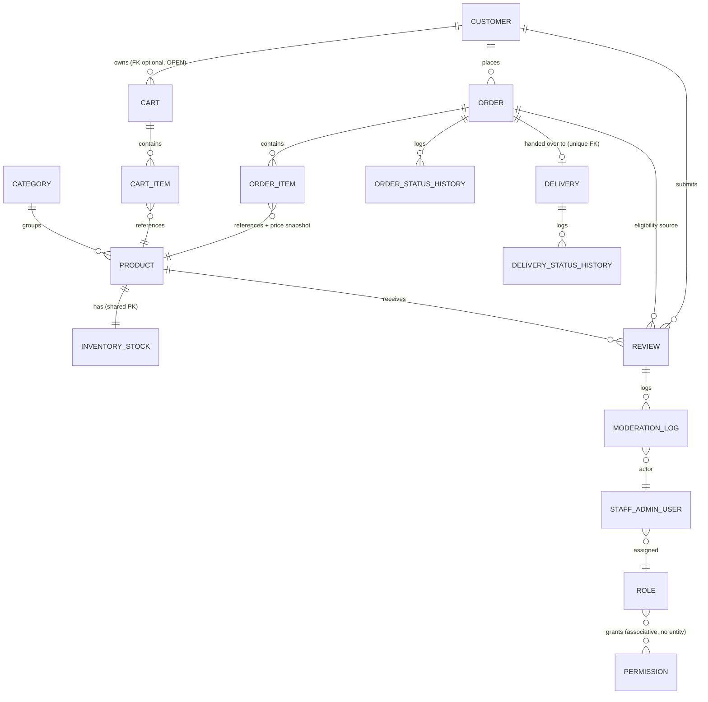
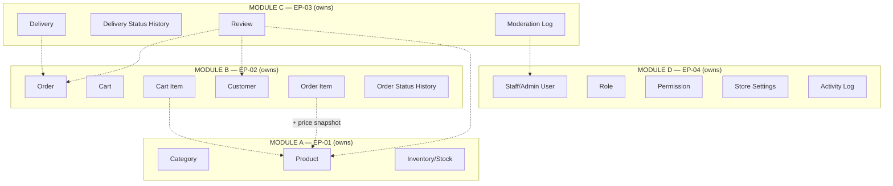

# LOGICAL DATABASE DESIGN — VERSION 1.1

**Gen-Z Digital Storefront — Men's, Boys' Clothing & Perfume Store**
**Project Group: ISE_WE_0201_58**

> Baseline: *Detailed Database Architecture — Version 1.1* (accepted conceptual baseline), which itself derives from *Detailed System Architecture V1.2* and *Integrated Business & Architecture Model V2*. This document transforms the accepted conceptual model (18 entities across EP-01–EP-04 in the final scope) into a precise **logical relational design** — primary keys, foreign keys, nullability, candidate keys, and business constraints — expressed independently of any physical MySQL syntax. **No SQL, DDL, API endpoints, controllers, services, repositories, or folder structure are included.** No OPEN decision from Database Architecture V1.1 is resolved here; each is carried forward and explicitly marked.
>
> **Version 1.1** applies four corrections to Version 1: (1) a relationship correction to a since-descoped section (no longer applicable); (2) Product's `ImageReference` attribute is explicitly reframed as an unresolved logical-to-physical mapping detail rather than a claimed-1NF single value, with no new entity added; (3) Customer `ContactInfo` uniqueness has been removed as an invented constraint; (4) the Delivery Person identity ambiguity is preserved as a structural point for physical/API design, not resolved here. The final four-epic scope contains 18 entities.

---

## 0. Notation Used Throughout

| Symbol/Term | Meaning |
|---|---|
| **PK** | Primary Key |
| **FK** | Foreign Key (cross-entity reference) |
| **Required** | Mandatory (NOT NULL) attribute |
| **Optional** | Nullable attribute |
| **Derived** | Computed from other data, not independently stored as a source of truth (may be cached/materialized later, but is not authoritative on its own) |
| **Snapshot** | A value intentionally copied and frozen at a point in time, distinct from the live source it was copied from |
| **Status/Lifecycle** | An enumerated, finite-state attribute governing an entity's lifecycle |
| **Candidate Key** | An attribute or attribute-set that could uniquely identify a row, in addition to the PK |
| **OPEN** | A decision explicitly left unresolved in Database Architecture V1.1 — not resolved by this document |

---

## MODULE A — EP-01 Product & Catalogue Management

### A1. Category

| Field | Detail |
|---|---|
| **Purpose** | Groups Products for browsing/filtering. |
| **PK** | `CategoryID` |
| **Attributes** | `Name` (Required), `Description` (Optional) |
| **FK** | None |
| **Relationships** | 1 : M → Product |
| **Candidate Key** | `Name` (Required, unique — two categories should not share an identical name) |
| **Business Constraints** | None beyond name uniqueness. |
| **Ownership Module** | A (EP-01) |
| **Cross-Module Reference Rules** | Not referenced by any other module directly; Product references it. |

### A2. Product

| Field | Detail |
|---|---|
| **Purpose** | The single source of product identity — sellable catalogue item. |
| **PK** | `ProductID` |
| **Attributes** | `Name` (Required), `Description` (Optional), `Price` (Required), `ImageReference` (Optional — **see "Image Reference Representation" note below; not claimed to satisfy 1NF as currently described**), `Status` (Status/Lifecycle: Active / Discontinued — deletion behaviour beyond this is not established, see Section "Additional Notes") |
| **FK** | `CategoryID` (Required) → Category |
| **Relationships** | M : 1 → Category; 1 : 1 → Inventory/Stock; 1 : M → Cart Item, Order Item, Review (all as the *referenced* side) |
| **Candidate Key** | None established beyond `ProductID` — no SKU or similar business key is defined in the source documents; not invented here. |
| **Business Constraints** | `Price` must be a positive value. Product is never duplicated by any other module — every cross-module reference below points back to this single row. |
| **Ownership Module** | A (EP-01) — sole owner; no other module may write to this entity. |
| **Cross-Module Reference Rules** | Referenced (read-only) by: Cart Item (B), Order Item (B), Review (C). None of these referencing entities may modify Product. |

> **Image Reference Representation — resolved approach for this revision.** Version 1 described `ImageReference` as "conceptually one-or-more references," which cannot satisfy 1NF as a single scalar attribute. Two options were available: (a) introduce a separate `ProductImage` entity, which would increase the approved entity count; or (b) keep the approved entity model intact and explicitly acknowledge the multiplicity question as unresolved at the logical level. **Option (b) is adopted.** `ImageReference` is retained as a single conceptual attribute on Product, and this document explicitly does **not** claim it satisfies strict 1NF as currently described — how one or more image references are actually represented (a single value, a delimited list, or a separate table) is an **unresolved logical-to-physical mapping detail**, deferred to Physical Database Schema Design, not decided here. This preserves the approved conceptual entity model exactly, per the instruction not to silently increase the entity count.

### A3. Inventory/Stock

| Field | Detail |
|---|---|
| **Purpose** | The single source of stock truth for a Product. |
| **PK** | `ProductID` (shared primary key with Product, reflecting the 1:1 relationship — Inventory/Stock has no independent identity apart from its Product) |
| **Attributes** | `Quantity` (Required), `AvailabilityStatus` (**Derived** — In Stock / Out of Stock, recalculated automatically whenever `Quantity` changes; not an independently authoritative value) |
| **FK** | `ProductID` (Required, also PK) → Product |
| **Relationships** | 1 : 1 ← Product |
| **Candidate Key** | None beyond the PK. |
| **Business Constraints** | `Quantity ≥ 0` at all times (no negative stock). **Mutated exclusively by Module A**, in response to a `decreaseStock`/`increaseStock` request from Module B, or through Module A's own manual stock adjustment (revised DEC-05) — no other module writes to this table under any circumstance. |
| **Ownership Module** | A (EP-01) — exclusively. |
| **Cross-Module Reference Rules** | Read by Modules B, C (availability checks). Write-requestable only by Module B (`decreaseStock`, `increaseStock`) — the request is fulfilled by Module A's own logic, never by a direct write from the requesting module. |

---

## MODULE B — EP-02 Customer & Order Management

### B1. Customer

| Field | Detail |
|---|---|
| **Purpose** | Represents a registered, authenticated storefront account. |
| **PK** | `CustomerID` |
| **Attributes** | `Name` (Required), `ContactInfo` (Required — email and/or phone), `CredentialsReference` (Required), `Status` (Status/Lifecycle: Active / Deactivated — **whether deactivation is supported is not explicitly established**; the attribute is included conceptually but its full lifecycle behaviour is not designed beyond "Active") |
| **FK** | None |
| **Relationships** | 1 : M → Cart, Order, Review |
| **Candidate Key** | **None established.** Version 1 of this design treated `ContactInfo` as a unique candidate key, reasoning it as a "standard assumption" — on review, this is not supported by any accepted project document and has been removed. Whether contact information (or any other attribute) must be unique per Customer account is **not a locked business constraint** in the approved documents and is not invented here; it is left as a decision for the next design stage. |
| **Business Constraints** | A Customer record is created only through registration (DEC-02, locked) — guest browsing never creates one. |
| **Ownership Module** | B (EP-02) |
| **Cross-Module Reference Rules** | Referenced (read-only) by Review (C) and Delivery (C, indirectly via Order). |

### B2. Cart

| Field | Detail |
|---|---|
| **Purpose** | In-progress item selection prior to checkout. |
| **PK** | `CartID` |
| **Attributes** | `Status` (Status/Lifecycle: Active / Converted-to-Order / Abandoned), `CreatedAt` (Required) |
| **FK** | `CustomerID` (**Nullability is OPEN** — whether a Cart can exist for an unauthenticated guest session, and how/whether it is later associated with a Customer upon login, is an explicitly OPEN decision. This design does not assume a mandatory `CustomerID`; it is modelled here as *Optional pending resolution*, not as a settled nullable design choice.) |
| **Relationships** | M : 1 → Customer (optional, pending the OPEN guest-cart decision); 1 : M → Cart Item |
| **Candidate Key** | None. |
| **Business Constraints** | Only one Active Cart is conceptually implied per Customer at a time (per DSA V1.2), but no uniqueness constraint is imposed here since the guest-cart question is unresolved and could affect how this is enforced. |
| **Ownership Module** | B (EP-02) |
| **Cross-Module Reference Rules** | Not referenced by any other module. |

### B3. Cart Item

| Field | Detail |
|---|---|
| **Purpose** | Line entry within a Cart. |
| **PK** | `CartItemID` |
| **Attributes** | `Quantity` (Required) |
| **FK** | `CartID` (Required) → Cart; `ProductID` (Required) → Product **(cross-module reference)** |
| **Relationships** | M : 1 → Cart; M : 1 → Product |
| **Candidate Key** | (`CartID`, `ProductID`) — a Cart should not have two separate line items for the same Product; quantities should accumulate on one row instead. |
| **Business Constraints** | `Quantity > 0`. No price is stored here — Cart Item is pre-checkout and does not need a historical snapshot; price is read live from Product for display. |
| **Ownership Module** | B (EP-02) |
| **Cross-Module Reference Rules** | References Product (A) read-only; never modifies it. |

### B4. Order

| Field | Detail |
|---|---|
| **Purpose** | A placed, trackable purchase transaction. |
| **PK** | `OrderID` |
| **Attributes** | `Total` (**Derived** — calculated as the sum of Order Item `Quantity × PriceSnapshot`; may be cached for performance but Order Item is the source of truth), `DeliveryAddress` (Required, **Snapshot** — 🟢 *project-owner amendment, resolving the EP-03 delivery-address gap found during Module C implementation*: captured once at checkout; Delivery later copies this value into its own `DeliveryAddress` snapshot at the Ready-for-Delivery handover, per Section C1 — Order is the authoritative source, never the Customer record live), `WhatsAppCheckoutReference` (Optional), `Status` (Status/Lifecycle: **Pending → Confirmed → Processing → Ready for Delivery** (handover); **Cancelled**, from Pending or from Confirmed-or-later), `CreatedAt` (Required) |
| **FK** | `CustomerID` (Required — login required before checkout, DEC-02 locked) |
| **Relationships** | M : 1 → Customer; 1 : M → Order Item, Order Status History; 1 : 0-or-1 ← Delivery (referenced by Module C, not owned by it) |
| **Candidate Key** | None. |
| **Business Constraints** | **A successful stock-decrease request completes only the Pending → Confirmed transition** — it never automatically advances the order to Processing (locked correction from DSA V1.2/DDA V1.1). Confirmed → Processing is a separate, independently triggered transition. If the stock-decrease request fails, `Status` remains Pending and `Quantity` in Inventory/Stock is left completely unchanged (no partial mutation). Cancellation: Pending → Cancelled triggers no stock effect; Confirmed-or-later → Cancelled triggers an `increaseStock` restoration request to Module A. **The actor permitted to trigger cancellation, at either stage, is OPEN** — not resolved by this design. |
| **Ownership Module** | B (EP-02) |
| **Cross-Module Reference Rules** | Read (not written) by Module C at and after the Ready-for-Delivery handover, for delivery creation and review-eligibility checks. |

### B5. Order Item

| Field | Detail |
|---|---|
| **Purpose** | Line entry within an Order. |
| **PK** | `OrderItemID` |
| **Attributes** | `Quantity` (Required), `PriceSnapshot` (Required, **Snapshot** — the Product's price at the moment the Order was created, frozen thereafter) |
| **FK** | `OrderID` (Required) → Order; `ProductID` (Required) → Product **(cross-module reference)** |
| **Relationships** | M : 1 → Order; M : 1 → Product |
| **Candidate Key** | (`OrderID`, `ProductID`) — one line per product per order. |
| **Business Constraints** | `Quantity > 0`; `PriceSnapshot` is immutable once written — it does not update even if the underlying Product's live price later changes (see "Price Snapshots" discussion, Section 4). |
| **Ownership Module** | B (EP-02) |
| **Cross-Module Reference Rules** | References Product (A) read-only, plus a frozen price copy; never modifies Product. Read by Module C for delivery-item context if needed. |

### B6. Order Status History

| Field | Detail |
|---|---|
| **Purpose** | Append-only record of each status transition an Order has passed through. |
| **PK** | `OrderStatusHistoryID` |
| **Attributes** | `FromStatus` (Required), `ToStatus` (Required), `ChangedAt` (Required), `ActorReference` (**Optional/polymorphic** — records who triggered the transition; given that the cancellation-actor question is OPEN, this field's exact referenced entity type (Staff/Admin User vs. Customer) is not fixed here) |
| **FK** | `OrderID` (Required) → Order |
| **Relationships** | M : 1 → Order |
| **Candidate Key** | None (append-only log). |
| **Business Constraints** | Insert-only; no update or delete once written. |
| **Ownership Module** | B (EP-02) |
| **Cross-Module Reference Rules** | Read by Module D for audit/dashboard purposes. |

---

## MODULE C — EP-03 Delivery Tracking with Review Management

### C1. Delivery

| Field | Detail |
|---|---|
| **Purpose** | Fulfilment record for an Order once it reaches Ready for Delivery. |
| **PK** | `DeliveryID` |
| **Attributes** | `DeliveryAddress` (Required, **Snapshot** — 🟢 *project-owner amendment*: copied from `Order.DeliveryAddress` at handover time, not a live link to either Order or Customer; see Section B4), `Status` (Status/Lifecycle: **Assigned → Picked Up → Out for Delivery → Delivered**), `AssignedAt` (Required), `DeliveryPersonReference` (Optional until assignment — see "Additional Note on Delivery Person" below) |
| **FK** | `OrderID` (Required, unique — enforces the 1:0-or-1 Order→Delivery cardinality) → Order **(cross-module reference)** |
| **Relationships** | 1 : 1 (optional on the Order side) ← Order; 1 : M → Delivery Status History |
| **Candidate Key** | `OrderID` (unique — at most one Delivery per Order). |
| **Business Constraints** | A Delivery record is created only once, at the moment an Order reaches "Ready for Delivery" — never earlier. Module C never writes to the Order entity itself. |
| **Ownership Module** | C (EP-03) |
| **Cross-Module Reference Rules** | References Order (B) read-only at creation (to copy the delivery-relevant snapshot data); never modifies Order. |

> **Additional Note on Delivery Person:** no source document formally establishes Delivery Person as its own account/entity (distinct from Staff/Admin User) or clarifies whether a Delivery Person is a specialised Staff/Admin User role. This is a genuine structural ambiguity surfaced during logical design — it is **not** one of the nine previously listed OPEN items, so it is flagged here separately rather than folded into them or silently resolved. No new entity or relationship is invented to solve this. `DeliveryPersonReference` is therefore modelled as an unconstrained identifier/attribute rather than a strict FK to a specific entity. **This structural point must be resolved during Physical Database Schema Design or API design** — whichever stage first requires a concrete decision on whether Delivery Person maps to Staff/Admin User, a new entity, or another mechanism — since the current conceptual architecture (Database Architecture V1.1, Detailed System Architecture V1.2) does not establish it.

### C2. Delivery Status History

| Field | Detail |
|---|---|
| **Purpose** | Append-only record of each Delivery status transition. |
| **PK** | `DeliveryStatusHistoryID` |
| **Attributes** | `FromStatus` (Required), `ToStatus` (Required), `ChangedAt` (Required), `ActorReference` (Optional/unconstrained, same Delivery Person ambiguity as above) |
| **FK** | `DeliveryID` (Required) → Delivery |
| **Relationships** | M : 1 → Delivery |
| **Candidate Key** | None. |
| **Business Constraints** | Insert-only. |
| **Ownership Module** | C (EP-03) |
| **Cross-Module Reference Rules** | Read by Module D for audit/dashboard. |

### C3. Review

| Field | Detail |
|---|---|
| **Purpose** | A customer's rating/feedback on a purchased Product. |
| **PK** | `ReviewID` |
| **Attributes** | `Rating` (Required, e.g. 1–5), `Text` (Optional), `ModerationStatus` (Status/Lifecycle: **Pending Moderation → Approved / Rejected**; Deleted as an admin action) |
| **FK** | `CustomerID` (Required) → Customer **(cross-module)**; `ProductID` (Required) → Product **(cross-module)**; `OrderID` (Required) → Order **(cross-module, for verified-purchase eligibility)** |
| **Relationships** | M : 1 → Customer; M : 1 → Product; M : 1 → Order |
| **Candidate Key** | **None imposed.** A composite of (`CustomerID`, `ProductID`, `OrderID`) would be the natural candidate for a "one review per purchase" rule, but **whether a Customer may submit more than one Review per Product/Order is OPEN** — no uniqueness constraint is added here, consistent with the instruction not to silently resolve this. |
| **Business Constraints** | Eligibility (enforced at the application layer, not by a database constraint alone): the referenced Order must be Delivered, and `CustomerID` must match the Order's own Customer. |
| **Ownership Module** | C (EP-03) |
| **Cross-Module Reference Rules** | References Customer (B) and Order (B), Product (A) — all read-only. Read by Module A's product detail experience for display (exact integration mechanism OPEN). |

### C4. Moderation Log

| Field | Detail |
|---|---|
| **Purpose** | Append-only record of moderation actions taken on Reviews. |
| **PK** | `ModerationLogID` |
| **Attributes** | `Action` (Required: Approve / Reject / Delete), `ActionAt` (Required), `ActorType` (**Required** — Staff/Admin User or Owner/Admin; see Actor Identity Decision below) |
| **FK** | `ReviewID` (Required) → Review; `ActorID` (**Conditional FK** → Staff/Admin User **(cross-module)** — required only when `ActorType` = Staff/Admin User; absent when `ActorType` = Owner/Admin) |
| **Relationships** | M : 1 → Review; M : 1 → Staff/Admin User (only for Staff/Admin User actors) |
| **Candidate Key** | None. |
| **Business Constraints** | Insert-only. `ActorType`/`ActorID` must agree (see Actor Identity Decision below). |
| **Ownership Module** | C (EP-03) |
| **Cross-Module Reference Rules** | References Staff/Admin User (D) read-only, for Staff/Admin User actors only. Read by Module D for audit. |

> **Actor Identity Decision (resolved 2026-09-08 — see Database Architecture V1.1 §21a and Physical Schema V1.0 §5b for full rationale):** Owner/Admin authenticates via the Access Key mechanism and does not hold a Staff/Admin User row (Section D1 below). Since the RBAC Architecture grants Owner/Admin full authority over review moderation, `ActorID`'s prior unconditional FK to Staff/Admin User was an internal inconsistency, not a documented OPEN decision. It is resolved by making `ActorID` conditional on `ActorType`, exactly as already modelled for Activity Log's `ActorReference` (Section D5) — no new entity, authentication mechanism, or sentinel Staff record is introduced. When `ActorType` = Owner/Admin, the Activity Log remains the authoritative audit record for that actor's identity.

---

## MODULE D — EP-04 Store Administration Management

### D1. Staff/Admin User

| Field | Detail |
|---|---|
| **Purpose** | Internal system user account (Staff). Distinct from, and never to be confused with, the Owner/Admin Access Key mechanism (see Section 6). |
| **PK** | `StaffAdminUserID` |
| **Attributes** | `Name` (Required), `CredentialsReference` (**field exists conceptually; the exact authentication mechanism is OPEN** — see Section 6), `Status` (Status/Lifecycle: Active / Deactivated) |
| **FK** | `RoleID` (Required) → Role |
| **Relationships** | M : 1 → Role |
| **Candidate Key** | None established (no username/email field is formally defined pending the OPEN authentication-mechanism decision). |
| **Business Constraints** | Created/managed only by an Owner/Admin who has already entered the Admin Dashboard via the Access Key flow — this is a process constraint, not a database-level FK, since the Access Key mechanism is not itself a Staff/Admin User record (Section 6). |
| **Ownership Module** | D (EP-04) |
| **Cross-Module Reference Rules** | Referenced (read-only) by Module C (Moderation Log's `ActorID`, when the actor is a Staff/Admin User). **As of the Actor Identity Decision (see C4 above), that reference is conditional on a paired `ActorType` attribute — Owner/Admin actions reference no Staff/Admin User row at all**, consistent with this entity's Business Constraints row above (Owner/Admin is never represented as a Staff/Admin User). |

### D2. Role

| Field | Detail |
|---|---|
| **Purpose** | Named permission grouping assignable to a Staff/Admin User. |
| **PK** | `RoleID` |
| **Attributes** | `Name` (Required) |
| **FK** | None |
| **Relationships** | 1 : M ← Staff/Admin User; M : M ↔ Permission (associative — see below) |
| **Candidate Key** | `Name` (Required, unique). |
| **Business Constraints** | None additional. |
| **Ownership Module** | D (EP-04) |
| **Cross-Module Reference Rules** | Not referenced outside Module D. |

### D3. Permission

| Field | Detail |
|---|---|
| **Purpose** | A specific allowed system action, at a conceptual (not yet technical-ID) level. |
| **PK** | `PermissionID` |
| **Attributes** | `Name` (Required) |
| **FK** | None |
| **Relationships** | M : M ↔ Role (associative) |
| **Candidate Key** | `Name` (Required, unique). |
| **Business Constraints** | None additional. |
| **Ownership Module** | D (EP-04) |
| **Cross-Module Reference Rules** | Not referenced outside Module D. |

> **Role ↔ Permission is explicitly an associative (many-to-many) relationship, not an independently owned business entity.** The eventual physical schema will require a junction/associative structure (conceptually: a `Role_Permission` linking table with `RoleID` + `PermissionID` as a composite key) to represent it — but this junction is **not counted among the 18 conceptual entities**, consistent with Database Architecture V1.1's explicit instruction.

### D4. Store Settings

| Field | Detail |
|---|---|
| **Purpose** | Store-wide configuration values. |
| **PK** | `StoreSettingsID` (conceptually a single-row entity) |
| **Attributes** | `StoreName` (Required), `ContactInfo` (Required), `WhatsAppNumber` (Required) |
| **FK** | None |
| **Relationships** | Referenced (read) by Module B for the WhatsApp number used at checkout. |
| **Candidate Key** | None (single-row by business rule). |
| **Business Constraints** | Exactly one row is expected to exist at any time — a business rule, not itself a relational constraint type, but worth stating explicitly for the next design stage. |
| **Ownership Module** | D (EP-04) |
| **Cross-Module Reference Rules** | Read-only by Module B. |

### D5. Activity Log

| Field | Detail |
|---|---|
| **Purpose** | The single, central, cross-module audit trail — the only audit entity in the entire system. |
| **PK** | `ActivityLogID` |
| **Attributes** | `ActorReference` (Optional/polymorphic — may reference a Staff/Admin User or the Owner/Admin's Access-Key session context; exact structure depends on the OPEN Access-Key/Staff-authentication decisions), `ActionType` (Required), `Timestamp` (Required), `AffectedEntityType` (Required — a label, e.g. "Product", "Order"), `AffectedEntityID` (Required — a generic identifier value, **not an enforced FK**, since it must be able to point to any entity in any of the 18), `OriginatingModule` (Required), `ContextNote` (Optional — e.g., the business reason Module A supplies for a stock mutation) |
| **FK** | None enforced (see `AffectedEntityID` note above) |
| **Relationships** | Conceptually references every other entity, but via a generic, unenforced pointer rather than a formal FK, precisely because a single FK column cannot target every other table simultaneously in a relational design. |
| **Candidate Key** | None. |
| **Business Constraints** | Insert-only. **No second audit entity is ever introduced anywhere in this design** — every module writes into this single table. |
| **Ownership Module** | D (EP-04) — sole owner. |
| **Cross-Module Reference Rules** | Written to by Modules A, B, C (and D itself); read/displayed only by Module D. |

---

## 1. Cross-Module Reference List (Complete)

| Referencing Entity (Owning Module) | Target Entity (Owning Module) | Nature |
|---|---|---|
| Cart Item (B) | Product (A) | Read-only reference |
| Order Item (B) | Product (A) | Read-only reference + price snapshot |
| Review (C) | Customer (B) | Read-only reference |
| Review (C) | Product (A) | Read-only reference |
| Review (C) | Order (B) | Read-only reference |
| Delivery (C) | Order (B) | Read-only reference (unique, 1:0-or-1) |
| Moderation Log (C) | Staff/Admin User (D) | Read-only reference, conditional on `ActorType` = Staff/Admin User (Actor Identity Decision — Section C4) |
| Activity Log (D) | Any entity, any module | Generic, unenforced pointer (not a formal FK) |

**Rule applied without exception:** every cross-module reference in this list is **read-only**. No referencing entity ever writes to, updates, or deletes a row it does not own. Where a value must reflect history accurately (Order Item), a **snapshot** is stored instead of a live link — this is the only mechanism by which a referencing entity is permitted to "own" a copy of another module's data, and only for a scalar price value, never for the whole referenced record.

---

## 2. Complete Logical ERD

**Note on the Staff/Admin User edge above (post-V1.1 Actor Identity Decision — see addendum, Part D):** `MODERATION_LOG "actor"` is conditional on a paired `ActorType` attribute (Section C4). The edge shown applies only when that actor is a Staff/Admin User; an Owner/Admin actor has no relationship to `STAFF_ADMIN_USER` at all — it is represented solely by the `ActorType` value and identified for audit purposes via Activity Log.

### Module Ownership Boundary View

Dotted lines = read-only cross-module references. All solid relationships inside a subgraph box are internal, same-module ownership relationships.

---

## 3. Relationship List (Text, for Independent ERD Verification)

1. Category (1) — Product (M)
2. Product (1) — Inventory/Stock (1) [shared PK]
3. Customer (1) — Cart (0..M) [Cart's FK to Customer is OPEN-nullable]
4. Customer (1) — Order (M)
5. Customer (1) — Review (M)
6. Cart (1) — Cart Item (M)
7. Cart Item (M) — Product (1)
8. Order (1) — Order Item (M)
9. Order Item (M) — Product (1)
10. Order (1) — Order Status History (M)
11. Order (1) — Delivery (0..1)
12. Delivery (1) — Delivery Status History (M)
13. Product (1) — Review (M)
14. Order (1) — Review (M)
15. Review (1) — Moderation Log (M)
16. Moderation Log (M) — Staff/Admin User (1)
17. Staff/Admin User (M) — Role (1)
18. Role (M) — Permission (M) [associative, no entity]

18 relationships across 18 entities, matching the entity/reference counts above.

---

## 4. Special Design Requirements

### 4.1 Price Snapshots — Why They Are Intentional, Not Denormalization Errors

**Order Item's `PriceSnapshot`** stores a copy of a price value that also exists, live, elsewhere (Product's `Price`). In a naive normalization review this would look like redundant data. It is retained deliberately because:

- **Historical accuracy is a business requirement, not a convenience.** An Order represents a transaction that was agreed at a specific moment. If `Price` on Product changes tomorrow, every past Order Item referencing that Product must continue to reflect what the customer actually agreed to pay — not today's price.
- **This is explicitly locked business logic**, carried unchanged from the Business/Architecture Model through the System and Database Architecture stages.
- **The alternative (a live FK-only reference with no snapshot) would silently corrupt historical records** every time a price changed — this is precisely the failure mode the snapshot exists to prevent.

**Do not "fix" this in a later normalization pass** — it is deliberate, bounded (one field, in one table), and does not propagate further redundancy elsewhere in the design.

### 4.2 Derived Values — Complete List

| Derived Value | Entity | Computed From |
|---|---|---|
| `AvailabilityStatus` | Inventory/Stock | `Quantity` (In Stock if > 0, else Out of Stock) |
| `Total` | Order | Sum of `Quantity × PriceSnapshot` across Order Items |
| Aggregate Review Rating | *(not a stored entity field — computed at read time or cached elsewhere)* | Average of `Rating` across all Approved Reviews for a Product |

None of these are treated as independently authoritative — each has one clear source of truth from which it is computed. Whether they are computed on read or materialized/cached in a column is a **physical schema decision**, deliberately deferred to the next stage.

### 4.3 Audit — Single Central Activity Log

As established in Section D5 above: **one** Activity Log entity, owned exclusively by Module D, written to by all other modules. No Inventory Audit, Inventory History, or any other per-module audit entity is introduced anywhere in this logical design. Every one of the three permitted Inventory/Stock mutation flows (Module B order confirmation, Module B cancellation restoration, Module A manual stock adjustment — the normal restocking path per revised DEC-05) produces an Activity Log entry via its `OriginatingModule` and `ContextNote` fields — traceability is achieved entirely through this single table.

---

## 5. Normalization Review (up to 3NF)

**1NF:** every entity's attributes are atomic (no repeating groups or multi-valued fields), **with one explicitly acknowledged exception**: Product's `ImageReference` is retained as a single conceptual attribute even though it may conceptually represent one-or-more values. Per the "Image Reference Representation" note (Section A2), this is **not claimed to satisfy strict 1NF** — it is deliberately left as an unresolved logical-to-physical mapping detail rather than either (a) forcing a false single-value claim, or (b) introducing a new `ProductImage` entity that would increase the approved entity count. Every other entity in this design is fully 1NF-compliant.

**2NF:** every non-key attribute in every entity is fully dependent on the whole primary key — no entity in this design has a composite PK with partial dependency (all PKs here are single-column surrogate identifiers, e.g., `ProductID`, `OrderID`, except Inventory/Stock, which shares its PK with Product by design, and the implied Role-Permission junction, which is explicitly excluded from the entity count and will carry a composite PK at the physical stage).

**3NF:** every non-key attribute depends on the key, the whole key, and nothing but the key — with **one deliberate, documented exception**:
- Order Item's `PriceSnapshot` (technically also derivable, at the time of creation, from Product's `Price` — but intentionally decoupled thereafter for historical accuracy, Section 4.1).

No other intentional denormalization exists in this design. `Total` on Order and the various "Derived" values listed in Section 4.2 are **not** stored redundant data in the normalization sense — they are computed values that may or may not be materialized at the physical stage; that decision does not affect this logical model's normalization status, since a logical design does not mandate either approach.

**Conclusion:** the design is normalized to 3NF except for the one explicitly justified, business-mandated price-snapshot exception, which is preserved deliberately and not "fixed."

---

## LOGICAL DATABASE DESIGN VALIDATION — VERSION 1.1

### Part A — Validation Against the Five Baseline Documents

| # | Validated Against | Result | Notes |
|---|---|---|---|
| 1 | **Database Architecture V1.1** | **CONSISTENT** | All entities in the final four-epic scope, their ownership, cardinalities, price-snapshot rules, and the Role-Permission/Access-Key/inventory-traceability corrections from V1.1 are carried forward. |
| 2 | **Detailed System Architecture V1.2** | **CONSISTENT** | The `decreaseStock`/`increaseStock` request pattern, the Pending→Confirmed-only stock-decrease completion rule (Confirmed→Processing kept separate), the EP-01/EP-03 frontend-composition note (not a database-layer concern, correctly left out of FK design), and the shared Auth/RBAC/Audit cross-cutting model are all reflected, unchanged by this revision's corrections. |
| 3 | **Integrated Business & Architecture Model V2** | **CONSISTENT** | The core customer flow (guest browsing → login at checkout → order → delivery → review) maps directly onto the Order/Delivery/Review entity chain; restocking is Module A's manual stock adjustment. |
| 4 | **Four approved epics (EP-01–EP-04), unchanged** | **CONSISTENT** | Module A/B/C/D ownership boundaries exactly match the epic responsibilities established from the original ISPM/EA documents onward — no entity moved, merged, or renamed across an epic boundary at any point in this revision. |

### Part B — Structural Checklist

| Check | Result | Basis |
|---|---|---|
| **Entity count = 18** | ✅ **CONFIRMED** | Sections A1–A3 (3), B1–B6 (6), C1–C4 (4), D1–D5 (5) = 18. The Product image-reference decision explicitly avoided adding a `ProductImage` entity. |
| **No duplicate entities** | ✅ **CONFIRMED** | No module maintains a second Product, Inventory, Order, or any other entity already owned elsewhere. Product remains singly defined in Module A. |
| **Ownership consistency** | ✅ **CONFIRMED** | Every one of the 18 entities is listed under exactly one module's section (A/B/C/D) and nowhere else in the document. |
| **Cross-module reference consistency** | ✅ **CONFIRMED** | Every reference in Section 1's Cross-Module Reference List is read-only, with no exceptions. |
| **PK/FK consistency** | ✅ **CONFIRMED** | Every FK in every entity table points to a PK defined elsewhere in this same document; no dangling or undefined reference exists. |
| **Cardinality consistency** | ✅ **CONFIRMED** | Section 3's Relationship List totals 18 relationships, and the ERD (Section 2) visually reflects the same set. |
| **Inventory ownership consistency** | ✅ **CONFIRMED** | Inventory/Stock (A3) remains mutated exclusively by Module A, in response to requests from Module B (`decreaseStock`/`increaseStock`) or through its own manual stock adjustment (revised DEC-05). |
| **Order-stock lifecycle consistency** | ✅ **CONFIRMED** | Order (B4) retains: stock decrease only at Pending→Confirmed; Confirmed→Processing kept as a separate transition; failed stock decrease leaves the order Pending with no partial mutation; Confirmed-or-later cancellation requests restoration; Pending cancellation does not. |
| **Admin Access Key consistency** | ✅ **CONFIRMED** | Staff/Admin User (D1) remains entirely separate from the Owner/Admin Access Key mechanism; no username/password page is implied anywhere; the Access Key's storage/validation mechanism remains OPEN and is not modelled as a Staff/Admin User field. |
| **Review consistency** | ✅ **CONFIRMED** | Review (C3) retains its three mandatory FKs (Customer, Product, Order) for verified-purchase eligibility; the duplicate-review question remains explicitly OPEN with no uniqueness constraint imposed. |
| **Activity Log consistency** | ✅ **CONFIRMED** | Activity Log (D5) remains the single, central, module-agnostic audit entity; no Inventory Audit, Inventory History, or any other per-module audit entity exists anywhere in this design, including after this revision's corrections. |

### Part C — 3NF and Intentional Denormalization (Restated for V1.1)

**3NF status:** unchanged by this revision's corrections — the design remains normalized to 3NF with the same deliberate, business-mandated exception:
- **Order Item's `PriceSnapshot`** — historical price accuracy for completed customer orders.

**1NF status — revised in this version:** Product's `ImageReference` attribute is now explicitly documented as **not claimed to satisfy strict 1NF**, rather than asserted as compliant. This is a deliberate, acknowledged exception (Section A2's "Image Reference Representation" note) — the multiplicity question is left as an unresolved logical-to-physical mapping detail specifically to avoid silently expanding the approved entity count.

**No other denormalization, intentional or otherwise, exists in this design.**

### Part D — Remaining OPEN Decisions (Unchanged in Substance, Restated for V1.1)

| OPEN Decision | Where It Surfaces in This Design | Status |
|---|---|---|
| Exact Staff authentication entry mechanism | Staff/Admin User's `CredentialsReference` field description | **OPEN** |
| Guest cart persistence through login/register | Cart's `CustomerID` FK nullability | **OPEN** |
| Exact WhatsApp integration mechanism | Order's `WhatsAppCheckoutReference` (simple optional attribute, no assumed structure) | **OPEN** |
| Exact mechanism for combining Product and Review/Rating data on the product detail page | Not modelled as a join/view — deliberately left to API design | **OPEN** |
| Who may trigger order cancellation, and at which stages | Order Status History's `ActorReference` (polymorphic, unconstrained) | **OPEN** |
| Whether a Customer may submit more than one Review per Product/Order | Review — no uniqueness constraint imposed | **OPEN** |
| Admin Access Key storage/validation mechanism | Not modelled as a Staff/Admin User field — kept outside this entity | **OPEN** |
| Deactivation/status handling for Category, Customer, and Staff/Admin User beyond Product | Customer's `Status` attribute included conceptually, full behaviour not designed | **OPEN** |

**Additional structural ambiguity (not one of the nine, not silently resolved):** the Delivery Person identity/account structure remains unestablished by any source document (Section C1's "Additional Note on Delivery Person"). This revision reinforces — but does not resolve — that this point must be settled during Physical Database Schema Design or API design, whichever comes first.

**None of the four corrections applied in this revision resolved any OPEN decision.** Each correction either concerned a since-descoped section, reframed an over-claimed attribute honestly (Product `ImageReference`), removed an invented constraint (Customer `ContactInfo` uniqueness), or reinforced an existing unresolved ambiguity without inventing a solution (Delivery Person).

**Post-V1.1 addendum — Actor Identity (Owner/Admin vs. Staff/Admin User), resolved 2026-09-08:** Section C4 above was subsequently updated to fix a genuine internal inconsistency — the RBAC Architecture (DSA V1.2 §15) grants Owner/Admin full authority over review moderation, yet Moderation Log's actor-tracking FK pointed exclusively to Staff/Admin User, an identity Owner/Admin never holds. **This was never one of the OPEN decisions listed above** — it was an unflagged contradiction, not a disclosed ambiguity. It has since been resolved by the project owner via a paired `ActorType`/`ActorID` structure mirroring Activity Log's existing `ActorReference` pattern; see Section C4's "Actor Identity Decision" note and Physical Schema V1.0 §5b.

---

## READINESS STATEMENT

**The corrected Logical Database Design V1.1 is READY to proceed to Physical MySQL Database Schema Design**, subject to the OPEN items above being understood as carried forward — not resolved — into that next stage. All four requested corrections have been applied and verified consistent against Database Architecture V1.1, Detailed System Architecture V1.2, Integrated Business & Architecture Model V2, and the four approved epics (the complete final scope). The final-scope entity count is 18, no duplicate entities exist, and no OPEN decision has been silently resolved.

---

*No SQL, DDL, API endpoints, controller code, service code, repository code, React code, or folder structure has been created in this task. This Logical Database Design V1.1 is the corrected, validated conceptual-to-logical bridge, ready for review before Physical MySQL Schema Design begins.*
