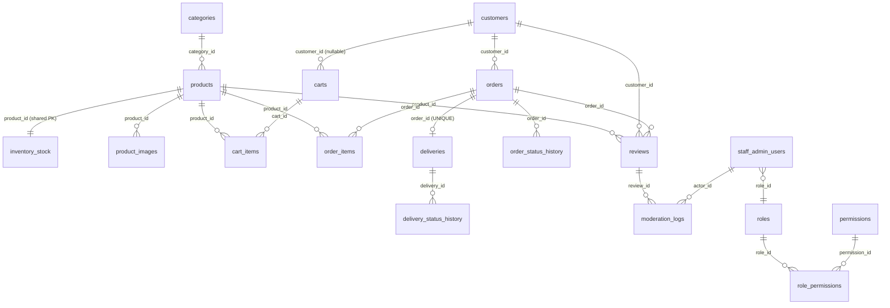

# PHYSICAL MYSQL DATABASE SCHEMA DESIGN — VERSION 1.0

**Gen-Z Digital Storefront — Men's, Boys' Clothing & Perfume Store**
**Project Group: ISE_WE_0201_58**

> Baseline: *Logical Database Design — Version 1.1* (authoritative input), which derives from *Database Architecture V1.1*, *Detailed System Architecture V1.2*, and *Integrated Business & Architecture Model V2*. This document transforms the 18-entity logical model (EP-01–EP-04) into an implementation-ready MySQL physical schema. **No backend code, APIs, controllers, services, repositories, or frontend code are included.** DDL appears only in Section 15, generated strictly from the design in Sections 1–14.

**Labelling used throughout:** 🔵 *Inherited from logical design* — 🟢 *New physical implementation decision* — 🟠 *Previously OPEN, addressed here as a physical placeholder without resolving the underlying business decision*.

---

## 1. Physical Database Overview

| Aspect | Decision | Type |
|---|---|---|
| **Database purpose** | Single relational store for the Gen-Z Digital Storefront, covering all four module domains in one schema, one database. | 🔵 |
| **MySQL version assumption** | MySQL 8.0+ (required for `CHECK` constraint enforcement, window functions if needed later, and `utf8mb4_0900_ai_ci` collation). | 🟢 |
| **Storage engine** | **InnoDB** for every table — the only engine offering foreign key enforcement, transactions, and row-level locking, all required given the multi-step business flows (order confirmation + stock decrease, order cancellation + stock restoration) that must be atomic. | 🟢 |
| **Character set** | `utf8mb4` — full Unicode support (needed for names, addresses, and free-text review/comment fields that may contain non-Latin characters or emoji). | 🟢 |
| **Collation** | `utf8mb4_0900_ai_ci` (MySQL 8 default, accent-insensitive, case-insensitive) — appropriate for name/text comparison and search without inventing locale-specific requirements. | 🟢 |
| **Naming convention** | Tables: `snake_case`, plural (e.g., `products`, `order_items`). Columns: `snake_case` (e.g., `product_id`, `created_at`). This is a physical naming choice — the logical design used PascalCase conceptual names (`Product`, `ProductID`); the mapping is 1:1 and lossless. | 🟢 |
| **ID strategy** | `BIGINT UNSIGNED AUTO_INCREMENT` surrogate primary key for every table, named `<entity>_id` (e.g., `product_id`). Chosen over UUIDs for simpler indexing/performance in a single-database, non-distributed system — no requirement in any source document calls for globally unique identifiers across systems. | 🟢 |
| **Timestamp strategy** | Every table includes `created_at DATETIME NOT NULL DEFAULT CURRENT_TIMESTAMP`. Tables with an update-capable lifecycle also include `updated_at DATETIME NOT NULL DEFAULT CURRENT_TIMESTAMP ON UPDATE CURRENT_TIMESTAMP`. Append-only/history tables (e.g., `order_status_history`) use only a single business timestamp column (`changed_at`) since they are never updated. `DATETIME` (not `TIMESTAMP`) is used to avoid the year-2038 and timezone-conversion quirks of MySQL's `TIMESTAMP` type, at the minor cost of manual timezone handling at the application layer. | 🟢 |

---

## 2–3. Physical Table Design & Required Physical Structures

*(Sections 2 and 3 are combined per table below, since every table's design directly addresses one of the "Required Physical Structures" call-outs where applicable.)*

### MODULE A — EP-01

#### `categories`
| Column | Type | Null | Default | Key |
|---|---|---|---|---|
| `category_id` | `BIGINT UNSIGNED AUTO_INCREMENT` | NOT NULL | — | PK |
| `name` | `VARCHAR(100)` | NOT NULL | — | UNIQUE |
| `description` | `VARCHAR(500)` | NULL | NULL | — |
| `created_at` | `DATETIME` | NOT NULL | `CURRENT_TIMESTAMP` | — |
| `updated_at` | `DATETIME` | NOT NULL | `CURRENT_TIMESTAMP` (on update) | — |

#### `products`
| Column | Type | Null | Default | Key |
|---|---|---|---|---|
| `product_id` | `BIGINT UNSIGNED AUTO_INCREMENT` | NOT NULL | — | PK |
| `category_id` | `BIGINT UNSIGNED` | NOT NULL | — | FK → `categories.category_id` |
| `name` | `VARCHAR(150)` | NOT NULL | — | INDEX |
| `description` | `TEXT` | NULL | NULL | — |
| `price` | `DECIMAL(10,2)` | NOT NULL | — | CHECK (`price > 0`) |
| `status` | `ENUM('ACTIVE','DISCONTINUED')` | NOT NULL | `'ACTIVE'` | INDEX |
| `created_at` / `updated_at` | as Section 1 | | | |

**Product `ImageReference` — physical resolution (see full analysis in Section 7).** A separate physical table `product_images` is introduced — explicitly **not** an additional conceptual entity, structurally identical in status to the `role_permissions` junction (Section 3, below): it exists only to support Product's single conceptual `ImageReference` attribute in a 1NF-compliant way, and has no independent business meaning of its own.

#### `product_images` 🟢 *(physical-only structure, not a conceptual entity — see Section 7)*
| Column | Type | Null | Default | Key |
|---|---|---|---|---|
| `product_image_id` | `BIGINT UNSIGNED AUTO_INCREMENT` | NOT NULL | — | PK |
| `product_id` | `BIGINT UNSIGNED` | NOT NULL | — | FK → `products.product_id` |
| `image_reference` | `VARCHAR(500)` | NOT NULL | — | — (Cloudflare R2 object key/URL) |
| `sort_order` | `SMALLINT UNSIGNED` | NOT NULL | `0` | — |
| `created_at` | `DATETIME` | NOT NULL | `CURRENT_TIMESTAMP` | — |

#### `inventory_stock` — **shared primary key with Product**
| Column | Type | Null | Default | Key |
|---|---|---|---|---|
| `product_id` | `BIGINT UNSIGNED` | NOT NULL | — | **PK, FK → `products.product_id`** |
| `quantity` | `INT UNSIGNED` | NOT NULL | `0` | CHECK (`quantity >= 0`) |
| `availability_status` | `ENUM('IN_STOCK','OUT_OF_STOCK')` **GENERATED ALWAYS AS** (`IF(quantity > 0, 'IN_STOCK', 'OUT_OF_STOCK')`) **STORED** | NOT NULL | — | INDEX |
| `updated_at` | `DATETIME` | NOT NULL | `CURRENT_TIMESTAMP` (on update) | — |

**Physical structure note:** `inventory_stock.product_id` is declared as *both* the primary key and a foreign key to `products.product_id` — this is MySQL's standard mechanism for a true 1:1 shared-PK relationship, exactly matching the logical design's "PK shared with Product." No `inventory_stock_id` surrogate is introduced, since the entity has no identity independent of its Product. `availability_status` is implemented as a MySQL **generated, stored column** — justified because it depends only on a column in the same row (Section 6).

---

### MODULE B — EP-02

#### `customers`
| Column | Type | Null | Default | Key |
|---|---|---|---|---|
| `customer_id` | `BIGINT UNSIGNED AUTO_INCREMENT` | NOT NULL | — | PK |
| `name` | `VARCHAR(150)` | NOT NULL | — | — |
| `contact_info` | `VARCHAR(255)` | NOT NULL | — | INDEX (**not UNIQUE** — per Logical Design V1.1's correction, no uniqueness constraint is invented here) |
| `credentials_reference` | `VARCHAR(255)` | NOT NULL | — | — (opaque; actual authentication mechanism is application-level, not designed here) |
| `status` | `ENUM('ACTIVE','DEACTIVATED')` | NOT NULL | `'ACTIVE'` | — 🟠 *(deactivation behaviour beyond this flag is OPEN — see Section 8)* |
| `created_at` / `updated_at` | as Section 1 | | | |

#### `carts` — **optional Customer relationship**
| Column | Type | Null | Default | Key |
|---|---|---|---|---|
| `cart_id` | `BIGINT UNSIGNED AUTO_INCREMENT` | NOT NULL | — | PK |
| `customer_id` | `BIGINT UNSIGNED` | **NULL** 🟠 | NULL | FK → `customers.customer_id` |
| `status` | `ENUM('ACTIVE','CONVERTED','ABANDONED')` | NOT NULL | `'ACTIVE'` | INDEX |
| `created_at` | `DATETIME` | NOT NULL | `CURRENT_TIMESTAMP` | — |

**Physical structure note:** `customer_id` is declared **nullable**, directly reflecting Logical Design V1.1's explicit statement that Cart→Customer nullability is OPEN pending the guest-cart-persistence decision. This is the minimal, non-committal physical choice: a nullable FK accommodates either eventual answer (mandatory-post-login-only carts, or guest carts later associated with a Customer) without requiring a schema change if the business decision resolves one way. No guest-session-identifier column (e.g., a session token) is invented here, since that would itself be silently resolving the OPEN decision.

#### `cart_items`
| Column | Type | Null | Default | Key |
|---|---|---|---|---|
| `cart_item_id` | `BIGINT UNSIGNED AUTO_INCREMENT` | NOT NULL | — | PK |
| `cart_id` | `BIGINT UNSIGNED` | NOT NULL | — | FK → `carts.cart_id` |
| `product_id` | `BIGINT UNSIGNED` | NOT NULL | — | FK → `products.product_id` |
| `quantity` | `INT UNSIGNED` | NOT NULL | — | CHECK (`quantity > 0`) |
| UNIQUE | (`cart_id`, `product_id`) | | | one line per product per cart |

#### `orders`
| Column | Type | Null | Default | Key |
|---|---|---|---|---|
| `order_id` | `BIGINT UNSIGNED AUTO_INCREMENT` | NOT NULL | — | PK |
| `customer_id` | `BIGINT UNSIGNED` | NOT NULL | — | FK → `customers.customer_id` (DEC-02 locked: login required before order creation) |
| `delivery_address` | `VARCHAR(500)` | NOT NULL | — | 🟢 *project-owner amendment* — captured at checkout; `deliveries.delivery_address` (Section 3, MODULE C) copies from this column at handover, never from a live Customer link. Resolves the EP-03 delivery-address schema gap found during Module C implementation (previously: no field anywhere stored a delivery address). |
| `whatsapp_checkout_reference` | `VARCHAR(255)` | NULL | NULL | 🟠 *(structure OPEN — see Section 8)* |
| `status` | `ENUM('PENDING','CONFIRMED','PROCESSING','READY_FOR_DELIVERY','CANCELLED')` | NOT NULL | `'PENDING'` | INDEX |
| `created_at` / `updated_at` | as Section 1 | | | |

**`orders.total` is deliberately NOT a column** — see Section 6 (Derived Values).

#### `order_items`
| Column | Type | Null | Default | Key |
|---|---|---|---|---|
| `order_item_id` | `BIGINT UNSIGNED AUTO_INCREMENT` | NOT NULL | — | PK |
| `order_id` | `BIGINT UNSIGNED` | NOT NULL | — | FK → `orders.order_id` |
| `product_id` | `BIGINT UNSIGNED` | NOT NULL | — | FK → `products.product_id` |
| `quantity` | `INT UNSIGNED` | NOT NULL | — | CHECK (`quantity > 0`) |
| `price_snapshot` | `DECIMAL(10,2)` | NOT NULL | — | **immutable historical value — see Section 11** |
| UNIQUE | (`order_id`, `product_id`) | | | one line per product per order |

#### `order_status_history`
| Column | Type | Null | Default | Key |
|---|---|---|---|---|
| `order_status_history_id` | `BIGINT UNSIGNED AUTO_INCREMENT` | NOT NULL | — | PK |
| `order_id` | `BIGINT UNSIGNED` | NOT NULL | — | FK → `orders.order_id` |
| `from_status` | `VARCHAR(30)` | NOT NULL | — | — |
| `to_status` | `VARCHAR(30)` | NOT NULL | — | — |
| `actor_type` | `ENUM('STAFF_ADMIN_USER','CUSTOMER','SYSTEM')` | NULL | NULL | 🟠 *(polymorphic — cancellation-actor question OPEN)* |
| `actor_id` | `BIGINT UNSIGNED` | NULL | NULL | *(no enforced FK — polymorphic across two possible tables; see Section 9)* |
| `changed_at` | `DATETIME` | NOT NULL | `CURRENT_TIMESTAMP` | INDEX |

---

### MODULE C — EP-03

#### `deliveries` — **Order → Delivery 1:0-or-1**
| Column | Type | Null | Default | Key |
|---|---|---|---|---|
| `delivery_id` | `BIGINT UNSIGNED AUTO_INCREMENT` | NOT NULL | — | PK |
| `order_id` | `BIGINT UNSIGNED` | NOT NULL | — | **UNIQUE FK** → `orders.order_id` |
| `delivery_address` | `VARCHAR(500)` | NOT NULL | — | *(snapshot, copied from `orders.delivery_address` at handover — 🟢 project-owner amendment, MODULE B section above)* |
| `delivery_person_reference` | `VARCHAR(150)` | NULL | NULL | 🟠 *(unconstrained — Delivery Person identity structure not established; see Section 8)* |
| `status` | `ENUM('ASSIGNED','PICKED_UP','OUT_FOR_DELIVERY','DELIVERED')` | NOT NULL | `'ASSIGNED'` | INDEX |
| `assigned_at` | `DATETIME` | NOT NULL | `CURRENT_TIMESTAMP` | — |

**Physical structure note:** the `UNIQUE` constraint on `order_id` is the mechanism enforcing the logical 1:0-or-1 cardinality — a given Order can have at most one Delivery row, and MySQL rejects any attempt to insert a second.

#### `delivery_status_history`
| Column | Type | Null | Default | Key |
|---|---|---|---|---|
| `delivery_status_history_id` | `BIGINT UNSIGNED AUTO_INCREMENT` | NOT NULL | — | PK |
| `delivery_id` | `BIGINT UNSIGNED` | NOT NULL | — | FK → `deliveries.delivery_id` |
| `from_status` | `VARCHAR(30)` | NOT NULL | — | — |
| `to_status` | `VARCHAR(30)` | NOT NULL | — | — |
| `actor_reference` | `VARCHAR(150)` | NULL | NULL | 🟠 *(same Delivery Person ambiguity)* |
| `changed_at` | `DATETIME` | NOT NULL | `CURRENT_TIMESTAMP` | INDEX |

#### `reviews`
| Column | Type | Null | Default | Key |
|---|---|---|---|---|
| `review_id` | `BIGINT UNSIGNED AUTO_INCREMENT` | NOT NULL | — | PK |
| `customer_id` | `BIGINT UNSIGNED` | NOT NULL | — | FK → `customers.customer_id` |
| `product_id` | `BIGINT UNSIGNED` | NOT NULL | — | FK → `products.product_id` |
| `order_id` | `BIGINT UNSIGNED` | NOT NULL | — | FK → `orders.order_id` |
| `rating` | `TINYINT UNSIGNED` | NOT NULL | — | CHECK (`rating BETWEEN 1 AND 5`) |
| `review_text` | `TEXT` | NULL | NULL | — |
| `moderation_status` | `ENUM('PENDING_MODERATION','APPROVED','REJECTED','DELETED')` | NOT NULL | `'PENDING_MODERATION'` | INDEX |
| `created_at` | `DATETIME` | NOT NULL | `CURRENT_TIMESTAMP` | — |

**No unique constraint on (`customer_id`, `product_id`, `order_id`)** — the duplicate-review question remains explicitly OPEN (Section 8); adding this constraint would silently resolve it.

#### `moderation_logs`
| Column | Type | Null | Default | Key |
|---|---|---|---|---|
| `moderation_log_id` | `BIGINT UNSIGNED AUTO_INCREMENT` | NOT NULL | — | PK |
| `review_id` | `BIGINT UNSIGNED` | NOT NULL | — | FK → `reviews.review_id` |
| `actor_type` | `ENUM('STAFF_ADMIN_USER','OWNER_ADMIN')` | NOT NULL | — | 🟢 *(Actor Identity Decision, Section 5b)* |
| `actor_id` | `BIGINT UNSIGNED` | **NULL** 🟢 | NULL | FK → `staff_admin_users.staff_admin_user_id`; NULL when `actor_type = 'OWNER_ADMIN'` |
| `action` | `ENUM('APPROVE','REJECT','DELETE')` | NOT NULL | — | — |
| `action_at` | `DATETIME` | NOT NULL | `CURRENT_TIMESTAMP` | INDEX |
| CHECK | (`actor_type`/`actor_id` pairing — see Section 5b) | | | DB-enforced |

---

### MODULE D — EP-04

#### `staff_admin_users` — **all references from other modules point here**
| Column | Type | Null | Default | Key |
|---|---|---|---|---|
| `staff_admin_user_id` | `BIGINT UNSIGNED AUTO_INCREMENT` | NOT NULL | — | PK |
| `role_id` | `BIGINT UNSIGNED` | NOT NULL | — | FK → `roles.role_id` |
| `name` | `VARCHAR(150)` | NOT NULL | — | — |
| `credentials_reference` | `VARCHAR(255)` | NULL | NULL | 🟠 *(Staff authentication mechanism OPEN — placeholder column only, no hashing scheme assumed)* |
| `status` | `ENUM('ACTIVE','DEACTIVATED')` | NOT NULL | `'ACTIVE'` | — |
| `created_at` / `updated_at` | as Section 1 | | | |

**This table has no relationship whatsoever to the Owner/Admin Access Key** (Section 3's dedicated call-out below) — confirmed by the complete absence of any Access-Key-related column here.

#### `roles`
| Column | Type | Null | Default | Key |
|---|---|---|---|---|
| `role_id` | `BIGINT UNSIGNED AUTO_INCREMENT` | NOT NULL | — | PK |
| `name` | `VARCHAR(100)` | NOT NULL | — | UNIQUE |

#### `permissions`
| Column | Type | Null | Default | Key |
|---|---|---|---|---|
| `permission_id` | `BIGINT UNSIGNED AUTO_INCREMENT` | NOT NULL | — | PK |
| `name` | `VARCHAR(100)` | NOT NULL | — | UNIQUE |

#### `role_permissions` 🟢 *(associative junction table — Role ↔ Permission M:M)*
| Column | Type | Null | Default | Key |
|---|---|---|---|---|
| `role_id` | `BIGINT UNSIGNED` | NOT NULL | — | PK (composite), FK → `roles.role_id` |
| `permission_id` | `BIGINT UNSIGNED` | NOT NULL | — | PK (composite), FK → `permissions.permission_id` |

**This table is a required physical implementation structure, not an additional conceptual entity.** It carries no attributes of its own beyond the two FKs forming its composite primary key — it exists purely to represent the many-to-many relationship, exactly as anticipated in Logical Design V1.1's explicit note that "the eventual physical relational design will require an appropriate junction/associative structure."

#### `store_settings` — single-row table
| Column | Type | Null | Default | Key |
|---|---|---|---|---|
| `store_settings_id` | `TINYINT UNSIGNED` | NOT NULL | `1` | PK, CHECK (`store_settings_id = 1`) |
| `store_name` | `VARCHAR(150)` | NOT NULL | — | — |
| `contact_info` | `VARCHAR(255)` | NOT NULL | — | — |
| `whatsapp_number` | `VARCHAR(30)` | NOT NULL | — | — |
| `updated_at` | `DATETIME` | NOT NULL | `CURRENT_TIMESTAMP` (on update) | — |

**Physical structure note:** the single-row business rule is enforced by a `CHECK` constraint pinning the PK to the literal value `1`, combined with the application never inserting a second row — this is the simplest reliable way to guarantee "exactly one settings row" in MySQL without a trigger.

#### `admin_access_key` 🟢🟠 *(new physical-only structure for the Owner/Admin entry mechanism — see Section 3 note and Section 8)*
| Column | Type | Null | Default | Key |
|---|---|---|---|---|
| `admin_access_key_id` | `TINYINT UNSIGNED` | NOT NULL | `1` | PK, CHECK (`admin_access_key_id = 1`) |
| `access_key_hash` | `VARCHAR(255)` | NOT NULL | — | 🟠 *(placeholder — exact hashing algorithm OPEN, see Section 8; column simply holds whatever hash the application produces)* |
| `updated_at` | `DATETIME` | NOT NULL | `CURRENT_TIMESTAMP` (on update) | — |

**Why this table exists:** Logical Design V1.1 explicitly noted the Access Key's storage location was undecided — "whether the Access Key's storage is conceptually attached to Store Settings, a dedicated single-row entity, or elsewhere is not decided." At the physical stage, a decision must be made to produce runnable DDL. **This document selects the dedicated single-row table option** (rather than folding it into `store_settings`), reasoning: the Access Key governs *authentication*, a fundamentally different concern from *store configuration*, and keeping it separate allows tighter access-control restrictions on this one table at the database-user level (Section 12) without having to also restrict all of Store Settings. This is a **physical implementation decision made explicitly and disclosed here** — it does not resolve the OPEN question of *how* the key is hashed/validated, only *where* it is stored.

#### `activity_log` — **single central audit table**
| Column | Type | Null | Default | Key |
|---|---|---|---|---|
| `activity_log_id` | `BIGINT UNSIGNED AUTO_INCREMENT` | NOT NULL | — | PK |
| `actor_type` | `ENUM('STAFF_ADMIN_USER','OWNER_ADMIN','SYSTEM')` | NULL | NULL | — |
| `actor_id` | `BIGINT UNSIGNED` | NULL | NULL | *(no enforced FK — see below)* |
| `action_type` | `VARCHAR(100)` | NOT NULL | — | INDEX |
| `affected_entity_type` | `VARCHAR(100)` | NOT NULL | — | INDEX (composite, below) |
| `affected_entity_id` | `BIGINT UNSIGNED` | NOT NULL | — | INDEX (composite, below) |
| `originating_module` | `ENUM('A','B','C','D','E')` | NOT NULL | — | INDEX |
| `context_note` | `VARCHAR(500)` | NULL | NULL | — |
| `timestamp` | `DATETIME` | NOT NULL | `CURRENT_TIMESTAMP` | INDEX |
| INDEX | (`affected_entity_type`, `affected_entity_id`) | | | composite lookup index |

**Physical structure note — no FK on `affected_entity_id`.** This is deliberate, not an oversight: a single column cannot hold an enforced foreign key to many different possible target tables simultaneously. This is the standard, accepted trade-off for a generic/polymorphic audit log design, and is explicitly foreshadowed in the logical design ("a generic reference, not enforced to every possible entity type"). Referential integrity for this table is an **application-level responsibility**, not a database-level one (Section 5).

---

## 4. Data Type Decisions — Summary Rationale

| Category | Type Chosen | Reasoning |
|---|---|---|
| Monetary values | `DECIMAL(10,2)` | Exact decimal arithmetic required for currency (LKR); `FLOAT`/`DOUBLE` would introduce rounding errors unacceptable for prices and financial snapshots. |
| Quantities | `INT UNSIGNED` (stock, cart and order quantities) | Unsigned rules out negative quantities at the type level as a first defense, backed by explicit `CHECK` constraints for the `> 0` / `>= 0` distinctions that matter per field. `SMALLINT UNSIGNED` used only for genuinely small bounded values (`sort_order`). |
| Ratings | `TINYINT UNSIGNED` with `CHECK (... BETWEEN 1 AND 5)` | A 1-byte type is more than sufficient for a 1–5 scale; the `CHECK` constraint (not the type) enforces the actual business range. |
| Dates/timestamps | `DATETIME` for business timestamps | `DATETIME` avoids `TIMESTAMP`'s 2038 ceiling and implicit timezone conversion. |
| Status/lifecycle values | `ENUM(...)` | Chosen over `VARCHAR + CHECK` for compactness and self-documentation of the fixed, small state sets already locked by the business model (e.g., Order's five states). Trade-off acknowledged: adding a new state later requires an `ALTER TABLE`, which is an acceptable cost given these state sets are already stable, locked business rules, not fields expected to grow. |
| Text fields | `VARCHAR(n)` for bounded names/references; `TEXT` for unbounded free text (descriptions, review text) | Sized `VARCHAR` limits chosen conservatively (100–500 chars) based on the field's conceptual purpose, not from any source-document-specified length. |
| Identifiers | `BIGINT UNSIGNED AUTO_INCREMENT` | Per Section 1's ID strategy. |
| Cross-module references (FKs) | Same type as the referenced PK (`BIGINT UNSIGNED`) | Required for MySQL FK compatibility. |
| Audit fields | `VARCHAR`/`ENUM` for classification, `DATETIME` for `timestamp` | Kept simple and queryable; no BLOB/JSON used for `activity_log`'s core fields, though `context_note` remains a bounded `VARCHAR` rather than unbounded `TEXT` to discourage using it as an unstructured dumping ground. |

---

## 5. Constraints — Database-Level vs. Application-Level

### Enforced at the database level (via `CHECK`, `UNIQUE`, `NOT NULL`, or `FOREIGN KEY`)

| Rule | Mechanism |
|---|---|
| Product price > 0 | `CHECK (price > 0)` on `products` |
| Inventory quantity ≥ 0 | `CHECK (quantity >= 0)` on `inventory_stock` |
| Cart Item quantity > 0 | `CHECK (quantity > 0)` on `cart_items` |
| Order Item quantity > 0 | `CHECK (quantity > 0)` on `order_items` |
| Unique Order → Delivery | `UNIQUE` on `deliveries.order_id` |
| Role name uniqueness | `UNIQUE` on `roles.name` |
| Permission name uniqueness | `UNIQUE` on `permissions.name` |
| Product references resolve | `FOREIGN KEY` on every referencing column |
| Actor `actor_type`/`actor_id` pairing (Moderation Log) | Paired `CHECK` on `moderation_logs` — see Section 5b |
| Single-row Store Settings / Access Key tables | `CHECK` pinning PK to `1` |

### Must remain application-level (cannot be safely or validly expressed as a MySQL table constraint)

| Rule | Why It Cannot Be a DB Constraint |
|---|---|
| Immutable historical price snapshots (no retroactive edit) | Same "no cross-row/cross-time comparison in `CHECK`" limitation — enforced by application logic never issuing an `UPDATE` to these columns after insert. |
| Stock-decrease failure leaves stock and order status unchanged (atomicity) | This is a **multi-statement transactional** rule (verify → decrease → update order status), which MySQL constraints do not express — enforced via an application-level transaction wrapping both statements. |
| Order cancellation actor authorization | Fully OPEN business decision — no DB constraint can express a rule that hasn't been decided (Section 8). |
| Duplicate-review restriction | Deliberately **not** enforced (OPEN) — see Section 8. |

**Note on triggers:** MySQL `BEFORE UPDATE` triggers *could* technically enforce the price-snapshot immutability rule above (rejecting an `UPDATE` to `price_snapshot`). This document does **not** add such triggers, to keep the physical schema itself simple and auditable, and because enforcing this at the application/service layer (which already must orchestrate the surrounding transaction) is equally reliable and easier to test/maintain for a 3-person academic team. This is a **physical design choice**, disclosed here, not an oversight — the option remains available to add later if the team prefers defense-in-depth.

---

## 5b. Actor Identity — Owner/Admin vs. Staff/Admin User (Resolved Architecture Decision)

**Status: RESOLVED.** This section documents an architecture decision made explicitly by the project owner on 2026-09-08, following a dedicated Actor Identity Architecture Review. It is **not** one of the items in Section 8 — it was never a documented OPEN decision; it was an unflagged internal inconsistency between the RBAC Architecture (Detailed System Architecture V1.2 §15, granting Owner/Admin full authority over review moderation) and the physical schema (which originally restricted `moderation_logs.actor_id` to `staff_admin_users` only — an identity Owner/Admin's Access Key authentication never creates).

**The decision:**
1. **Owner/Admin and Staff/Admin User remain two distinct, unmerged identity models.** Owner/Admin continues to authenticate via the existing Access Key mechanism and does **not** receive or require a `staff_admin_users` row. No sentinel/fake Staff record is introduced.
2. **`moderation_logs` carries a paired `actor_type ENUM('STAFF_ADMIN_USER','OWNER_ADMIN')` discriminator**, mirroring the pattern `activity_log.actor_type` already uses elsewhere in this schema. `actor_id` is nullable and populated **only** when `actor_type = 'STAFF_ADMIN_USER'`; it is `NULL` when `actor_type = 'OWNER_ADMIN'`.
3. **A `CHECK` constraint enforces the pairing** (type/id nullability must agree) — see the DDL in Section 15.
4. **The `activity_log` table is the authoritative audit record for Owner/Admin actions.** When `actor_id` is `NULL` because the actor was Owner/Admin, the corresponding `activity_log` row (`actor_type = 'OWNER_ADMIN'`) identifies the actor for audit purposes.
5. **No new table, no new authentication mechanism, and no second Access Key system is introduced.**
6. **Staff authentication remains OPEN**, exactly as before (Section 8, item 1).

---

## 6. Derived Values — Storage Decisions

| Derived Value | Decision | Justification |
|---|---|---|
| **Inventory `AvailabilityStatus`** | **Stored — MySQL `GENERATED ALWAYS AS ... STORED` column** on `inventory_stock` | Depends only on a column in the *same row* (`quantity`); a generated column is safe, always consistent, and indexable at negligible cost. |
| **Order `Total`** | **NOT stored — calculated at query/application level** (`SUM(quantity * price_snapshot)` over `order_items`) | Requires aggregating across *child rows in another table* — MySQL generated columns cannot express cross-row aggregates. Recomputing on read is cheap for a single order's item count in this domain; a cached/trigger-maintained column can be introduced later purely for performance if needed, but is not required now. |

**Principle applied throughout:** a derived value is stored **only** when it depends solely on same-row data (safe for a MySQL generated column). Anything requiring live cross-row aggregation remains query-time-computed.

---

## 7. Product `ImageReference` — Full Physical Analysis

**Option A — Single VARCHAR column on `products`** (e.g., `image_reference VARCHAR(500)`). Simple, but only supports exactly one image, and does not honestly represent "one-or-more" as the conceptual model describes. Rejected as insufficient.

**Option B — JSON column on `products`** (e.g., `image_references JSON`). Keeps everything in one table, supports multiple values within a single column. Still does not achieve 1NF (a JSON array in one cell is a classic repeating-group violation), and querying/ordering individual images becomes awkward in MySQL. Rejected — trades one 1NF violation for a differently-shaped one.

**Option C — Separate physical table `product_images`** (adopted — see Section 2's `products` entry). Each image is its own row, `product_id` FK, `sort_order` for display ordering. Fully 1NF-compliant, supports any number of images per product, and is trivially indexable/queryable.

**Decision: Option C is adopted.** This is explicitly a **new physical decision made at this stage**, not a silent one — Logical Design V1.1 deliberately left this open specifically so it could be resolved *here*, at the physical design stage, where such a decision belongs. `product_images` is structurally identical in status to `role_permissions`: **it is a required physical implementation structure, not an additional conceptual business entity.** It has no independent business meaning — it exists solely to represent Product's own `ImageReference` attribute correctly. The approved 18-entity conceptual model is unaffected; this table maps back to exactly one conceptual attribute on exactly one conceptual entity (Product).

---

## 8. OPEN Decisions — Carried Forward to Physical Design

For each item: **Decision → Options → Recommendation → Impact on physical schema.** None of these are resolved by this document — each is addressed only to the minimum extent required to produce runnable, non-committal DDL.

| # | OPEN Decision | Options | Recommendation (non-binding) | Physical Schema Impact |
|---|---|---|---|---|
| 1 | Staff authentication mechanism | (a) Username/password with hashed credential; (b) Access-Key-per-staff; (c) SSO/external | Not recommended here — outside this document's scope to select | `staff_admin_users.credentials_reference` is a generic nullable `VARCHAR(255)` placeholder only; no hashing scheme, no username column assumed |
| 2 | Guest cart persistence through login/register | (a) Guest carts allowed, later merged into Customer's cart on login; (b) Cart only ever created post-login | Not recommended here | `carts.customer_id` is nullable (Section 3) — schema supports either eventual answer |
| 3 | WhatsApp checkout integration/reference | (a) Simple `wa.me` pre-filled link (no stored reference needed beyond order data); (b) Formal WhatsApp Business API with a message/conversation ID to store | Not recommended here | `orders.whatsapp_checkout_reference` is a generic nullable `VARCHAR(255)` — accommodates either outcome, including "column unused" if (a) is chosen |
| 4 | Product + Review aggregation mechanism | (a) Application computes aggregate rating via JOIN/query at read time; (b) Materialized/cached rating column on `products` | Application-level query recommended for now (simplicity); materialization can be added later without breaking existing data | No `average_rating` column is added to `products` in this schema — avoiding a premature, unrequested denormalization |
| 5 | Order cancellation authority (who, at which stages) | (a) Customer self-service for Pending only; (b) Admin/Owner only, any stage; (c) Both, stage-dependent | Not recommended here | `order_status_history.actor_type`/`actor_id` are nullable and polymorphic (unconstrained by FK) — schema does not presume an answer |
| 6 | Multiple reviews per Product/Order | (a) One review only (add unique constraint later); (b) Unlimited reviews permitted | Not recommended here | `reviews` table has **no** uniqueness constraint on (`customer_id`,`product_id`,`order_id`) — adding one later is a straightforward, non-breaking migration if (a) is chosen |
| 7 | Admin Access Key storage/validation mechanism | (a) bcrypt/argon2 hash; (b) HMAC with server secret; (c) other | Not recommended here — a security decision for the team/supervisor | `admin_access_key.access_key_hash` is a generic `VARCHAR(255)` — large enough for any common hash output, but the algorithm itself is unspecified by this schema |
| 8 | *(Withdrawn — not applicable to the final four-epic scope)* | — | — | — |
| 9 | Category/Customer/Staff deactivation behaviour (beyond the flag existing) | (a) Deactivated rows remain fully visible/functional except for new actions; (b) Deactivated rows are hidden from most queries; (c) Other | Not recommended here | `status` `ENUM` columns exist on `customers`/`staff_admin_users`/`categories` is *not* added (Category has no deactivation flag at all, since no source document requests one for Category specifically — only Product explicitly has this need established) |
| 10 | Delivery Person identity structure | (a) Delivery Person is a Staff/Admin User with a specific Role; (b) A wholly separate entity/table; (c) An unauthenticated reference only | Not recommended here | `deliveries.delivery_person_reference` and `delivery_status_history.actor_reference` are plain, unconstrained `VARCHAR` columns — no FK to `staff_admin_users` is added, since that would silently pick option (a) |
| 11 | Product `ImageReference` physical representation | *(Resolved in Section 7 — this is the one item from the original OPEN list that this document explicitly and intentionally settles, since it is a physical-design-stage decision by nature)* | **Option C selected** (separate `product_images` table) | See Section 7 |

**Item 11 is deliberately handled differently from Items 1–10:** the task instructions explicitly invited a physical-level resolution for the image-reference question ("Analyse the physical options... If a physical structure is required, clearly explain..."), whereas Items 1–10 remain genuine business/security/process decisions outside a database schema's authority to settle. This distinction is intentional, not inconsistent.

---

## 9. Referential Actions (`ON DELETE` / `ON UPDATE`)

**General principle applied:** `ON UPDATE RESTRICT` is used uniformly across every FK, since all primary keys are auto-increment surrogates that are never expected to change — CASCADE-on-update would only ever matter for a scenario (manual PK renumbering) this design does not anticipate. `ON DELETE` varies by relationship, following two sub-principles:
- **RESTRICT** where the child row represents historical/transactional data that must never silently disappear (protects audit trails, financial/order history, and immutable records).
- **CASCADE** only where the child row has *no independent meaning whatsoever* apart from its still-mutable parent (e.g., Cart Items belong entirely to a Cart that is itself freely disposable pre-checkout).

| Parent → Child | ON DELETE | Justification |
|---|---|---|
| `categories` → `products` | RESTRICT | Prevent deleting a category while products still reference it; force explicit recategorization first. |
| `products` → `inventory_stock` | RESTRICT | A Product with stock history should not be silently orphaned; encourages `status = 'DISCONTINUED'` (soft-delete) over hard delete. |
| `products` → `product_images` | CASCADE | Images have no meaning without their Product; deleting a Product's images along with it is safe and expected. |
| `products` → `cart_items` | RESTRICT | Protects active carts from silently losing items if a product is hard-deleted. |
| `products` → `order_items` | RESTRICT | **Critical** — historical order records must never lose their product reference. |
| `products` → `reviews` | RESTRICT | Preserve review history. |
| `customers` → `carts` | SET NULL | Consistent with `carts.customer_id` being nullable (Section 3, OPEN item 2) — if a Customer row is ever removed, an in-progress cart is not forced to disappear with it. |
| `customers` → `orders` | RESTRICT | **Critical** — order history must never be silently lost. |
| `customers` → `reviews` | RESTRICT | Preserve review history. |
| `carts` → `cart_items` | CASCADE | Cart Items are meaningless without their Cart, and Carts themselves are freely disposable pre-checkout data. |
| `orders` → `order_items` | CASCADE | Order Items are meaningless without their Order; Orders themselves are not expected to be hard-deleted in normal operation (cancellation is a status, not a delete) — CASCADE here is a safety default for the rare case a row deletion does occur. |
| `orders` → `order_status_history` | CASCADE | Same reasoning. |
| `orders` → `deliveries` | RESTRICT | Deliveries carry their own operational/tracking history that should not vanish silently. |
| `orders` → `reviews` | RESTRICT | Preserve review history even if an order row were ever removed. |
| `deliveries` → `delivery_status_history` | CASCADE | History rows are meaningless without their Delivery. |
| `reviews` → `moderation_logs` | **RESTRICT** | Deliberately *not* CASCADE — Moderation Log is itself an audit trail, including of "Delete" actions on a Review; cascading its deletion alongside the Review it documents would destroy the very audit record meant to prove the deletion happened. Soft-deletion (`moderation_status = 'DELETED'`) is the intended mechanism, not a hard `DELETE`. |
| `staff_admin_users` → `roles` (i.e., `staff_admin_users.role_id` FK) | RESTRICT | Prevent deleting a Role while Staff still reference it. |
| `roles`/`permissions` → `role_permissions` | CASCADE | Junction rows are meaningless without both sides; this is standard, safe junction-table behaviour. |
| `staff_admin_users` → `moderation_logs` (actor) | RESTRICT | Never allow deleting a Staff account that has historical, audit-relevant actions attached — deactivation (`status`) is the intended mechanism instead. **This FK is nullable as of Section 5b (Actor Identity Decision)** — `NULL` means the actor was Owner/Admin (identified instead via `actor_type` and the `activity_log`), not a dangling/unset reference. |

---

## 10. Index Strategy

Beyond the indexes already implied by every `PRIMARY KEY`, `UNIQUE`, and `FOREIGN KEY` above (MySQL/InnoDB automatically indexes FK columns), the following additional indexes are defined:

| Index | Table(s) | Purpose |
|---|---|---|
| `idx_products_category_status` | `products (category_id, status)` | Category-browsing queries filtered to Active products — the single most common storefront query pattern. |
| `idx_products_name` | `products (name)` | Name-based search/filter (US-05). |
| `idx_orders_customer_status` | `orders (customer_id, status)` | Customer order history queries (US-13) and Admin's "view orders by status" (US-11). |
| `idx_orders_created_at` | `orders (created_at)` | Dashboard/reporting queries ordered by recency. |
| `idx_deliveries_status` | `deliveries (status)` | Admin delivery-tracking dashboard views. |
| `idx_reviews_product_moderation` | `reviews (product_id, moderation_status)` | Product-detail page's "show approved reviews" query (US-18) — the most frequent read pattern on this table. |
| `idx_reviews_customer` | `reviews (customer_id)` | Customer's own review history. |
| `idx_activity_log_timestamp` | `activity_log (timestamp)` | Recency-ordered audit browsing (US-25). |
| `idx_activity_log_module` | `activity_log (originating_module)` | Filtering the audit trail by module. |
| `idx_activity_log_entity` | `activity_log (affected_entity_type, affected_entity_id)` | *(already listed in Section 2/3 as a composite index — repeated here for completeness)* Looking up all audit history for one specific record. |
| `idx_inventory_stock_availability` | `inventory_stock (availability_status)` | Low-stock/out-of-stock dashboard and reporting queries — indexable precisely because `availability_status` is a **stored** generated column (Section 6). |

**Indexing philosophy applied:** every index above is tied to a specific, named user story or dashboard requirement already established in the project's documentation — no speculative indexes were added "just in case," consistent with the instruction not to invent unnecessary structure.

---

## 11. Normalization Check (Physical Schema)

The physical schema preserves the logical design's normalization status exactly:

- **1NF:** achieved throughout, **including** for Product images — the introduction of `product_images` (Section 7) is precisely what brings this attribute into full 1NF compliance at the physical stage, resolving the one acknowledged exception carried from the logical design.
- **2NF/3NF:** unchanged from the logical design — every non-key column depends on the whole key and nothing but the key, **except** the deliberately preserved historical snapshot:
  - `order_items.price_snapshot`

**This exception is not "fixed" in this physical schema, per explicit instruction.** It remains because it represents a business requirement (historical accuracy of what a customer actually agreed to pay), not a modelling oversight. No other denormalization exists in the physical schema — `inventory_stock.availability_status`, while a generated/stored column, is not a normalization violation in the traditional sense since MySQL guarantees it is always mechanically consistent with `quantity` (it can never independently drift, unlike a manually-maintained redundant column).

---

## 12. Security Considerations (Database-Level Only — Not Application Authentication Design)

| Concern | Database-Level Consideration |
|---|---|
| **Credentials references** (`customers.credentials_reference`, `staff_admin_users.credentials_reference`) | Columns are sized and typed to hold an opaque hashed value (`VARCHAR(255)`), never a plaintext password — the schema itself does not store plaintext by design, though the actual hashing happens at the application layer (out of scope here). |
| **Admin Access Key storage** | Isolated into its own single-row table (`admin_access_key`, Section 3) specifically so that database-level access grants can restrict `SELECT` on this one table to only the specific application service role that performs Access-Key validation — no other part of the application (e.g., the reporting/dashboard code path) needs, or should have, read access to this table. |
| **Staff/Admin data** | `staff_admin_users` and `roles`/`permissions` should be granted only to the application's own database user, not to any reporting/analytics-only database account, since this table indirectly gates administrative authority. |
| **Audit logging** | `activity_log` should be `INSERT`-only for the general application database user (no `UPDATE`/`DELETE` grants), enforcing append-only behaviour at the database-privilege level as a second line of defense beyond application logic. |
| **Sensitive customer information** | `customers.contact_info` and `credentials_reference` are the two fields warranting the most restrictive `SELECT` grants — reporting/dashboard database roles should query aggregate order data without needing raw customer contact details wherever possible. |
| **Least-privilege database access (general principle)** | A single shared "application" MySQL user with full read/write across the schema is the simplest approach for a 3-person academic project and is **not prohibited** by anything in this document — but this section records that finer-grained roles (e.g., a read-only reporting user, a restricted Access-Key-validation-only user) are a recommended hardening step for Phase 2 of the project if time allows, not a requirement being designed now. |

**This section deliberately stops short of designing the application's authentication system** — JWT issuance, session handling, password hashing algorithm choice, and the Access Key's exact validation flow all remain OPEN (Sections 5, 8) and are correctly deferred to backend/API design, the next stage after this one.

---

## 13. Physical ERD



*(`store_settings` and `admin_access_key` are standalone single-row tables with no FK relationships to any other table, and are omitted from this relationship-focused diagram for clarity; `activity_log` is likewise omitted since its `affected_entity_id` is an intentionally unenforced polymorphic reference, not a drawable FK edge.)*

**Note on the `staff_admin_users` edge above (post-Section 5b):** `moderation_logs.actor_id` is nullable and paired with an `actor_type` discriminator (Section 5b). The FK edge shown is drawn only for the `'STAFF_ADMIN_USER'` case; an Owner/Admin actor is represented by a `NULL` FK plus `actor_type = 'OWNER_ADMIN'`, with no drawable edge to `staff_admin_users` (Owner/Admin has no row there by design) — the actor is instead identifiable via `activity_log`.

---

## 14. Schema Validation

| Check | Result |
|---|---|
| **18 approved conceptual entities remain represented** | ✅ Every conceptual entity from Logical Design V1.1 in the final four-epic scope maps to exactly one physical table (Sections 2–3); count verified: 3 (Module A) + 6 (Module B) + 4 (Module C) + 5 (Module D) = 18. |
| **No duplicated business entities** | ✅ `role_permissions`, `product_images`, and `admin_access_key` are all clearly labelled as physical-only structures (junction table, image-support table, and a settings-like table respectively), never counted among the 18, and each maps back to an existing conceptual attribute/relationship rather than introducing new business meaning. |
| **All PKs exist** | ✅ Every table has exactly one `PRIMARY KEY` (surrogate `BIGINT UNSIGNED AUTO_INCREMENT`, except `inventory_stock`'s shared PK and the two single-row tables' fixed-value PK, and `role_permissions`' composite PK). |
| **All FKs resolve** | ✅ Every `FOREIGN KEY` in Sections 2–3 targets a PK defined elsewhere in this same schema; none is left dangling. |
| **All required relationships are represented** | ✅ Verified individually against the task's explicit list: Role↔Permission (junction), Inventory shared PK, optional Cart→Customer, Order→Delivery 1:0-or-1 (UNIQUE FK), all Staff/Admin User references, central Activity Log — all present exactly as specified. |
| **All important constraints are represented** | ✅ Section 5's full table cross-checked against the task's explicit list — every named constraint (price>0, quantity≥0/>0 variants, unique Order→Delivery, Role/Permission name uniqueness) is implemented at the database level where technically possible, and explicitly flagged as application-level where not. |
| **No business rule has been silently changed** | ✅ Every locked rule from the logical/architecture chain (stock-decrease-only-at-Confirmed, Confirmed→Processing as a separate transition, cancellation stock-effect asymmetry, price snapshots, single Activity Log) is preserved in structure or explicitly noted as an application-enforced extension of the same rule, never altered. |
| **OPEN decisions remain explicitly tracked** | ✅ Section 8 individually addresses all eleven previously-identified OPEN items (the original nine plus Delivery Person and Product ImageReference), with ImageReference the sole item deliberately resolved at this stage — for legitimate, disclosed physical-design reasons — and the others left open (or withdrawn as no longer applicable) with non-committal schema accommodations. |
| **Actor Identity (Owner/Admin vs. Staff/Admin User) resolved consistently** | ✅ Section 5b documents the resolved decision; `moderation_logs` carries a paired `actor_type`/`actor_id` structure with a matching `CHECK` constraint (Section 15). This was a genuine internal inconsistency, not a previously-tracked OPEN item. |

---

## 15. SQL / DDL

*(Generated strictly from Sections 1–14 above. Presented in dependency order so that every `FOREIGN KEY` reference points to an already-created table.)*

```sql
-- =====================================================================
-- GEN-Z DIGITAL STOREFRONT — PHYSICAL MYSQL SCHEMA — VERSION 1.0
-- Generated from Physical MySQL Database Schema Design V1.0
-- Engine: InnoDB | Charset: utf8mb4 | Collation: utf8mb4_0900_ai_ci
-- =====================================================================

CREATE DATABASE IF NOT EXISTS genz_digital_storefront
    CHARACTER SET utf8mb4
    COLLATE utf8mb4_0900_ai_ci;

USE genz_digital_storefront;

-- =====================================================================
-- MODULE A — EP-01 PRODUCT & CATALOGUE MANAGEMENT
-- =====================================================================

CREATE TABLE categories (
    category_id     BIGINT UNSIGNED AUTO_INCREMENT PRIMARY KEY,
    name            VARCHAR(100) NOT NULL UNIQUE,
    description     VARCHAR(500) NULL,
    created_at      DATETIME NOT NULL DEFAULT CURRENT_TIMESTAMP,
    updated_at      DATETIME NOT NULL DEFAULT CURRENT_TIMESTAMP ON UPDATE CURRENT_TIMESTAMP
) ENGINE=InnoDB;

CREATE TABLE products (
    product_id      BIGINT UNSIGNED AUTO_INCREMENT PRIMARY KEY,
    category_id     BIGINT UNSIGNED NOT NULL,
    name            VARCHAR(150) NOT NULL,
    description     TEXT NULL,
    price           DECIMAL(10,2) NOT NULL,
    status          ENUM('ACTIVE','DISCONTINUED') NOT NULL DEFAULT 'ACTIVE',
    created_at      DATETIME NOT NULL DEFAULT CURRENT_TIMESTAMP,
    updated_at      DATETIME NOT NULL DEFAULT CURRENT_TIMESTAMP ON UPDATE CURRENT_TIMESTAMP,
    CONSTRAINT chk_products_price_positive CHECK (price > 0),
    CONSTRAINT fk_products_category
        FOREIGN KEY (category_id) REFERENCES categories(category_id)
        ON DELETE RESTRICT ON UPDATE RESTRICT,
    INDEX idx_products_category_status (category_id, status),
    INDEX idx_products_name (name)
) ENGINE=InnoDB;

CREATE TABLE product_images (
    product_image_id   BIGINT UNSIGNED AUTO_INCREMENT PRIMARY KEY,
    product_id         BIGINT UNSIGNED NOT NULL,
    image_reference     VARCHAR(500) NOT NULL,
    sort_order          SMALLINT UNSIGNED NOT NULL DEFAULT 0,
    created_at          DATETIME NOT NULL DEFAULT CURRENT_TIMESTAMP,
    CONSTRAINT fk_product_images_product
        FOREIGN KEY (product_id) REFERENCES products(product_id)
        ON DELETE CASCADE ON UPDATE RESTRICT
) ENGINE=InnoDB;

CREATE TABLE inventory_stock (
    product_id          BIGINT UNSIGNED PRIMARY KEY,
    quantity            INT UNSIGNED NOT NULL DEFAULT 0,
    availability_status ENUM('IN_STOCK','OUT_OF_STOCK')
        GENERATED ALWAYS AS (IF(quantity > 0, 'IN_STOCK', 'OUT_OF_STOCK')) STORED,
    updated_at          DATETIME NOT NULL DEFAULT CURRENT_TIMESTAMP ON UPDATE CURRENT_TIMESTAMP,
    CONSTRAINT chk_inventory_quantity_nonnegative CHECK (quantity >= 0),
    CONSTRAINT fk_inventory_stock_product
        FOREIGN KEY (product_id) REFERENCES products(product_id)
        ON DELETE RESTRICT ON UPDATE RESTRICT,
    INDEX idx_inventory_stock_availability (availability_status)
) ENGINE=InnoDB;

-- =====================================================================
-- MODULE D — EP-04 STORE ADMINISTRATION (created before B/C, which reference it)
-- =====================================================================

CREATE TABLE roles (
    role_id     BIGINT UNSIGNED AUTO_INCREMENT PRIMARY KEY,
    name        VARCHAR(100) NOT NULL UNIQUE
) ENGINE=InnoDB;

CREATE TABLE permissions (
    permission_id   BIGINT UNSIGNED AUTO_INCREMENT PRIMARY KEY,
    name            VARCHAR(100) NOT NULL UNIQUE
) ENGINE=InnoDB;

CREATE TABLE role_permissions (
    role_id         BIGINT UNSIGNED NOT NULL,
    permission_id   BIGINT UNSIGNED NOT NULL,
    PRIMARY KEY (role_id, permission_id),
    CONSTRAINT fk_role_permissions_role
        FOREIGN KEY (role_id) REFERENCES roles(role_id)
        ON DELETE CASCADE ON UPDATE RESTRICT,
    CONSTRAINT fk_role_permissions_permission
        FOREIGN KEY (permission_id) REFERENCES permissions(permission_id)
        ON DELETE CASCADE ON UPDATE RESTRICT
) ENGINE=InnoDB;

CREATE TABLE staff_admin_users (
    staff_admin_user_id     BIGINT UNSIGNED AUTO_INCREMENT PRIMARY KEY,
    role_id                 BIGINT UNSIGNED NOT NULL,
    name                    VARCHAR(150) NOT NULL,
    credentials_reference   VARCHAR(255) NULL,           -- OPEN: staff auth mechanism (see Section 8, item 1)
    status                  ENUM('ACTIVE','DEACTIVATED') NOT NULL DEFAULT 'ACTIVE',
    created_at              DATETIME NOT NULL DEFAULT CURRENT_TIMESTAMP,
    updated_at              DATETIME NOT NULL DEFAULT CURRENT_TIMESTAMP ON UPDATE CURRENT_TIMESTAMP,
    CONSTRAINT fk_staff_admin_users_role
        FOREIGN KEY (role_id) REFERENCES roles(role_id)
        ON DELETE RESTRICT ON UPDATE RESTRICT
) ENGINE=InnoDB;

CREATE TABLE store_settings (
    store_settings_id   TINYINT UNSIGNED PRIMARY KEY DEFAULT 1,
    store_name           VARCHAR(150) NOT NULL,
    contact_info          VARCHAR(255) NOT NULL,
    whatsapp_number        VARCHAR(30) NOT NULL,
    updated_at             DATETIME NOT NULL DEFAULT CURRENT_TIMESTAMP ON UPDATE CURRENT_TIMESTAMP,
    CONSTRAINT chk_store_settings_singleton CHECK (store_settings_id = 1)
) ENGINE=InnoDB;

CREATE TABLE admin_access_key (
    admin_access_key_id   TINYINT UNSIGNED PRIMARY KEY DEFAULT 1,
    access_key_hash        VARCHAR(255) NOT NULL,        -- OPEN: hashing mechanism (see Section 8, item 7)
    updated_at              DATETIME NOT NULL DEFAULT CURRENT_TIMESTAMP ON UPDATE CURRENT_TIMESTAMP,
    CONSTRAINT chk_admin_access_key_singleton CHECK (admin_access_key_id = 1)
) ENGINE=InnoDB;

CREATE TABLE activity_log (
    activity_log_id        BIGINT UNSIGNED AUTO_INCREMENT PRIMARY KEY,
    actor_type              ENUM('STAFF_ADMIN_USER','OWNER_ADMIN','SYSTEM') NULL,
    actor_id                 BIGINT UNSIGNED NULL,        -- intentionally unenforced (polymorphic) — see Section 3/9
    action_type              VARCHAR(100) NOT NULL,
    affected_entity_type      VARCHAR(100) NOT NULL,
    affected_entity_id        BIGINT UNSIGNED NOT NULL,   -- intentionally unenforced (polymorphic) — see Section 3/9
    originating_module        ENUM('A','B','C','D','E') NOT NULL,  -- 'E' retained for historical compatibility only;
                                                             -- the application writes A-D (EP-01..EP-04)
    context_note               VARCHAR(500) NULL,
    `timestamp`                 DATETIME NOT NULL DEFAULT CURRENT_TIMESTAMP,
    INDEX idx_activity_log_timestamp (`timestamp`),
    INDEX idx_activity_log_module (originating_module),
    INDEX idx_activity_log_entity (affected_entity_type, affected_entity_id)
) ENGINE=InnoDB;

-- =====================================================================
-- MODULE B — EP-02 CUSTOMER & ORDER MANAGEMENT
-- =====================================================================

CREATE TABLE customers (
    customer_id             BIGINT UNSIGNED AUTO_INCREMENT PRIMARY KEY,
    name                     VARCHAR(150) NOT NULL,
    contact_info              VARCHAR(255) NOT NULL,      -- NOT unique (see Section 3 note; DEC removed in Logical Design V1.1)
    credentials_reference      VARCHAR(255) NOT NULL,
    status                     ENUM('ACTIVE','DEACTIVATED') NOT NULL DEFAULT 'ACTIVE',
    created_at                  DATETIME NOT NULL DEFAULT CURRENT_TIMESTAMP,
    updated_at                   DATETIME NOT NULL DEFAULT CURRENT_TIMESTAMP ON UPDATE CURRENT_TIMESTAMP,
    INDEX idx_customers_contact_info (contact_info)
) ENGINE=InnoDB;

CREATE TABLE carts (
    cart_id         BIGINT UNSIGNED AUTO_INCREMENT PRIMARY KEY,
    customer_id     BIGINT UNSIGNED NULL,                 -- OPEN: guest cart persistence (see Section 8, item 2)
    status          ENUM('ACTIVE','CONVERTED','ABANDONED') NOT NULL DEFAULT 'ACTIVE',
    created_at      DATETIME NOT NULL DEFAULT CURRENT_TIMESTAMP,
    CONSTRAINT fk_carts_customer
        FOREIGN KEY (customer_id) REFERENCES customers(customer_id)
        ON DELETE SET NULL ON UPDATE RESTRICT,
    INDEX idx_carts_customer_status (customer_id, status)
) ENGINE=InnoDB;

CREATE TABLE cart_items (
    cart_item_id    BIGINT UNSIGNED AUTO_INCREMENT PRIMARY KEY,
    cart_id         BIGINT UNSIGNED NOT NULL,
    product_id      BIGINT UNSIGNED NOT NULL,
    quantity        INT UNSIGNED NOT NULL,
    CONSTRAINT chk_cart_items_quantity_positive CHECK (quantity > 0),
    CONSTRAINT fk_cart_items_cart
        FOREIGN KEY (cart_id) REFERENCES carts(cart_id)
        ON DELETE CASCADE ON UPDATE RESTRICT,
    CONSTRAINT fk_cart_items_product
        FOREIGN KEY (product_id) REFERENCES products(product_id)
        ON DELETE RESTRICT ON UPDATE RESTRICT,
    UNIQUE KEY uq_cart_items_cart_product (cart_id, product_id)
) ENGINE=InnoDB;

CREATE TABLE orders (
    order_id                    BIGINT UNSIGNED AUTO_INCREMENT PRIMARY KEY,
    customer_id                  BIGINT UNSIGNED NOT NULL,
    delivery_address              VARCHAR(500) NOT NULL,  -- project-owner amendment: captured at checkout,
                                                            -- snapshotted into deliveries.delivery_address at
                                                            -- handover (POST /deliveries) — never a live
                                                            -- Customer link. Resolves the EP-03 delivery-address
                                                            -- schema gap found during Module C implementation.
    whatsapp_checkout_reference   VARCHAR(255) NULL,      -- OPEN: WhatsApp mechanism (see Section 8, item 3)
    status                        ENUM('PENDING','CONFIRMED','PROCESSING','READY_FOR_DELIVERY','CANCELLED')
                                     NOT NULL DEFAULT 'PENDING',
    created_at                    DATETIME NOT NULL DEFAULT CURRENT_TIMESTAMP,
    updated_at                     DATETIME NOT NULL DEFAULT CURRENT_TIMESTAMP ON UPDATE CURRENT_TIMESTAMP,
    CONSTRAINT fk_orders_customer
        FOREIGN KEY (customer_id) REFERENCES customers(customer_id)
        ON DELETE RESTRICT ON UPDATE RESTRICT,
    INDEX idx_orders_customer_status (customer_id, status),
    INDEX idx_orders_created_at (created_at)
) ENGINE=InnoDB;

CREATE TABLE order_items (
    order_item_id    BIGINT UNSIGNED AUTO_INCREMENT PRIMARY KEY,
    order_id          BIGINT UNSIGNED NOT NULL,
    product_id         BIGINT UNSIGNED NOT NULL,
    quantity            INT UNSIGNED NOT NULL,
    price_snapshot       DECIMAL(10,2) NOT NULL,          -- immutable historical value (Section 11)
    CONSTRAINT chk_order_items_quantity_positive CHECK (quantity > 0),
    CONSTRAINT fk_order_items_order
        FOREIGN KEY (order_id) REFERENCES orders(order_id)
        ON DELETE CASCADE ON UPDATE RESTRICT,
    CONSTRAINT fk_order_items_product
        FOREIGN KEY (product_id) REFERENCES products(product_id)
        ON DELETE RESTRICT ON UPDATE RESTRICT,
    UNIQUE KEY uq_order_items_order_product (order_id, product_id)
) ENGINE=InnoDB;

CREATE TABLE order_status_history (
    order_status_history_id   BIGINT UNSIGNED AUTO_INCREMENT PRIMARY KEY,
    order_id                    BIGINT UNSIGNED NOT NULL,
    from_status                  VARCHAR(30) NOT NULL,
    to_status                     VARCHAR(30) NOT NULL,
    actor_type                     ENUM('STAFF_ADMIN_USER','CUSTOMER','SYSTEM') NULL,  -- OPEN item 5
    actor_id                        BIGINT UNSIGNED NULL,                              -- OPEN item 5, polymorphic
    changed_at                       DATETIME NOT NULL DEFAULT CURRENT_TIMESTAMP,
    CONSTRAINT fk_order_status_history_order
        FOREIGN KEY (order_id) REFERENCES orders(order_id)
        ON DELETE CASCADE ON UPDATE RESTRICT,
    INDEX idx_order_status_history_order (order_id),
    INDEX idx_order_status_history_changed_at (changed_at)
) ENGINE=InnoDB;

-- =====================================================================
-- MODULE C — EP-03 DELIVERY TRACKING WITH REVIEW MANAGEMENT
-- =====================================================================

CREATE TABLE deliveries (
    delivery_id                BIGINT UNSIGNED AUTO_INCREMENT PRIMARY KEY,
    order_id                     BIGINT UNSIGNED NOT NULL,
    delivery_address              VARCHAR(500) NOT NULL,
    delivery_person_reference       VARCHAR(150) NULL,    -- OPEN: Delivery Person identity (Section 8, item 10)
    status                          ENUM('ASSIGNED','PICKED_UP','OUT_FOR_DELIVERY','DELIVERED')
                                       NOT NULL DEFAULT 'ASSIGNED',
    assigned_at                      DATETIME NOT NULL DEFAULT CURRENT_TIMESTAMP,
    CONSTRAINT fk_deliveries_order
        FOREIGN KEY (order_id) REFERENCES orders(order_id)
        ON DELETE RESTRICT ON UPDATE RESTRICT,
    UNIQUE KEY uq_deliveries_order (order_id),
    INDEX idx_deliveries_status (status)
) ENGINE=InnoDB;

CREATE TABLE delivery_status_history (
    delivery_status_history_id   BIGINT UNSIGNED AUTO_INCREMENT PRIMARY KEY,
    delivery_id                    BIGINT UNSIGNED NOT NULL,
    from_status                     VARCHAR(30) NOT NULL,
    to_status                        VARCHAR(30) NOT NULL,
    actor_reference                   VARCHAR(150) NULL,  -- OPEN item 10
    changed_at                         DATETIME NOT NULL DEFAULT CURRENT_TIMESTAMP,
    CONSTRAINT fk_delivery_status_history_delivery
        FOREIGN KEY (delivery_id) REFERENCES deliveries(delivery_id)
        ON DELETE CASCADE ON UPDATE RESTRICT
) ENGINE=InnoDB;

CREATE TABLE reviews (
    review_id            BIGINT UNSIGNED AUTO_INCREMENT PRIMARY KEY,
    customer_id            BIGINT UNSIGNED NOT NULL,
    product_id               BIGINT UNSIGNED NOT NULL,
    order_id                   BIGINT UNSIGNED NOT NULL,
    rating                       TINYINT UNSIGNED NOT NULL,
    review_text                   TEXT NULL,
    moderation_status               ENUM('PENDING_MODERATION','APPROVED','REJECTED','DELETED')
                                       NOT NULL DEFAULT 'PENDING_MODERATION',
    created_at                        DATETIME NOT NULL DEFAULT CURRENT_TIMESTAMP,
    CONSTRAINT chk_reviews_rating_range CHECK (rating BETWEEN 1 AND 5),
    CONSTRAINT fk_reviews_customer
        FOREIGN KEY (customer_id) REFERENCES customers(customer_id)
        ON DELETE RESTRICT ON UPDATE RESTRICT,
    CONSTRAINT fk_reviews_product
        FOREIGN KEY (product_id) REFERENCES products(product_id)
        ON DELETE RESTRICT ON UPDATE RESTRICT,
    CONSTRAINT fk_reviews_order
        FOREIGN KEY (order_id) REFERENCES orders(order_id)
        ON DELETE RESTRICT ON UPDATE RESTRICT,
    -- No UNIQUE on (customer_id, product_id, order_id): duplicate-review rule is OPEN (Section 8, item 6)
    INDEX idx_reviews_product_moderation (product_id, moderation_status),
    INDEX idx_reviews_customer (customer_id)
) ENGINE=InnoDB;

CREATE TABLE moderation_logs (
    moderation_log_id   BIGINT UNSIGNED AUTO_INCREMENT PRIMARY KEY,
    review_id              BIGINT UNSIGNED NOT NULL,
    actor_type                ENUM('STAFF_ADMIN_USER','OWNER_ADMIN') NOT NULL,   -- Actor Identity Decision, see Section 5b
    actor_id                     BIGINT UNSIGNED NULL,        -- NULL when actor_type = 'OWNER_ADMIN'
    action                          ENUM('APPROVE','REJECT','DELETE') NOT NULL,
    action_at                          DATETIME NOT NULL DEFAULT CURRENT_TIMESTAMP,
    CONSTRAINT chk_moderation_logs_actor_pairing
        CHECK ((actor_type = 'STAFF_ADMIN_USER' AND actor_id IS NOT NULL)
            OR (actor_type = 'OWNER_ADMIN' AND actor_id IS NULL)),
    CONSTRAINT fk_moderation_logs_review
        FOREIGN KEY (review_id) REFERENCES reviews(review_id)
        ON DELETE RESTRICT ON UPDATE RESTRICT,
    CONSTRAINT fk_moderation_logs_actor
        FOREIGN KEY (actor_id) REFERENCES staff_admin_users(staff_admin_user_id)
        ON DELETE RESTRICT ON UPDATE RESTRICT
) ENGINE=InnoDB;

-- =====================================================================
-- END OF SCHEMA — 18 conceptual entities across EP-01..EP-04, plus
-- role_permissions, product_images, and admin_access_key as disclosed
-- physical-only structures (Sections 3, 7, 14) — 21 tables in total.
-- No further tables are created.
-- =====================================================================
```

---

## PHYSICAL DATABASE DESIGN STATUS

**Ready for implementation: YES**, with the explicit caveats below.

### Remaining OPEN Decisions (carried forward, unresolved by this schema)
1. Exact Staff authentication entry mechanism
2. Guest cart persistence through login/register
3. Exact WhatsApp integration mechanism/reference structure
4. Exact Product + Review aggregation mechanism (query-time vs. cached)
5. Order cancellation authority (who, at which stages)
6. Whether multiple reviews per Product/Order are permitted
7. Admin Access Key storage/validation mechanism (hashing algorithm)
8. Category/Customer/Staff deactivation behaviour beyond the status flag existing
9. Delivery Person identity structure (Staff/Admin User role vs. separate entity vs. unauthenticated reference)

*(Item 11, Product `ImageReference` physical representation, was resolved at this stage via the `product_images` table — see Section 7 — as this was explicitly a physical-design-stage decision, not a business decision left open by the logical design.)*

### Physical Decisions Made in This Document
- MySQL 8.0+, InnoDB, `utf8mb4`/`utf8mb4_0900_ai_ci`
- `snake_case` naming; `BIGINT UNSIGNED AUTO_INCREMENT` surrogate PKs throughout
- `DATETIME` over `TIMESTAMP` for all business timestamps
- `product_images` table introduced (physical-only, resolves ImageReference)
- `role_permissions` junction table (physical-only, required for Role↔Permission M:M)
- `admin_access_key` isolated into its own single-row table, separate from `store_settings`
- Generated/stored `availability_status` column on `inventory_stock`
- `Order.Total` deliberately left unmaterialized in the schema, per Section 6's reasoning
- Full `ON DELETE`/`ON UPDATE` policy per Section 9, favouring RESTRICT for historical/audit-relevant data and CASCADE only for genuinely disposable child rows

### Risks / Assumptions
- **Assumption:** a single shared application database user is acceptable for the current academic project scope (Section 12); finer-grained database roles are recommended but not implemented here.
- **Risk:** several business rules (price-snapshot immutability, atomic stock mutation, order state transitions) are **not** database-enforced and rely entirely on correct application-layer implementation — any bug in the backend service layer could violate them without the database objecting. This is a disclosed, deliberate trade-off (Section 5), not an oversight, but it does mean backend development must treat these rules as first-class requirements.
- **Risk:** the remaining OPEN items each represent a point where the current schema's nullable/unconstrained columns will likely need a follow-up migration (e.g., adding a `UNIQUE` constraint if "one review only" is later confirmed) — this is expected and low-cost, not a structural flaw.

### Exact Next Stage
**Backend / API Architecture and Implementation** — designing the Node.js + Express.js service layer, REST endpoints, and the application-level enforcement of every rule flagged in Section 5 as "must remain application-level," using this schema as the fixed data contract. Frontend development follows only after the backend/API layer is architected. This document does not begin either.

---

*This concludes Physical MySQL Database Schema Design — Version 1.0. No backend code, API endpoints, controllers, services, repositories, or frontend code have been created in this task.*
