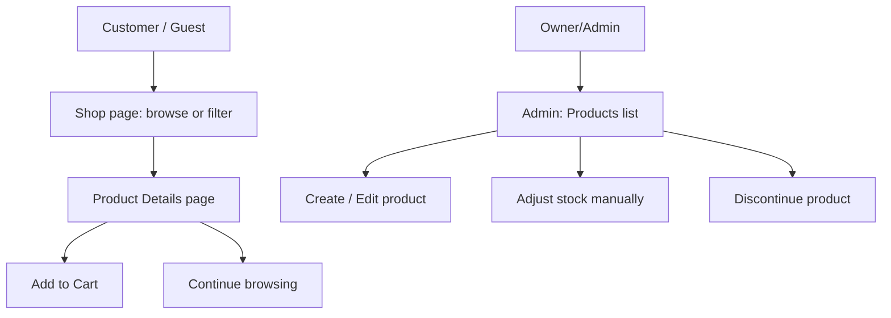

# EP-01 — Product & Catalogue Management

## 1. Epic Overview

- **Epic name:** Product & Catalogue Management
- **Epic number:** EP-01
- **Purpose:** Owns every product, category, and stock-quantity record in the Gen-Z Digital Storefront. It is the single source of truth for "what do we sell and how many do we have."
- **Business goal:** Let the store owner list, edit, and retire products and categories, keep stock counts accurate, and let shoppers browse a clean, searchable catalogue.
- **Who uses it:**
  - **Customers / guests** — browse and search products, no login required.
  - **Owner/Admin** — create/edit/discontinue products and categories, upload image references, adjust stock manually, attach product images.
- **What problem it solves:** Without this Epic there is no catalogue to sell from and no single owner of inventory numbers — every other Epic (Cart, Orders, Reviews) depends on it for product identity and stock truth.

> Architecturally, EP-01 is the **absolute sole owner of Product and Inventory data**. No other module is permitted to write directly to `products` or `inventory_stock` — every other module goes through this Epic's exposed `inventory.service.js` functions (`decreaseStock`, `increaseStock`, `getAvailability`, `getProduct`). This rule is enforced throughout the codebase and is verified in this Epic's own architecture-compliance audits.

---

## 2. What This Epic Does

This Epic manages the products and categories available in the Gen-Z Digital Storefront. Administrators can create, edit, discontinue (soft-delete) products, attach image references, and manually adjust stock quantities. Customers and guests can browse, search, and filter products by category and price, and view full product detail pages including live stock availability — all without logging in.

---

## 3. Features Implemented

| Feature | Status | Description |
|---|---|---|
| Public product search/browse | Implemented | `GET /products` — filter by category, name, min/max price, paginated |
| Product detail view | Implemented | `GET /products/:id` — includes images and live stock/availability |
| Category listing | Implemented | `GET /categories` — public, no auth |
| Admin: create product | Implemented | `POST /products` |
| Admin: edit product | Implemented | `PUT /products/:id` |
| Admin: discontinue product | Implemented | `DELETE /products/:id` — **soft delete only**, sets `status = DISCONTINUED`, never a hard row delete |
| Admin: manual stock adjustment | Implemented | `PATCH /products/:id/stock` — requires a `reason`, logged to the Activity Log. This is the normal way to increase or correct stock (revised DEC-05) |
| Admin: add product image | Implemented | `POST /products/:id/images` — stores an already-uploaded Cloudflare R2 object key/URL, does not itself upload bytes |
| Admin: create category | Implemented | `POST /categories` |
| Admin: edit category | Implemented | `PUT /categories/:id` |
| Cross-module stock interface | Implemented | `inventory.service.js` exposes `decreaseStock()` / `increaseStock()` / `getAvailability()` / `getProduct()` for EP-02 (cart and orders) to call — no other module ever touches `inventory_stock` directly |
| Remove a product image | Not implemented | No `DELETE /products/:id/images` route exists |
| Presigned-URL image upload | Not implemented | The API only stores an `imageReference` string you already have (e.g. from an out-of-band R2 upload) — it does not generate upload URLs or accept file bytes |
| Size / colour / variant fields | Not implemented | `products` has no such columns — the frontend deliberately does not show size/colour selectors |

---

## 4. Frontend Components

| Component | Location | Purpose |
|---|---|---|
| `ProductCard` | `genz-frontend/src/components/product/ProductCard.jsx` | Renders one product tile (image, name, price, stock badge, add-to-cart button) inside a grid |
| `ProductGrid` | `genz-frontend/src/components/product/ProductGrid.jsx` | Lays out a list of `ProductCard`s; shows an empty state when there are none |
| `ProductFilters` | `genz-frontend/src/components/product/ProductFilters.jsx` | Category chips + price-range inputs; only exposes filters the backend actually supports |
| `ProductImage` | `genz-frontend/src/components/ui/ProductImage.jsx` | Resolves `image_reference` to a real ``, or renders a styled placeholder monogram if none is resolvable |
| `SearchBar` | `genz-frontend/src/components/search/SearchBar.jsx` | Navbar/mobile search input, submits to `/shop?q=` |

---

## 5. Frontend Pages

| Page | Route | Purpose |
|---|---|---|
| Shop / Catalogue | `/shop` | Product grid with category/price filters, pagination, and search-by-name (`?q=`) |
| Category page | `/category/:categoryId` | Same as Shop, pre-filtered to one category |
| Product Details | `/products/:id` | Full detail view: gallery, price, stock, description, quantity selector, Add to Cart / Buy Now (also hosts reviews — see EP-03) |
| Admin: Products list | `/admin/products` | Table of all products with Edit / Adjust Stock / Discontinue actions |
| Admin: New/Edit Product | `/admin/products/new`, `/admin/products/:id/edit` | Create/edit form; also where an image reference is attached (edit mode only) |
| Admin: Categories | `/admin/categories` | List + create/edit modal for categories |

---

## 6. Backend Components

| Component | File | Purpose |
|---|---|---|
| Product routes | `genz-backend/genz-backend/src/modules/product-catalogue/routes/product.routes.js` | Registers all `/products` endpoints |
| Category routes | `genz-backend/genz-backend/src/modules/product-catalogue/routes/category.routes.js` | Registers all `/categories` endpoints |
| Route index | `genz-backend/genz-backend/src/modules/product-catalogue/routes/index.js` | Exports `productRoutes`, `categoryRoutes` for mounting in `src/app.js` |
| Product controller | `genz-backend/genz-backend/src/modules/product-catalogue/controllers/product.controller.js` | Request/response handling for products |
| Category controller | `genz-backend/genz-backend/src/modules/product-catalogue/controllers/category.controller.js` | Request/response handling for categories |
| Product service | `genz-backend/genz-backend/src/modules/product-catalogue/services/product.service.js` | Business logic: search, CRUD, manual stock adjustment, Activity Log writes |
| Category service | `genz-backend/genz-backend/src/modules/product-catalogue/services/category.service.js` | Business logic for categories |
| **Inventory service** | `genz-backend/genz-backend/src/modules/product-catalogue/services/inventory.service.js` | **The sole exposed stock-mutation interface** — `decreaseStock`, `increaseStock`, `getAvailability`, `getProduct`. Imported directly by EP-02 (`order.service.js`, `cart.service.js`). No other file may import `inventory.repository.js`. |
| Product repository | `genz-backend/genz-backend/src/modules/product-catalogue/repositories/product.repository.js` | Direct SQL for `products` + `product_images` |
| Category repository | `genz-backend/genz-backend/src/modules/product-catalogue/repositories/category.repository.js` | Direct SQL for `categories` |
| Inventory repository | `genz-backend/genz-backend/src/modules/product-catalogue/repositories/inventory.repository.js` | Direct SQL for `inventory_stock` — imported **only** by `inventory.service.js` and `product.service.js` (for the manual-adjustment path) |
| Validators | `genz-backend/genz-backend/src/modules/product-catalogue/validators/product.validator.js`, `category.validator.js` | Zod request-shape validation (first line of defense; DB `CHECK` constraints are the final authority) |

---

## 7. API Endpoints

| Method | Endpoint | Purpose | Authentication |
|---|---|---|---|
| GET | `/api/v1/products` | Search/browse products (`categoryId`, `name`, `minPrice`, `maxPrice`, `page`, `limit`) | Public |
| GET | `/api/v1/products/:id` | Product detail (includes images + live stock) | Public |
| POST | `/api/v1/products` | Create product | Admin (`PRODUCT_MANAGE`) |
| PUT | `/api/v1/products/:id` | Edit product | Admin (`PRODUCT_MANAGE`) |
| DELETE | `/api/v1/products/:id` | Discontinue product (soft delete) | Admin (`PRODUCT_MANAGE`) |
| PATCH | `/api/v1/products/:id/stock` | Manual stock adjustment (`newQuantity`, `reason`) | Admin (`PRODUCT_MANAGE`) |
| POST | `/api/v1/products/:id/images` | Attach an image reference | Admin (`PRODUCT_MANAGE`) |
| GET | `/api/v1/categories` | List categories | Public |
| POST | `/api/v1/categories` | Create category | Admin (`CATEGORY_MANAGE`) |
| PUT | `/api/v1/categories/:id` | Edit category | Admin (`CATEGORY_MANAGE`) |

"Admin" = a valid Owner/Admin Access Key session, or (once Staff authentication is resolved — see §11) a Staff session holding the named permission.

---

## 8. Database / Data Model

```text
products
├── product_id            (PK)
├── category_id           (FK → categories)
├── name
├── description
├── price                 DECIMAL(10,2), CHECK price > 0
├── status                ENUM('ACTIVE','DISCONTINUED')
├── created_at / updated_at

categories
├── category_id           (PK)
├── name                  UNIQUE
├── description

inventory_stock            -- shared primary key with products (1:1)
├── product_id             (PK, FK → products)
├── quantity               INT UNSIGNED, CHECK quantity >= 0
├── availability_status    GENERATED column: IN_STOCK / OUT_OF_STOCK (derived from quantity)
├── updated_at

product_images              -- physical-only support table, not a separate business entity
├── product_image_id       (PK)
├── product_id             (FK → products)
├── image_reference         Cloudflare R2 object key or full URL
├── sort_order
```

**Business rules:**
- `DELETE /products/:id` never issues a real SQL `DELETE` — it sets `status = 'DISCONTINUED'` (Physical Schema's `RESTRICT` policy on Product's child references requires this).
- A new product always gets an `inventory_stock` row created atomically with it (quantity `0`), in the same DB transaction — a Product can never exist without a stock row.
- `availability_status` is a MySQL **generated column** — it is never written directly, only derived from `quantity`.
- **`GET /products` (the list/search endpoint) does not return `images`** — only `GET /products/:id` (detail) does. This is a real backend response-shape fact, not a frontend bug — product grid cards correctly show a placeholder image because of this.

---

## 9. User Workflow



---

## 10. Backend Workflow

```text
React page/component (ProductGrid, ProductDetailsPage, AdminProductsPage)
      ↓
src/api/products.js / categories.js  (Axios calls)
      ↓
Express route (product.routes.js / category.routes.js)
      ↓  [validate() middleware — Zod schema check]
      ↓  [authAdminAccessKey + requirePermission() for Admin routes]
Controller (product.controller.js / category.controller.js)
      ↓
Service (product.service.js / category.service.js / inventory.service.js)
      ↓
Repository (product.repository.js / category.repository.js / inventory.repository.js)
      ↓
MySQL (products, categories, inventory_stock, product_images)
```

Mutating actions (create/update/discontinue) also call `activity-log.service.js` (owned by EP-04) so every product change is written to the single, central Activity Log.

---

## 11. Authentication & Authorization

- **Browsing (search, detail, categories) requires no login** — deliberately public, per the locked "guest browsing" rule.
- **All mutating endpoints require an Admin session** — either an Owner/Admin Access Key session (`authAdminAccessKey` middleware) or a Staff session holding the `PRODUCT_MANAGE` / `CATEGORY_MANAGE` permission (`requirePermission()` middleware).
- **Staff login itself is an OPEN architecture decision, not yet implemented** — `auth-staff.middleware.js` exists only as a documented placeholder and always rejects. In practice, today, only the Owner/Admin Access Key can reach these endpoints.
- No secrets, tokens, or `.env` values are reproduced here — see §17 for variable **names** only.

---

## 12. Integration With Other Epics

```text
EP-01 Product & Catalogue
   ├──→ EP-02 Customer & Order   (Cart reads product existence/price via inventory.service.getProduct();
   │                              Order confirm/cancel calls decreaseStock()/increaseStock())
   └──→ EP-03 Delivery & Review  (Reviews reference a productId; product detail page renders reviews)
```

EP-01 has **no incoming dependency** on any other Epic for its own core function — it is the foundation every other Epic reads from.

---

## 13. Files Owned / Main Files

```text
Frontend:
genz-frontend/src/pages/ShopPage.jsx
genz-frontend/src/pages/CategoryPage.jsx
genz-frontend/src/pages/ProductDetailsPage.jsx        (shared with EP-03 for the reviews section)
genz-frontend/src/pages/admin/AdminProductsPage.jsx
genz-frontend/src/pages/admin/AdminProductFormPage.jsx
genz-frontend/src/pages/admin/AdminCategoriesPage.jsx
genz-frontend/src/components/product/ProductCard.jsx
genz-frontend/src/components/product/ProductGrid.jsx
genz-frontend/src/components/product/ProductFilters.jsx
genz-frontend/src/components/ui/ProductImage.jsx
genz-frontend/src/api/products.js
genz-frontend/src/api/categories.js

Backend:
genz-backend/genz-backend/src/modules/product-catalogue/
  ├── controllers/product.controller.js, category.controller.js
  ├── services/product.service.js, category.service.js, inventory.service.js
  ├── repositories/product.repository.js, category.repository.js, inventory.repository.js
  ├── routes/product.routes.js, category.routes.js, index.js
  └── validators/product.validator.js, category.validator.js
```

---

## 14. How to Run / Test This Epic

### Backend

```bash
cd genz-backend/genz-backend
npm install
node server.js
```
> On this project's Windows path (contains `&`), `npm run <script>` and `npm start` may fail via `cmd.exe`; run `node server.js` directly, or `node node_modules/jest/bin/jest.js` for tests, as a workaround.

### Frontend

```bash
cd genz-frontend
npm install
cp .env.example .env   # set VITE_API_URL to the running backend
npm run dev
```

### Manual test steps

1. Start the backend, then the frontend.
2. Open `/shop` — confirm products load, category chips and price filters narrow the grid.
3. Click a product — confirm the detail page shows price, stock, description.
4. Log in as Admin (`/admin/login`) → `/admin/products` → create a product → confirm it appears in `/shop`.
5. Adjust its stock with a reason → confirm the new quantity shows on the detail page.
6. Discontinue it → confirm it disappears from `/shop` (it is soft-deleted, not gone from the admin list).

---

## 15. Testing Checklist

- [ ] Product list loads and paginates
- [ ] Category filter narrows results
- [ ] Price range filter narrows results
- [ ] Search by name (`/shop?q=`) works
- [ ] Product details page loads with correct price/stock/description
- [ ] Out-of-stock products show a disabled Add to Cart
- [ ] Admin can create a product
- [ ] Admin can edit a product
- [ ] Admin can discontinue a product (and it disappears from public listings)
- [ ] Admin can manually adjust stock and must supply a reason
- [ ] Admin can attach an image reference to an existing product
- [ ] Invalid product data (e.g. negative price) is rejected with a clear error
- [ ] API/network errors show the ErrorState component, not a blank page
- [ ] Mobile layout of Shop and Product Details works

---

## 16. Common Issues / Troubleshooting

| Issue | Likely Cause |
|---|---|
| "Unable to reach the server" on every page | Backend not running, or `VITE_API_URL` wrong/unset |
| Product images never show, always a placeholder | Expected on the Shop grid (list endpoint returns no images); on the detail page, confirm `VITE_R2_PUBLIC_BASE_URL` is set if `image_reference` is a bare object key, not a full URL |
| 401 on any admin product action | No Admin session, or the Access Key session token expired |
| 400 on product create/edit | A required field is missing, or `price` is not a positive number |
| Backend won't start / native module errors | Known environment issue — see `genz-backend/genz-backend/README.md`'s "Note on this environment" (project path contains `&`, breaking `bcrypt`'s native build on `cmd.exe`) |

---

## 17. Environment Variables

```text
Backend:  DB_HOST, DB_PORT, DB_USER, DB_PASSWORD, DB_NAME, API_PREFIX, PORT, R2_ACCOUNT_ID, R2_ACCESS_KEY_ID,
          R2_SECRET_ACCESS_KEY, R2_BUCKET_NAME, R2_PUBLIC_BASE_URL
Frontend: VITE_API_URL, VITE_R2_PUBLIC_BASE_URL (optional)
```
No values are reproduced here — see each project's own `.env.example`.

---

## 18. Developer Notes

- **Never write to `inventory_stock` or `products` from another module.** Every other Epic must go through `inventory.service.js`'s exported functions. This is the single most important rule in the whole system and is checked in every architecture audit performed on this project.
- `decreaseStock()` / `increaseStock()` **require a transaction connection** (`conn`) — they throw if called without one, by design, so a caller can never accidentally mutate stock outside an atomic operation.
- The duplicate-review, size/colour, and image-upload-endpoint questions are **not** oversights — they are either genuinely out of scope for the approved schema or deliberately left open; do not add them without a project-owner decision.
- `product.service.js`'s manual stock adjustment (`adjustStockManually`) is Module A's **own** restocking/correction path — the normal way stock is increased or corrected (revised DEC-05), always with a mandatory reason and an Activity Log entry. It is distinct from the `decreaseStock`/`increaseStock` interface other modules call.

---

## 19. Current Status

```text
Status: Completed
Last verified: 2026-09-09
```
