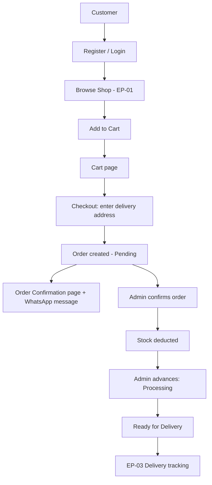

# EP-02 — Customer & Order Management

## 1. Epic Overview

- **Epic name:** Customer & Order Management
- **Epic number:** EP-02
- **Purpose:** Owns customer accounts, shopping carts, and the full order lifecycle — from checkout through to cancellation.
- **Business goal:** Let a shopper create an account, build a cart, place an order, and track it; let an admin confirm/progress/cancel orders and see everyone's order history.
- **Who uses it:**
  - **Customers** — register, log in, manage their cart, check out, view/cancel their own orders.
  - **Owner/Admin** — view all orders, confirm them (triggers stock deduction), advance their status, cancel at any stage.
- **What problem it solves:** This is the actual commerce transaction path — without it, browsing the catalogue (EP-01) never converts into a real sale.

---

## 2. What This Epic Does

This Epic manages customer accounts and the complete order lifecycle in the Gen-Z Digital Storefront. Customers register and log in with a JWT session, build a cart (cart access itself requires login — there is no guest cart), check out with a delivery address, and receive a pre-filled WhatsApp message to confirm their order with the store. Admins confirm orders (which deducts stock), progress them through Processing → Ready for Delivery, and can cancel orders at any stage (restoring stock if it had already been deducted).

---

## 3. Features Implemented

| Feature | Status | Description |
|---|---|---|
| Customer registration | Implemented | `POST /auth/customer/register` — bcrypt-hashed password, returns a session JWT immediately |
| Customer login | Implemented | `POST /auth/customer/login` |
| Cart: view | Implemented | `GET /cart` — customer-authenticated only |
| Cart: add item | Implemented | `POST /cart/items` |
| Cart: update quantity | Implemented | `PUT /cart/items/:id` |
| Cart: remove item | Implemented | `DELETE /cart/items/:id` |
| Checkout | Implemented | `POST /orders` — requires `deliveryAddress`, creates a Pending order from the cart, generates a WhatsApp order message/link |
| Order history (own) | Implemented | `GET /orders` (customer scope) |
| Order history (all, admin) | Implemented | `GET /orders` (admin scope, filterable by status) |
| Order detail | Implemented | `GET /orders/:id` |
| Admin: confirm order | Implemented | `PATCH /orders/:id/confirm` — Pending → Confirmed, **deducts stock via EP-01's `decreaseStock()`** |
| Admin: advance order status | Implemented | `PATCH /orders/:id/status` — Confirmed → Processing → Ready for Delivery |
| Cancel order | Implemented | `PATCH /orders/:id/cancel` — customer may cancel their own **Pending** order only; Admin may cancel from any non-Cancelled stage; **restores stock via `increaseStock()`** if it had been deducted |
| WhatsApp ordering | Implemented | A `wa.me` deep link with a pre-filled order summary is generated at checkout and shown on the confirmation page |
| Bank transfer ordering | Not implemented | No such field, endpoint, or UI exists anywhere in the backend or frontend — WhatsApp is the only checkout mechanism |
| Guest cart | Not implemented (resolved as out of scope) | Cart is customer-authenticated-only by explicit project-owner decision — there is no local/guest cart anywhere in the frontend |
| Customer profile editing | Not implemented | No `PUT /customers/:id` endpoint exists — the Account page shows only the name/contact info returned at register/login time |
| Customer profile fetch (after login) | Not implemented | No `GET /customers/:id` endpoint exists — profile data is cached client-side from the register/login response only |

---

## 4. Frontend Components

| Component | Location | Purpose |
|---|---|---|
| `CartItemRow` | `genz-frontend/src/components/cart/CartItemRow.jsx` | One cart line: image, name, quantity selector, line total, remove button |
| `QuantitySelector` | `genz-frontend/src/components/ui/QuantitySelector.jsx` | Reusable +/− quantity input, used in the cart and product detail page |
| `FormField` | `genz-frontend/src/components/forms/FormField.jsx` | Shared labeled-input wrapper used by login/register/checkout forms |
| `ProtectedRoute` | `genz-frontend/src/components/routing/ProtectedRoute.jsx` | Redirects to `/login` if no customer session exists; guards checkout, account, and order pages |

---

## 5. Frontend Pages

| Page | Route | Purpose |
|---|---|---|
| Login | `/login` | Customer login form |
| Register | `/register` | Customer registration form |
| Cart | `/cart` | View/edit cart, proceed to checkout |
| Checkout | `/checkout` (customer-only) | Delivery address form → places the order |
| Order Confirmation | `/orders/:id/confirmation` (customer-only) | Shows the new order + the WhatsApp order-via-WhatsApp button |
| Account | `/account` (customer-only) | Cached profile info + links to order history |
| Order History | `/account/orders` (customer-only) | List of the logged-in customer's own orders |
| Order Details | `/account/orders/:id` (customer-only) | Full order detail, delivery status (see EP-03), cancel button when eligible |
| Admin: Orders | `/admin/orders` | All orders, filterable by status |
| Admin: Order Details | `/admin/orders/:id` | Confirm / advance status / cancel actions |

---

## 6. Backend Components

| Component | File | Purpose |
|---|---|---|
| Customer-auth routes | `genz-backend/genz-backend/src/modules/customer-order/routes/customer-auth.routes.js` | `/auth/customer/register`, `/auth/customer/login` |
| Cart routes | `genz-backend/genz-backend/src/modules/customer-order/routes/cart.routes.js` | All `/cart` endpoints (every route wrapped in `authCustomer`) |
| Order routes | `genz-backend/genz-backend/src/modules/customer-order/routes/order.routes.js` | All `/orders` endpoints |
| Customer controller | `.../controllers/customer.controller.js` | register/login request handling |
| Cart controller | `.../controllers/cart.controller.js` | Cart request handling |
| Order controller | `.../controllers/order.controller.js` | Order request handling (checkout, list, detail, confirm, advance, cancel) |
| Customer service | `.../services/customer.service.js` | bcrypt hashing, JWT issuance, application-level contact-info uniqueness check |
| Cart service | `.../services/cart.service.js` | Cart business logic — verifies product existence via EP-01's `inventory.service.getProduct()`, never reads `products` directly |
| Order service | `.../services/order.service.js` | Checkout, status transitions, cancellation — calls EP-01's `decreaseStock()`/`increaseStock()` inside a DB transaction |
| WhatsApp service | `.../services/whatsapp.service.js` | Builds the `wa.me` deep link + message text at checkout |
| Repositories | `.../repositories/customer.repository.js`, `cart.repository.js`, `order.repository.js` | Direct SQL for `customers`, `carts`/`cart_items`, `orders`/`order_items`/`order_status_history` |
| Validators | `.../validators/customer.validator.js`, `cart.validator.js`, `order.validator.js` | Zod request-shape validation |
| Auth middleware | `genz-backend/genz-backend/src/shared/middleware/auth-customer.middleware.js` | Validates the Customer JWT, attaches `req.customer` |
| Auth middleware (hybrid) | `genz-backend/genz-backend/src/shared/middleware/auth-customer-or-admin.middleware.js` | Used on `GET /orders` and `GET /orders/:id`, which serve both customer-own and admin-all views |

---

## 7. API Endpoints

| Method | Endpoint | Purpose | Authentication |
|---|---|---|---|
| POST | `/api/v1/auth/customer/register` | Create a customer account | Public |
| POST | `/api/v1/auth/customer/login` | Log in | Public |
| GET | `/api/v1/cart` | View own cart | Customer |
| POST | `/api/v1/cart/items` | Add item to cart | Customer |
| PUT | `/api/v1/cart/items/:id` | Update cart item quantity | Customer |
| DELETE | `/api/v1/cart/items/:id` | Remove cart item | Customer |
| POST | `/api/v1/orders` | Checkout (create order) | Customer |
| GET | `/api/v1/orders` | List orders (own, or all if Admin) | Customer or Admin |
| GET | `/api/v1/orders/:id` | Order detail | Customer (own) or Admin |
| PATCH | `/api/v1/orders/:id/confirm` | Pending → Confirmed (deducts stock) | Admin |
| PATCH | `/api/v1/orders/:id/status` | Confirmed → Processing → Ready for Delivery | Admin |
| PATCH | `/api/v1/orders/:id/cancel` | Cancel order (restores stock if applicable) | Customer (own, Pending only) or Admin (any stage) |

---

## 8. Database / Data Model

```text
customers
├── customer_id          (PK)
├── name
├── contact_info          -- login identifier; uniqueness enforced at the APPLICATION layer only, not a DB constraint
├── credentials_reference  -- bcrypt hash
├── status                ENUM('ACTIVE','DEACTIVATED')

carts
├── cart_id               (PK)
├── customer_id           (FK → customers, NOT NULL — no guest cart)
├── status                ENUM('ACTIVE','CONVERTED','ABANDONED')

cart_items
├── cart_item_id          (PK)
├── cart_id               (FK → carts)
├── product_id            (FK → products, EP-01)
├── quantity               -- NOTE: no price stored here; price is fetched live from EP-01 for display

orders
├── order_id              (PK)
├── customer_id           (FK → customers)
├── delivery_address        -- captured at checkout; the authoritative source EP-03's Delivery later snapshots from
├── whatsapp_checkout_reference
├── status                ENUM('PENDING','CONFIRMED','PROCESSING','READY_FOR_DELIVERY','CANCELLED')

order_items
├── order_item_id         (PK)
├── order_id               (FK → orders)
├── product_id             (FK → products)
├── quantity
├── price_snapshot          -- frozen at checkout time, immutable afterward

order_status_history        -- append-only audit trail of every status change
├── order_id, from_status, to_status, actor_type, actor_id, changed_at
```

**Business rules:**
- Stock is decreased **only** at `PENDING → CONFIRMED`, never at checkout itself.
- A successful `decreaseStock()` completes **only** that one transition — `Confirmed → Processing` never happens automatically.
- Cart Items carry no price — the frontend fetches each product's current price live (via EP-01) to compute a subtotal; the price is only frozen (`price_snapshot`) once an Order Item is created at checkout.
- Cancellation stock effect: Pending → Cancelled has **no** stock effect (nothing was deducted yet); Confirmed-or-later → Cancelled **restores** stock.

---

## 9. User Workflow



---

## 10. Backend Workflow

```text
React page (CartPage, CheckoutPage, OrderHistoryPage, AdminOrdersPage)
      ↓
src/api/cart.js / orders.js / customerAuth.js  (Axios, carries the Customer JWT via authAs: "customer")
      ↓
Express route (cart.routes.js / order.routes.js / customer-auth.routes.js)
      ↓  [authCustomer / authCustomerOrAdmin middleware]
      ↓  [validate() — Zod schema]
Controller (cart.controller.js / order.controller.js / customer.controller.js)
      ↓
Service (cart.service.js / order.service.js / customer.service.js / whatsapp.service.js)
      ↓ (order confirm/cancel calls EP-01's inventory.service.js inside withTransaction())
Repository (cart.repository.js / order.repository.js / customer.repository.js)
      ↓
MySQL (customers, carts, cart_items, orders, order_items, order_status_history)
```

---

## 11. Authentication & Authorization

- **Customer session:** a JWT issued at register/login, stored client-side, sent as `Authorization: Bearer <token>`. Validated by `auth-customer.middleware.js`, which attaches `req.customer = { customerId }`.
- **Every cart endpoint requires a Customer session** — there is no guest path.
- **Checkout requires a Customer session** (mandatory login-before-checkout, a locked business rule).
- **`GET /orders` and `GET /orders/:id` accept either a Customer or an Admin session** (`auth-customer-or-admin.middleware.js`) — a customer sees only their own orders; an Admin sees all.
- **Order confirm/advance-status require an Admin session.**
- **Cancel accepts either**: a Customer may cancel only their own order, and only while Pending; an Admin may cancel from any non-Cancelled stage.
- No secrets are reproduced here — see §17 for variable **names** only.

---

## 12. Integration With Other Epics

```text
EP-01 Product & Catalogue  →  EP-02  (Cart/Order read product price+existence; Order confirm/cancel mutate stock)
EP-02  →  EP-03 Delivery & Review  (Order reaching "Ready for Delivery" is the handover point EP-03's Delivery is created against;
                                      a Review references an Order to prove verified purchase)
EP-04 Store Administration  →  EP-02  (Activity Log records every order-affecting action; Admin sessions authorize confirm/advance/cancel)
```

---

## 13. Files Owned / Main Files

```text
Frontend:
genz-frontend/src/pages/CartPage.jsx
genz-frontend/src/pages/CheckoutPage.jsx
genz-frontend/src/pages/OrderConfirmationPage.jsx
genz-frontend/src/pages/OrderHistoryPage.jsx
genz-frontend/src/pages/OrderDetailsPage.jsx
genz-frontend/src/pages/LoginPage.jsx
genz-frontend/src/pages/RegisterPage.jsx
genz-frontend/src/pages/AccountPage.jsx
genz-frontend/src/pages/admin/AdminOrdersPage.jsx
genz-frontend/src/pages/admin/AdminOrderDetailsPage.jsx
genz-frontend/src/context/CustomerAuthContext.jsx
genz-frontend/src/context/CartContext.jsx
genz-frontend/src/api/customerAuth.js, cart.js, orders.js

Backend:
genz-backend/genz-backend/src/modules/customer-order/
  ├── controllers/customer.controller.js, cart.controller.js, order.controller.js
  ├── services/customer.service.js, cart.service.js, order.service.js, whatsapp.service.js
  ├── repositories/customer.repository.js, cart.repository.js, order.repository.js
  ├── routes/customer-auth.routes.js, cart.routes.js, order.routes.js, index.js
  └── validators/customer.validator.js, cart.validator.js, order.validator.js
```

---

## 14. How to Run / Test This Epic

### Backend
```bash
cd genz-backend/genz-backend
npm install
node server.js
```

### Frontend
```bash
cd genz-frontend
npm install
cp .env.example .env
npm run dev
```

### Manual test steps

1. Register a new customer at `/register`.
2. Add a product to the cart from `/shop` or `/products/:id`.
3. Go to `/cart`, adjust a quantity, remove an item, confirm the subtotal updates.
4. Go to `/checkout`, enter a delivery address, place the order.
5. Confirm the WhatsApp message/link appears on the confirmation page.
6. Log in as Admin, go to `/admin/orders`, find the new order, confirm it — check the product's stock dropped by the ordered quantity (EP-01).
7. Advance it through Processing → Ready for Delivery.
8. As the customer, try cancelling a **different**, still-Pending order — confirm it succeeds with no stock change.

---

## 15. Testing Checklist

- [ ] Registration rejects a duplicate contact info
- [ ] Login rejects wrong credentials
- [ ] Cart requires login (redirects/prompts when logged out)
- [ ] Add/update/remove cart item all work and recompute the subtotal
- [ ] Checkout fails cleanly if the cart is empty
- [ ] Checkout fails cleanly if an item is out of stock
- [ ] Order confirmation shows a working WhatsApp link
- [ ] Order history shows only the logged-in customer's own orders
- [ ] Customer cannot cancel a Confirmed (or later) order
- [ ] Customer cannot view another customer's order
- [ ] Admin confirm deducts stock exactly once
- [ ] Admin cancel after Confirmed restores stock
- [ ] Mobile layout of Cart and Checkout works

---

## 16. Common Issues / Troubleshooting

| Issue | Likely Cause |
|---|---|
| "Unable to reach the server" everywhere | Backend not running / wrong `VITE_API_URL` |
| Cart always looks empty even when logged in | Session token expired — log in again |
| Checkout button disabled | Cart has an out-of-stock item — remove or reduce it first |
| 409 `CONTACT_INFO_IN_USE` on register | An active account already uses that contact info |
| 401 `INVALID_CREDENTIALS` on login | Wrong contact info/password, or the account is deactivated |
| Admin can't confirm an order | Order isn't in `PENDING` status, or insufficient stock at the moment of confirmation |

---

## 17. Environment Variables

```text
Backend:  CUSTOMER_JWT_SECRET, CUSTOMER_JWT_EXPIRES_IN, STORE_WHATSAPP_NUMBER, DB_HOST, DB_PORT, DB_USER,
          DB_PASSWORD, DB_NAME, API_PREFIX, PORT
Frontend: VITE_API_URL
```
No values are reproduced here.

---

## 18. Developer Notes

- **Cart has no guest path by design** — do not add local/session-storage cart persistence without a project-owner decision; this was an explicitly resolved OPEN item (Option B: "Cart only created post-login").
- **Cart Item prices are never stored** — always fetch live product price for display; never assume a cached price is current.
- **Stock mutation always goes through EP-01's `inventory.service.js`, inside a transaction** — `order.service.js` never writes `inventory_stock` directly.
- **Bank transfer does not exist anywhere in this system.** Do not add bank-transfer UI without first adding real backend support — the frontend intentionally implements WhatsApp ordering only, matching the real API.
- There is currently **no endpoint to update a customer's own profile** — the Account page is read-only, sourced from the cached register/login response.

---

## 19. Current Status

```text
Status: Completed
Last verified: 2026-09-09
```
