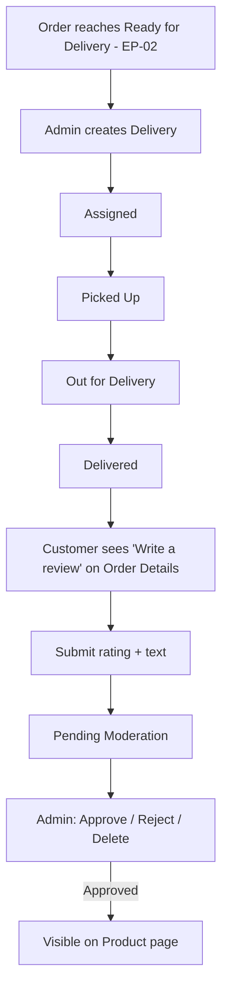

# EP-03 — Delivery Tracking with Review Management

## 1. Epic Overview

- **Epic name:** Delivery Tracking with Review Management
- **Epic number:** EP-03
- **Purpose:** Owns delivery records/status once an order is ready to ship, and owns product reviews (submission + moderation).
- **Business goal:** Let the store track a parcel from assignment to delivered, and let verified customers leave reviews that an admin moderates before they go public.
- **Who uses it:**
  - **Customers** — track their own delivery, submit a review after their order is delivered.
  - **Owner/Admin** — create delivery records, advance delivery status, moderate the review queue.
  - **Public/guests** — read approved reviews on a product page.
- **What problem it solves:** Closes the loop after checkout (EP-02) — someone has to actually get the parcel to the customer, and the store needs a trustworthy, moderated review signal to build customer confidence.

---

## 2. What This Epic Does

This Epic tracks a Delivery from the moment an order is Ready for Delivery through Assigned → Picked Up → Out for Delivery → Delivered, and manages product reviews end to end: a customer submits a rating + optional text tied to a specific delivered order/product, it sits in a Pending Moderation queue, and an admin approves, rejects, or deletes it. Only approved reviews (and the aggregate rating computed from them) are shown publicly on a product's page.

---

## 3. Features Implemented

| Feature | Status | Description |
|---|---|---|
| Create delivery record | Implemented | `POST /deliveries` — Admin, links to an Order that has reached `READY_FOR_DELIVERY` |
| Delivery detail | Implemented | `GET /deliveries/:id` — Customer (own, via order ownership check) or Admin |
| Delivery by order (customer) | Implemented | `GET /orders/:id/delivery` — **Customer-only**, convenience lookup |
| Advance delivery status | Implemented | `PATCH /deliveries/:id/status` — **Admin only**; sequential Assigned → Picked Up → Out for Delivery → Delivered |
| Submit review | Implemented | `POST /reviews` — Customer; backend validates the order was Delivered and genuinely contains the product ("verified purchase") |
| Public approved reviews + rating | Implemented | `GET /products/:id/reviews` — public, Approved reviews only, plus an aggregate average rating |
| Admin moderation queue | Implemented | `GET /reviews` — Admin, Pending Moderation only, read-only |
| Moderate a review | Implemented | `PATCH /reviews/:id/moderate` — Admin, action = `APPROVE` / `REJECT` / `DELETE` |
| Delivery Person self-service tracking | Not implemented (OPEN decision) | No Delivery Person identity/authentication exists — `PATCH /deliveries/:id/status` is reachable by Admin only today |
| Duplicate-review prevention | Not implemented (OPEN decision) | A customer may submit more than one review for the same product/order; no uniqueness check exists at any layer |
| Admin "find delivery by order ID" | Not implemented | No backend endpoint lets an Admin look up an existing delivery from an order ID — `GET /orders/:id/delivery` is Customer-only. The Admin Order Details page discloses this limitation rather than working around it (see §16) |

---

## 4. Frontend Components

| Component | Location | Purpose |
|---|---|---|
| `ReviewCard` | `genz-frontend/src/components/product/ReviewCard.jsx` | Renders one review (star rating, date, text). Shows "Verified Customer" — the review DTO carries no reviewer name |
| `StarRating` | `genz-frontend/src/components/ui/StarRating.jsx` | Read-only display, or an interactive 1–5 picker (used by the review submission form) |

---

## 5. Frontend Pages

| Page | Route | Purpose |
|---|---|---|
| Product Details | `/products/:id` | Hosts the review list + a review-submission form (shown to logged-in customers with at least one delivered, product-matching order — see §9) |
| Order Details (customer) | `/account/orders/:id` | Shows delivery status and a "write a review" link once Delivered |
| Admin: Deliveries | `/admin/deliveries` | Create a delivery for a Ready-for-Delivery order, or look one up by its own Delivery ID and advance its status |
| Admin: Order Details | `/admin/orders/:id` | Create a delivery from an eligible order, or advance a just-created delivery's status (session-scoped — see §16) |
| Admin: Review Moderation | `/admin/reviews` | Pending Moderation queue with Approve / Reject / Delete actions |

---

## 6. Backend Components

| Component | File | Purpose |
|---|---|---|
| Delivery routes | `genz-backend/genz-backend/src/modules/delivery-review/routes/delivery.routes.js` | `/deliveries` endpoints |
| Order-delivery routes | `genz-backend/genz-backend/src/modules/delivery-review/routes/order-delivery.routes.js` | `GET /orders/:id/delivery` (mounted alongside EP-02's order routes) |
| Review routes | `genz-backend/genz-backend/src/modules/delivery-review/routes/review.routes.js` | `POST /reviews`, `GET /reviews`, `PATCH /reviews/:id/moderate` |
| Product-reviews routes | `genz-backend/genz-backend/src/modules/delivery-review/routes/product-reviews.routes.js` | `GET /products/:id/reviews` (mounted alongside EP-01's product routes) |
| Delivery controller/service/repository | `.../controllers/delivery.controller.js`, `.../services/delivery.service.js`, `.../repositories/delivery.repository.js` | Delivery CRUD/status logic and SQL for `deliveries` + `delivery_status_history` |
| Review controller/service/repository | `.../controllers/review.controller.js`, `.../services/review.service.js`, `.../repositories/review.repository.js` | Review + moderation logic and SQL for `reviews` + `moderation_logs` |
| Validators | `.../validators/delivery.validator.js`, `review.validator.js` | Zod schemas |

---

## 7. API Endpoints

| Method | Endpoint | Purpose | Authentication |
|---|---|---|---|
| POST | `/api/v1/deliveries` | Create a delivery record for a Ready-for-Delivery order | Admin |
| GET | `/api/v1/deliveries/:id` | Delivery detail | Customer (own, via order) or Admin |
| PATCH | `/api/v1/deliveries/:id/status` | Advance delivery status | Admin (Delivery Person path is OPEN, not implemented) |
| GET | `/api/v1/orders/:id/delivery` | Delivery for a given order | Customer (own) only |
| POST | `/api/v1/reviews` | Submit a review | Customer |
| GET | `/api/v1/products/:id/reviews` | Approved reviews + aggregate rating for a product | Public |
| GET | `/api/v1/reviews` | Moderation queue (Pending Moderation) | Admin (`REVIEW_MODERATE`) |
| PATCH | `/api/v1/reviews/:id/moderate` | Approve / Reject / Delete a review | Admin (`REVIEW_MODERATE`) |

---

## 8. Database / Data Model

```text
deliveries
├── delivery_id              (PK)
├── order_id                  (FK → orders, UNIQUE — one delivery per order)
├── delivery_address           -- snapshotted from the Order at handover, never a live Customer link
├── delivery_person_reference   -- free-text placeholder only; no real identity/auth (OPEN decision)
├── status                    ENUM('ASSIGNED','PICKED_UP','OUT_FOR_DELIVERY','DELIVERED')

delivery_status_history        -- append-only
├── delivery_id, from_status, to_status, actor_reference, changed_at

reviews
├── review_id                 (PK)
├── customer_id, product_id, order_id   (all required — proves verified purchase)
├── rating                    1–5
├── review_text                optional
├── moderation_status          ENUM('PENDING_MODERATION','APPROVED','REJECTED','DELETED')

moderation_logs                -- append-only audit of every moderation action
├── moderation_log_id         (PK)
├── review_id                  (FK → reviews)
├── actor_type                 ENUM('STAFF_ADMIN_USER','OWNER_ADMIN')
├── actor_id                    Staff/Admin User ID when actor_type = STAFF_ADMIN_USER, otherwise NULL
├── action                     ENUM('APPROVE','REJECT','DELETE')
```

**Business rules:**
- A Review requires the referenced Order's Delivery to have reached `DELIVERED`, and the Customer must own that Order (verified-purchase eligibility).
- No uniqueness constraint on `(customer_id, product_id, order_id)` — a customer **can** submit more than one review; this is a deliberately preserved OPEN decision, not a bug.
- `moderation_logs.actor_type`/`actor_id` implement the project's **Actor Identity Decision**: Owner/Admin moderates with `actor_type = 'OWNER_ADMIN'`, `actor_id = NULL` (no fake Staff row is ever created); a Staff moderator would use `actor_type = 'STAFF_ADMIN_USER'` with a real ID once Staff login exists.
- Only `Assigned → Picked Up → Out for Delivery → Delivered`, strictly sequential — no skipping stages.

---

## 9. User Workflow



---

## 10. Backend Workflow

```text
React page (ProductDetailsPage, OrderDetailsPage, AdminDeliveriesPage, AdminReviewsPage)
      ↓
src/api/deliveries.js / reviews.js
      ↓
Express route (delivery.routes.js / review.routes.js / order-delivery.routes.js / product-reviews.routes.js)
      ↓  [authCustomer or authAdminAccessKey + requirePermission()]
      ↓  [validate() — Zod schema]
Controller (delivery.controller.js / review.controller.js)
      ↓
Service (delivery.service.js / review.service.js)
      ↓ (moderateReview writes moderation_logs + calls EP-04's activity-log.service.js, inside one transaction)
Repository (delivery.repository.js / review.repository.js)
      ↓
MySQL (deliveries, delivery_status_history, reviews, moderation_logs)
```

---

## 11. Authentication & Authorization

- **`GET /products/:id/reviews` is public** — no login needed to read approved reviews.
- **`POST /reviews` requires a Customer session.**
- **`GET /orders/:id/delivery` requires a Customer session**, and only returns the delivery if the requesting customer owns the order.
- **`GET /deliveries/:id` accepts a Customer session (own delivery only, via order ownership) or an Admin session.**
- **`POST /deliveries`, `PATCH /deliveries/:id/status`, `GET /reviews`, `PATCH /reviews/:id/moderate` all require an Admin session** with the relevant permission (`DELIVERY_MANAGE`, `REVIEW_MODERATE`).
- **Delivery Person authentication does not exist** — this is a genuinely OPEN decision; do not build around it.

---

## 12. Integration With Other Epics

```text
EP-02 Customer & Order  →  EP-03  (an Order reaching Ready for Delivery is the precondition for creating a Delivery;
                                     a Review requires a Delivered Order the customer owns)
EP-01 Product & Catalogue  →  EP-03  (a Review references a productId; product detail page renders that product's reviews)
EP-04 Store Administration  →  EP-03  (Activity Log records delivery-status and review-moderation actions;
                                         Admin/Staff sessions authorize every Admin-only EP-03 action)
```

---

## 13. Files Owned / Main Files

```text
Frontend:
genz-frontend/src/components/product/ReviewCard.jsx
genz-frontend/src/components/ui/StarRating.jsx
genz-frontend/src/pages/admin/AdminDeliveriesPage.jsx
genz-frontend/src/pages/admin/AdminReviewsPage.jsx
genz-frontend/src/api/deliveries.js, reviews.js
(review submission + display logic lives inside ProductDetailsPage.jsx, shared with EP-01)

Backend:
genz-backend/genz-backend/src/modules/delivery-review/
  ├── controllers/delivery.controller.js, review.controller.js
  ├── services/delivery.service.js, review.service.js
  ├── repositories/delivery.repository.js, review.repository.js
  ├── routes/delivery.routes.js, review.routes.js, order-delivery.routes.js, product-reviews.routes.js, index.js
  └── validators/delivery.validator.js, review.validator.js
```

---

## 14. How to Run / Test This Epic

### Backend
```bash
cd genz-backend/genz-backend
npm install
node server.js
```

### Frontend
```bash
cd genz-frontend
npm install
cp .env.example .env
npm run dev
```

### Manual test steps

1. As Admin, take an order through Confirmed → Processing → Ready for Delivery (EP-02).
2. `/admin/orders/:id` → "Create Delivery Record."
3. Advance it: Assigned → Picked Up → Out for Delivery → Delivered.
4. As the owning customer, go to `/account/orders/:id` — confirm a "write a review" link now appears.
5. Submit a review from the product page.
6. As Admin, go to `/admin/reviews` — confirm it's in the Pending Moderation queue.
7. Approve it — confirm it now appears on the product's public review list with the correct average rating.

---

## 15. Testing Checklist

- [ ] Delivery can only be created for a Ready-for-Delivery order
- [ ] Delivery status only advances one step at a time, in order
- [ ] Customer cannot view another customer's delivery
- [ ] Review submission is rejected if the order isn't Delivered yet
- [ ] Review submission is rejected if the product wasn't actually in that order
- [ ] Public review list shows only Approved reviews
- [ ] Aggregate rating recalculates correctly after a new approval
- [ ] Admin moderation queue shows only Pending Moderation reviews
- [ ] Approve / Reject / Delete each update the review's status correctly
- [ ] Moderation actor is recorded correctly (Owner/Admin vs. Staff)
- [ ] Mobile layout of the review form and delivery status works

---

## 16. Common Issues / Troubleshooting

| Issue | Likely Cause |
|---|---|
| "Write a review" never appears | The order's Delivery hasn't reached `DELIVERED` yet, or the customer doesn't own that order |
| Review submission fails with a verified-purchase error | The `orderId`/`productId` pair doesn't match an actual line item on a Delivered order |
| Admin Order Details page can't show delivery status after a page refresh | **By design, not a bug** — the backend has no endpoint for an Admin session to look up a delivery by order ID; status is only shown for the duration of the page visit right after you create/advance it there. Use `/admin/deliveries` and look it up by Delivery ID instead if you know it. |
| 501/placeholder responses on any Delivery Person–specific action | Delivery Person identity is an OPEN decision — do not attempt to "fix" this without a project-owner decision |

---

## 17. Environment Variables

```text
Backend:  DB_HOST, DB_PORT, DB_USER, DB_PASSWORD, DB_NAME, API_PREFIX, PORT
Frontend: VITE_API_URL
```
No values are reproduced here.

---

## 18. Developer Notes

- **Do not implement Delivery Person authentication or a duplicate-review restriction** without an explicit project-owner decision — both are deliberately preserved OPEN items across this entire project's history.
- **Do not invent a "list all deliveries" or "delivery by order, for admins" endpoint** on the frontend by guessing a URL — it does not exist. If this is needed, it is a backend change requiring project-owner sign-off, not a frontend workaround.
- `moderation_logs` is append-only and only ever grows — moderation is not a single mutable "current status" but a full history of actions.
- The Actor Identity Decision (`actor_type`/`actor_id` pairing, `NULL` id for Owner/Admin) is specified in Physical Schema V1.0 §5b — see it for the full rationale if you need to touch this logic.

---

## 19. Current Status

```text
Status: Completed for the documented endpoint set. Delivery Person identity and duplicate-review policy remain OPEN (by design).
Last verified: 2026-09-09
```
