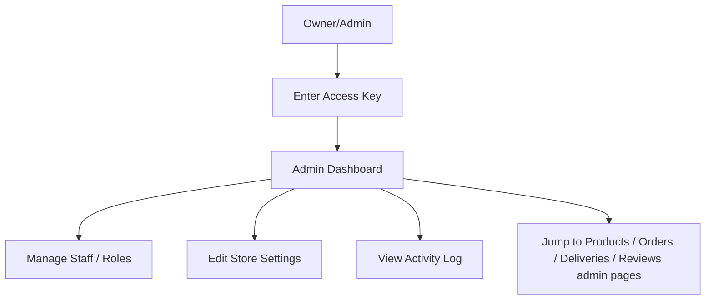

# EP-04 — Store Administration Management

## 1. Epic Overview

- **Epic name:** Store Administration Management
- **Epic number:** EP-04
- **Purpose:** Owns Owner/Admin authentication, Staff accounts, Roles/Permissions (RBAC), Store Settings, the operational Dashboard, and the single central Activity Log used by every other Epic.
- **Business goal:** Give the store owner a way in (the Access Key), a way to create staff and control what they can do, a place to configure store-wide info, a one-screen operational summary, and a full audit trail of every administrative action across the system.
- **Who uses it:** Exclusively the **Owner/Admin** (via the Access Key) today. Staff accounts can be *created* by this Epic, but Staff cannot yet *log in* anywhere in the system (see §3).
- **What problem it solves:** Every other Epic's "Admin"-only functionality depends on this Epic's authentication and authorization machinery; without it, nothing administrative could be gated at all.

---

## 2. What This Epic Does

This Epic implements the Owner/Admin Access Key login (a shared secret, not a username/password), Staff/Admin User account management, a Role/Permission system for future fine-grained authorization, Store Settings (name, contact info, WhatsApp number), a read-only operational Dashboard summarizing counts across the other modules, and the single central Activity Log that every mutating action in the entire application writes into.

---

## 3. Features Implemented

| Feature | Status | Description |
|---|---|---|
| Owner/Admin Access Key login | Implemented | `POST /admin/access-key/validate` — bcrypt-verified shared key, issues a session JWT; rate-limited server-side against brute force |
| Owner/Admin logout | Implemented | `POST /admin/logout` |
| Staff: list | Implemented | `GET /staff` |
| Staff: create | Implemented | `POST /staff` — **Owner-Access-Key-exclusive**, deliberately not reachable by any Staff permission |
| Staff: edit | Implemented | `PUT /staff/:id` |
| Staff: deactivate | Implemented | `PATCH /staff/:id/deactivate` |
| Roles: list/create | Implemented | `GET /roles`, `POST /roles` |
| Permissions: list | Implemented | `GET /permissions` (read-only — no create endpoint exists) |
| Assign permissions to a role | Implemented | `POST /roles/:id/permissions` |
| Store Settings: public read | Implemented | `GET /settings` (unauthenticated) returns only `whatsappNumber` |
| Store Settings: full read/update | Implemented | `GET /settings` (Admin session) returns everything; `PUT /settings` updates it |
| Dashboard | Implemented | `GET /dashboard` — read-only aggregation across Product, Order, and Review counts |
| Activity Log: write | Implemented | Internal `logActivity()` interface, called by every module (A, B, C, D) for every documented auditable action |
| Activity Log: read | Implemented | `GET /activity-log` — filterable by module and action type |
| Staff login | **Not implemented (OPEN decision)** | `auth-staff.middleware.js` exists only as a documented placeholder and always rejects. Staff accounts exist in the database but have no way to authenticate anywhere in this system yet |
| Permission creation via API | Not implemented | Permissions must be seeded directly in the database — there is no `POST /permissions` |

---

## 4. Frontend Components

| Component | Location | Purpose |
|---|---|---|
| `AdminSidebar` | `genz-frontend/src/components/admin/AdminSidebar.jsx` | The full admin navigation, grouped by module |
| `AdminPageHeader` | `genz-frontend/src/components/admin/AdminPageHeader.jsx` | Consistent page title + description + action-button header used by every admin page |
| `StatCard` | `genz-frontend/src/components/admin/StatCard.jsx` | Dashboard's number-tile |
| `AdminTable` | `genz-frontend/src/components/admin/AdminTable.jsx` | Reusable list table used across the Staff, Categories, Orders, Products, and Activity Log admin pages |
| `AdminProtectedRoute` | `genz-frontend/src/components/routing/AdminProtectedRoute.jsx` | Redirects to `/admin/login` if no Admin session exists; guards the entire `/admin/*` area |

---

## 5. Frontend Pages

| Page | Route | Purpose |
|---|---|---|
| Admin Login | `/admin/login` | Access Key entry |
| Admin Dashboard | `/admin` (index) | Operational summary |
| Staff | `/admin/staff` | List + create (Owner-only) + deactivate |
| Roles & Permissions | `/admin/roles` | Create roles, assign existing permissions to a role |
| Store Settings | `/admin/settings` | Edit store name/contact/WhatsApp number |
| Activity Log | `/admin/activity-log` | Filterable audit trail, every module |

---

## 6. Backend Components

| Component | File | Purpose |
|---|---|---|
| Access Key routes | `genz-backend/genz-backend/src/modules/store-administration/routes/admin-access-key.routes.js` | Login/logout |
| Staff routes | `.../routes/staff.routes.js` | Staff CRUD |
| Role routes | `.../routes/role.routes.js` | Role create/list, permission assignment |
| Permission routes | `.../routes/permission.routes.js` | Permission list |
| Store Settings routes | `.../routes/store-settings.routes.js` | Settings read/update |
| Dashboard routes | `.../routes/dashboard.routes.js` | `GET /dashboard` |
| Activity Log routes | `.../routes/activity-log.routes.js` | `GET /activity-log` |
| Controllers | `.../controllers/admin-access-key.controller.js`, `staff.controller.js`, `role-permission.controller.js`, `store-settings.controller.js`, `dashboard.controller.js`, `activity-log.controller.js` | Request/response handling per resource |
| **`activity-log.service.js`** | `.../services/activity-log.service.js` | **The single, central audit writer** — `logActivity()` is imported directly by every other module (never a second audit table anywhere) |
| Other services | `.../services/admin-access-key.service.js`, `staff.service.js`, `role-permission.service.js`, `store-settings.service.js`, `dashboard.service.js` | Business logic per resource. `dashboard.service.js` is read-only aggregation — it never re-implements another module's logic, only calls each module's own exposed list functions |
| Repositories | `.../repositories/admin-access-key.repository.js`, `activity-log.repository.js`, `role-permission.repository.js`, `staff.repository.js`, `store-settings.repository.js` | Direct SQL |
| Validators | `.../validators/*.validator.js` | Zod schemas per resource |
| Admin auth middleware | `genz-backend/genz-backend/src/shared/middleware/auth-admin-access-key.middleware.js` | Validates the Owner/Admin session JWT, attaches `req.adminSession`. Has an `.optional` variant for the public/admin hybrid `GET /settings` |
| Staff auth middleware (placeholder) | `genz-backend/genz-backend/src/shared/middleware/auth-staff.middleware.js` | **Not implemented** — always returns 401; exists only so the RBAC middleware has a defined attachment point once Staff login is resolved |
| RBAC middleware | `genz-backend/genz-backend/src/shared/middleware/rbac.middleware.js` | `requirePermission(name)` — an Owner/Admin session always passes; a Staff session is checked against `role_permissions` in the database |

---

## 7. API Endpoints

| Method | Endpoint | Purpose | Authentication |
|---|---|---|---|
| POST | `/api/v1/admin/access-key/validate` | Owner/Admin login | Public (rate-limited server-side) |
| POST | `/api/v1/admin/logout` | End Owner/Admin session | Admin |
| GET | `/api/v1/staff` | List staff accounts | Admin (`STAFF_MANAGE`) |
| POST | `/api/v1/staff` | Create staff account | **Owner-Access-Key session only** |
| PUT | `/api/v1/staff/:id` | Edit staff account | Admin (`STAFF_MANAGE`) |
| PATCH | `/api/v1/staff/:id/deactivate` | Deactivate staff | Admin (`STAFF_MANAGE`) |
| GET | `/api/v1/roles` | List roles | Admin (`ROLE_MANAGE`) |
| POST | `/api/v1/roles` | Create role | Admin (`ROLE_MANAGE`) |
| GET | `/api/v1/permissions` | List permissions | Admin (`ROLE_MANAGE`) |
| POST | `/api/v1/roles/:id/permissions` | Assign permission(s) to a role | Admin (`ROLE_MANAGE`) |
| GET | `/api/v1/settings` | Store settings (WhatsApp number only if public; full if Admin) | Public / Admin (hybrid) |
| PUT | `/api/v1/settings` | Update store settings | Admin (`SETTINGS_MANAGE`) |
| GET | `/api/v1/dashboard` | Operational summary | Admin (`DASHBOARD_VIEW`) |
| GET | `/api/v1/activity-log` | Audit trail, filterable | Admin (`ACTIVITY_LOG_VIEW`) |

---

## 8. Database / Data Model

```text
admin_access_key            -- single-row table
├── admin_access_key_id     PK, pinned to 1
├── access_key_hash          bcrypt hash

staff_admin_users
├── staff_admin_user_id     (PK)
├── role_id                  (FK → roles)
├── name
├── credentials_reference     -- placeholder column only; Staff login mechanism is OPEN, nothing is ever written here
├── status                   ENUM('ACTIVE','DEACTIVATED')

roles
├── role_id                 (PK)
├── name                     UNIQUE

permissions
├── permission_id           (PK)
├── name                     UNIQUE

role_permissions             -- associative junction table (not a business entity)
├── role_id, permission_id  (composite PK)

store_settings               -- single-row table
├── store_settings_id       PK, pinned to 1
├── store_name, contact_info, whatsapp_number

activity_log                 -- the ONLY audit table in the entire system
├── activity_log_id         (PK)
├── actor_type               ENUM('STAFF_ADMIN_USER','OWNER_ADMIN','SYSTEM')
├── actor_id                  NULL when actor_type = 'OWNER_ADMIN'
├── action_type, affected_entity_type, affected_entity_id, originating_module, context_note, timestamp
```

**Business rules:**
- `admin_access_key` and `store_settings` are both single-row tables (`CHECK` pinning the PK to `1`).
- `staff_admin_users.credentials_reference` exists as a schema placeholder only — Staff authentication itself is genuinely undesigned; do not populate it.
- `activity_log` is **insert-only** and is the single point of truth for every auditable action anywhere in the system — no module ever writes a second, parallel audit record.

---

## 9. User Workflow



---

## 10. Backend Workflow

```text
React page (AdminLoginPage, AdminDashboardPage, AdminStaffPage, AdminRolesPage, AdminSettingsPage, AdminActivityLogPage)
      ↓
src/api/adminAuth.js / staff.js / roles.js / settings.js / dashboard.js / activityLog.js
      ↓
Express route
      ↓  [authAdminAccessKey (+ .optional for public/admin hybrid) + requirePermission()]
      ↓  [validate() — Zod schema]
Controller
      ↓
Service  (every mutating service also calls activity-log.service.js.logActivity())
      ↓
Repository
      ↓
MySQL (admin_access_key, staff_admin_users, roles, permissions, role_permissions, store_settings, activity_log)
```

---

## 11. Authentication & Authorization

- **Owner/Admin Access Key** is a single shared secret (not a per-person username/password) validated server-side and rate-limited; a successful validation issues a session JWT distinct from the Customer JWT (EP-02). This session is treated as **always fully authorized** — an Owner/Admin session passes every `requirePermission()` check automatically.
- **Staff sessions**, once Staff login exists, would be checked against the actual `role_permissions` assignment in the database via `requirePermission(name)`.
- **`POST /staff` is deliberately Owner-Access-Key-only**, even after Staff login exists in the future — creating new privileged accounts is not delegable to a permission grant.
- **`GET /settings` is the one intentionally hybrid endpoint** — no token returns only the WhatsApp number; an Admin token returns the full settings object.
- No secrets, keys, or `.env` values are reproduced here — see §17 for variable **names** only.

---

## 12. Integration With Other Epics

```text
EP-04 Store Administration → EP-01, EP-02, EP-03   (Activity Log receives writes from every one of them;
                                                                 authAdminAccessKey + requirePermission() gate every
                                                                 Admin-only endpoint across the whole system)
EP-01, EP-02, EP-03 → EP-04 (Dashboard reads counts from each module's own exposed list functions,
                                          never a direct table read)
```

EP-04 is the **cross-cutting authorization and audit backbone** of the whole system — every other Epic depends on it; it has no functional dependency back on them beyond the read-only Dashboard aggregation.

---

## 13. Files Owned / Main Files

```text
Frontend:
genz-frontend/src/pages/admin/AdminLoginPage.jsx
genz-frontend/src/pages/admin/AdminDashboardPage.jsx
genz-frontend/src/pages/admin/AdminStaffPage.jsx
genz-frontend/src/pages/admin/AdminRolesPage.jsx
genz-frontend/src/pages/admin/AdminSettingsPage.jsx
genz-frontend/src/pages/admin/AdminActivityLogPage.jsx
genz-frontend/src/layouts/AdminLayout.jsx
genz-frontend/src/components/admin/AdminSidebar.jsx, AdminPageHeader.jsx, StatCard.jsx, AdminTable.jsx
genz-frontend/src/context/AdminAuthContext.jsx
genz-frontend/src/api/adminAuth.js, staff.js, roles.js, settings.js, dashboard.js, activityLog.js

Backend:
genz-backend/genz-backend/src/modules/store-administration/
  ├── controllers/ (6 files, one per resource)
  ├── services/ (6 files — activity-log.service.js is the one every other module imports)
  ├── repositories/ (5 files)
  ├── routes/ (7 files + index.js)
  └── validators/ (5 files)
genz-backend/genz-backend/src/shared/middleware/auth-admin-access-key.middleware.js
genz-backend/genz-backend/src/shared/middleware/auth-staff.middleware.js   (placeholder — OPEN)
genz-backend/genz-backend/src/shared/middleware/rbac.middleware.js
```

---

## 14. How to Run / Test This Epic

### Backend
```bash
cd genz-backend/genz-backend
npm install
node server.js
```
The Access Key itself must be seeded once via `node scripts/set-admin-access-key.js` (reads `ADMIN_ACCESS_KEY_RAW` from the environment) before anyone can log in.

### Frontend
```bash
cd genz-frontend
npm install
cp .env.example .env
npm run dev
```

### Manual test steps

1. Seed the Access Key on the backend (see above).
2. Go to `/admin/login`, enter the key — confirm you land on `/admin`.
3. Confirm the Dashboard shows real product/order/review counts.
4. `/admin/roles` — create a role, then a permission assignment (permissions themselves come pre-seeded in the DB, not created here).
5. `/admin/staff` — create a Staff account, confirm it appears, then deactivate it.
6. `/admin/settings` — update the store name/WhatsApp number, confirm the public footer (any storefront page) picks up the new WhatsApp number.
7. `/admin/activity-log` — confirm every action above produced a corresponding entry.
8. Log out, confirm `/admin` redirects back to `/admin/login`.

---

## 15. Testing Checklist

- [ ] Wrong Access Key is rejected with a generic error (never reveals *why* it failed)
- [ ] Repeated wrong attempts eventually get rate-limited
- [ ] Admin session persists across a page reload
- [ ] Logout clears the session and `/admin` redirects to `/admin/login`
- [ ] Staff can be created, edited, deactivated
- [ ] `POST /staff` cannot be reached by anything except the Owner-Access-Key session
- [ ] Roles can be created; permissions can be assigned to a role
- [ ] Store Settings public read returns only the WhatsApp number, unauthenticated
- [ ] Store Settings full read/update requires an Admin session
- [ ] Dashboard numbers match what the other modules' own admin pages show
- [ ] Activity Log entries have the correct actor, action, module, and entity
- [ ] Mobile layout of the admin sidebar/topbar works

---

## 16. Common Issues / Troubleshooting

| Issue | Likely Cause |
|---|---|
| Login always fails, even with the right key | The key hasn't been seeded yet — run `scripts/set-admin-access-key.js` |
| `/admin` redirects to login immediately after a successful login | Token not persisted client-side, or `ADMIN_SESSION_JWT_SECRET` mismatch between requests |
| A Staff-only test can't be performed | Expected — Staff login is an OPEN decision, genuinely not implemented anywhere |
| Dashboard's Delivery note looks odd or says "not available" | Read whatever the backend actually returns — the dashboard never fabricates a number it doesn't have |
| Backend won't start / native module errors | See the known `bcrypt`/path environment issue in `genz-backend/genz-backend/README.md` |

---

## 17. Environment Variables

```text
Backend:  ADMIN_ACCESS_KEY_RAW (one-time seed script only, never read by the running server),
          ADMIN_SESSION_JWT_SECRET, ADMIN_SESSION_EXPIRES_IN,
          ADMIN_ACCESS_KEY_RATE_LIMIT_WINDOW_MS, ADMIN_ACCESS_KEY_RATE_LIMIT_MAX_ATTEMPTS,
          DB_HOST, DB_PORT, DB_USER, DB_PASSWORD, DB_NAME, API_PREFIX, PORT
Frontend: VITE_API_URL
```
No values are reproduced here.

---

## 18. Developer Notes

- **`activity-log.service.js` is the only file allowed to write to the `activity_log` table.** Every other module calls its exported `logActivity()` — never add a second audit mechanism anywhere.
- **Do not invent a Staff login endpoint or credential shape.** This is the most consequential OPEN decision in the whole project (it blocks Staff from ever actually using any Admin-gated route); resolving it requires an explicit project-owner decision, not a guess.
- `rbac.middleware.js` is intentionally simple: Owner/Admin always passes, Staff is checked against `role_permissions`. Do not refactor this without checking every other module's route files that depend on it.
- `dashboard.service.js` must never read another module's table directly — it may only call that module's already-exposed service function (usually the same list function used by that module's own admin page, requesting page 1 with a small limit to read just the total count).

---

## 19. Current Status

```text
Status: Completed for the documented endpoint set. Staff login remains OPEN (by design) — Staff accounts exist but cannot authenticate.
Last verified: 2026-09-09
```
